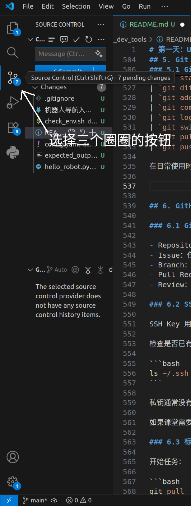
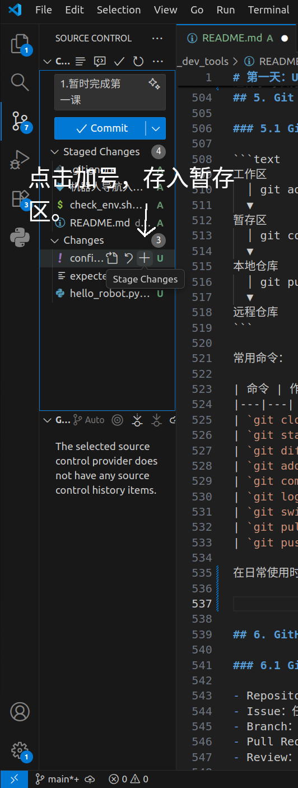
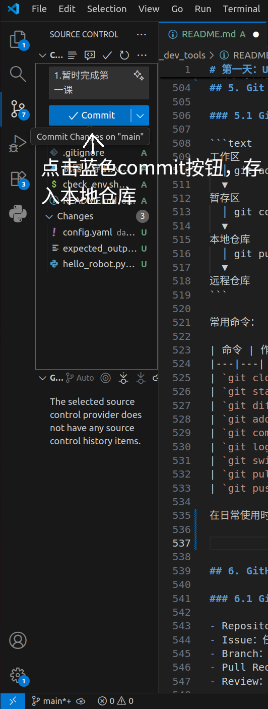
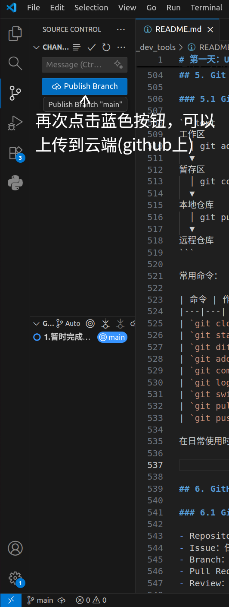
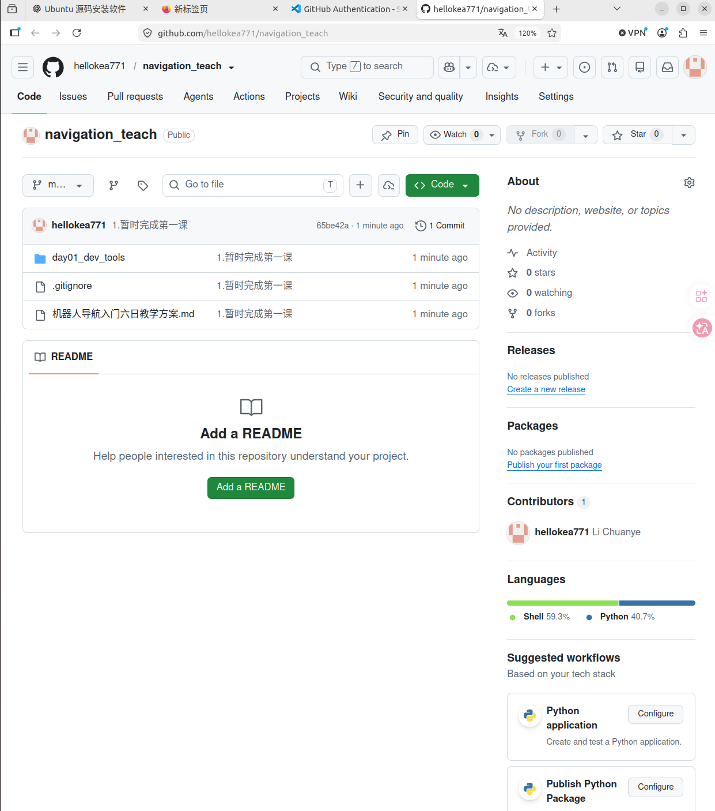
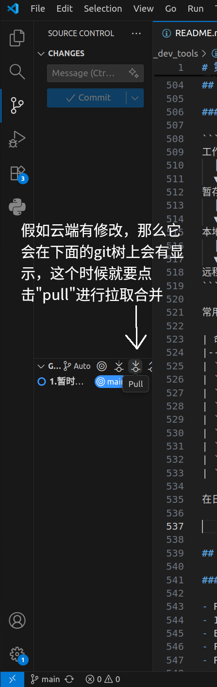
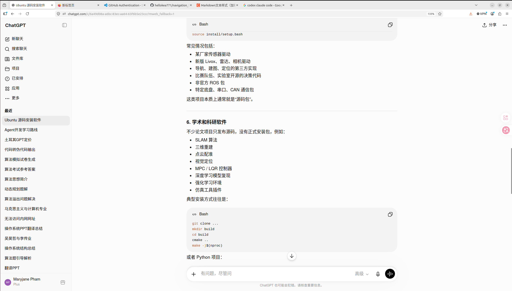
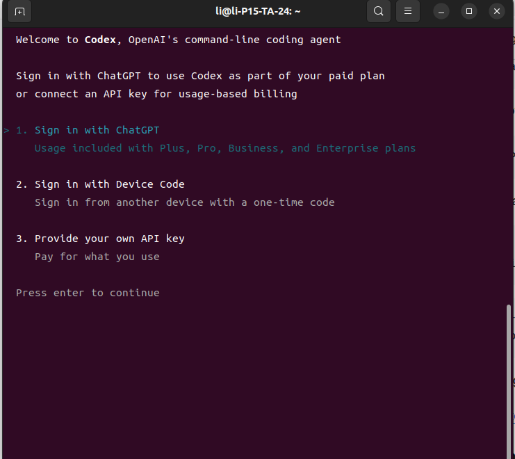
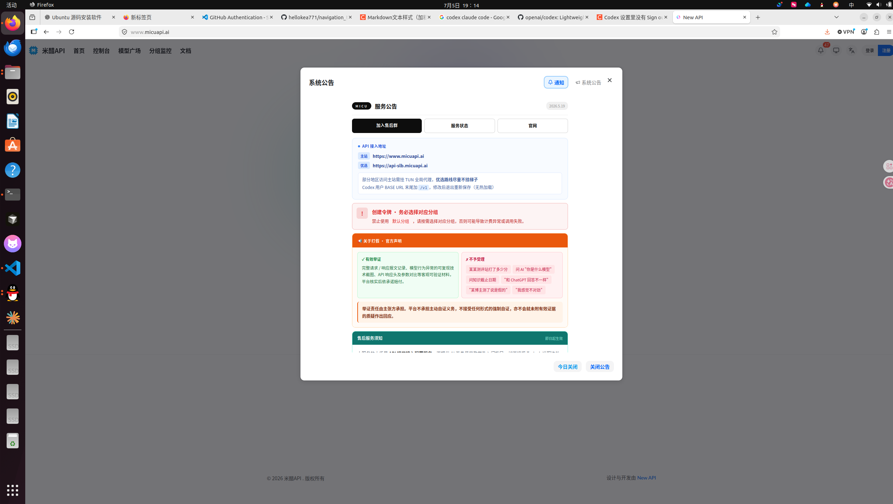
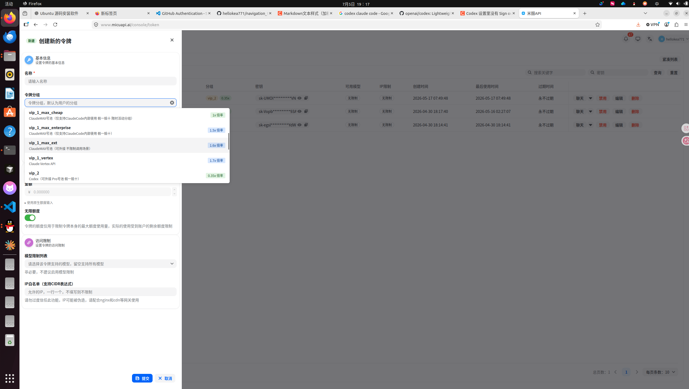

# 第一天：Ubuntu、Git、GitHub 与 AI

## 1. 今日目标

今天不学习机器人导航算法，而是建立后续开发需要的基本工作流。

完成课程后，你应当能够：

- 使用 Ubuntu 终端完成基本文件操作。
- 看懂命令中的路径，区分绝对路径和相对路径。
- 运行程序、保存完整报错并进行初步排查。
- 理解 Git 与 GitHub 的区别。
- 完成 `clone → branch → edit → commit → push → Pull Request`。
- 使用 AI 辅助分析问题，并验证 AI 给出的建议。

今天的最终任务是：

```text
获取教学仓库
→ 创建个人分支
→ 运行一个存在问题的程序
→ 保存报错
→ 使用 AI 辅助分析
→ 修复并验证
→ 查看 Git diff
→ 提交代码
→ 创建 Pull Request
```


## 2. 开发工具全景

机器人开发通常会同时接触以下工具：

| 工具 | 作用 |
|---|---|
| Ubuntu | 机器人软件常用的开发和运行环境 |
| Terminal/Shell | 输入命令、运行程序和查看日志 |
| VS Code | 编辑代码、搜索文件和查看 Git 修改 |
| Git | 在本地记录代码版本 |
| GitHub | 托管仓库、协作和代码审查 |
| AI | 辅助理解、排错、生成和审查 |
| ROS 2 | 机器人软件模块之间的通信框架 |
| colcon/CMake | 编译和组织 ROS 2 工程 |
| RViz | 显示地图、点云、路径和坐标系 |
| rosbag | 记录和回放 ROS 2 数据 |

需要特别区分：

```text
Git：本地版本管理工具
GitHub：托管 Git 仓库的在线协作平台
```

即使没有 GitHub，Git 仍然可以在本地使用。

## 3. Ubuntu 基础

### 3.1 打开终端

Ubuntu 中可以使用快捷键：

```text
Ctrl + Alt + T
```

终端提示符通常包含用户名、主机名和当前目录。复制教程中的命令时，不要复制提示符 `$`。

### 3.2 确认当前环境

进入第一天课程目录：

```bash
cd ~/navigation_teach/day01_dev_tools
pwd
ls
```

预期 `pwd` 末尾为：

```text
/navigation_teach/day01_dev_tools
```

运行环境检查：

```bash
./check_env.sh
```

脚本会检查 Ubuntu、Git、Python、文本搜索工具和 Git 用户信息，不会安装或删除任何软件。

### 3.3 目录和路径

常用符号：

| 写法 | 含义 |
|---|---|
| `/` | Linux 根目录 |
| `~` | 当前用户的主目录 |
| `.` | 当前目录 |
| `..` | 上一级目录 |

绝对路径从 `/` 开始：

```text
/home/user/navigation_teach/day01_dev_tools
```

相对路径以当前工作目录为起点：

```text
demo/hello_robot.py
```

同一个相对路径，在不同工作目录中可能指向不同文件。这是开发中常见的问题来源。


### 3.4 运行程序和停止进程

查看 Python 版本：

```bash
python3 --version
```

运行示例程序：

```bash
python3 demo/hello_robot.py
```

现在程序应当失败。不要立即修改，先完成三件事：

1. 找到报错类型。
2. 找到报错涉及的文件路径。
3. 从第一行到最后一行保存完整报错。

运行持续工作的程序时，通常使用：

```text
Ctrl + C
```


### 3.5 Ubuntu 中的软件安装

#### 3.5.1 常见安装方式

Ubuntu 中的软件可能来自不同渠道：

| 方式 | 常见形式 | 特点 |
|---|---|---|
| APT 软件源 | `sudo apt install ...` | 自动处理 Ubuntu 软件源中的依赖，优先使用 |
| 本地 Debian 包 | `xxx.deb` | 已经编译好的 Ubuntu 安装包 |
| 语言包管理器 | `pip`、`npm` | 安装特定语言生态中的库，例如 pip 是安装 Python 库的工具 |
| 源码编译 | `CMakeLists.txt`、`Makefile` | 灵活，但需要自行处理依赖、编译和安装 |

安装软件前先确认：

1. 是否支持当前 Ubuntu 版本。
2. 是否支持当前 CPU 架构。
3. 是否会与已有版本冲突。


#### 3.5.2 使用 APT

APT 是 Ubuntu 常用的软件包管理工具。

更新本地的软件包索引：

```bash
sudo apt update
```

这条命令更新“有哪些软件和版本可用”的信息，不会自动升级所有软件。


安装软件：

```bash
sudo apt install cmake
```

同时安装多个开发工具：

```bash
sudo apt install build-essential cmake git
```

其中：

- `build-essential` 提供 GCC、G++、Make 等基础编译工具。
- `cmake` 用于配置和生成构建系统。
- `git` 用于版本管理。

查看一个包安装了哪些文件：

```bash
dpkg -L cmake
```

卸载软件：

```bash
sudo apt remove cmake
```

`remove` 通常保留系统级配置；`purge` 会同时删除包管理器记录的配置：

```bash
sudo apt purge cmake
```

不要为了练习而卸载当前课程依赖。

需要区分：

```text
apt update：更新软件包索引
apt upgrade：升级已经安装的软件(一般不用)
apt install：安装指定软件
```

课程期间不要未经确认执行整个系统的 `apt upgrade`，因为大范围升级可能改变开发环境。

#### 3.5.3 安装本地 `.deb` 包

先查看 CPU 架构：

```bash
dpkg --print-architecture
```

常见结果是：

```text
amd64
arm64
```

安装本地包时，推荐使用 APT：

```bash
sudo apt install ./example.deb
```

命令中的 `./` 表明这是当前目录中的文件，而不是软件源中的包名。

与直接运行 `dpkg -i` 相比，APT 更容易处理依赖关系。

安装前应检查：

- 文件来源。
- Ubuntu 版本。
- CPU 架构。
- 软件签名或官方校验值。
- 是否已经安装其他版本。

#### 3.5.4 Python 包

不要默认使用：

```bash
sudo pip install ...
```

它可能覆盖 Ubuntu 或 ROS 依赖的 Python 包。

项目开发更推荐虚拟环境：

```bash
python3 -m venv .venv
source .venv/bin/activate
python -m pip install --upgrade pip
python -m pip install <package-name>
```

查看当前环境安装的包：

```bash
python -m pip list
python -m pip freeze
```

退出虚拟环境：

```bash
deactivate
```

虚拟环境的作用是隔离项目依赖，减少不同项目之间的版本冲突，但是实际开发接触比较少，在使用一些独立工具的时候可能会用到。

### 3.6 从源码编译和安装

#### 3.6.1 为什么需要源码编译

以下情况可能需要源码编译：

- 软件源中没有该软件。
- 软件源版本过旧。
- 需要开启或关闭某些编译选项。
- 需要修改源码。
- 目标平台没有官方安装包。

源码安装比 APT 更灵活，但也意味着开发者需要自己管理：

- 编译器。
- 依赖库。
- 编译参数。
- 安装位置。
- 版本更新。
- 卸载方式。

当你拿到一个源码压缩包之后，
确认路径安全后再解压：

```bash
tar -xf project.tar.gz
cd project
```

#### 3.6.2 CMake 项目的标准流程

机器人项目常用 CMake。一个典型流程是：

```text
准备依赖 → 配置 → 编译 → 测试 → 安装
```

流程大致如下：

```bash
cd <项目根目录>

mkdir build

cd build

cmake ..

make -j$(nproc)

sudo make install
```


#### 3.6.3 ROS 2 工作空间

ROS 2 的 `colcon` 会调用各个包的构建系统：

```bash
colcon build --symlink-install
```

常见目录：

```text
src/      源码
build/    构建中间文件
install/  安装结果和环境脚本
log/      构建日志
```

构建后通常需要：

```bash
source install/setup.bash
```

这样当前终端才能找到新编译的 ROS 2 包。

### 3.7 环境变量

#### 3.7.1 环境变量是什么

环境变量是由“名称”和“值”组成的运行环境配置，例如：

```text
HOME=/home/user
PATH=/usr/local/bin:/usr/bin:/bin
```

程序可以读取环境变量来决定：

- 去哪里寻找可执行文件。
- 去哪里寻找动态库。
- 去哪里寻找 Python 模块。
- 使用哪个配置或工作空间。
- 当前使用哪个 ROS 2 发行版。


查看环境变量：

```bash
echo "$HOME"
echo "$PATH"
printenv HOME
env | head
```


#### 3.7.2 临时设置与永久设置

终端中执行：

```bash
export COURSE_DAY=1
```

通常只对当前终端及其子进程有效。关闭终端后，该设置消失。

如果希望每次打开 Bash 都自动设置，可以写入 `~/.bashrc`。使用下面的命令打开：

```bash
nano ~/.bashrc
```

例如：

```bash
export PATH="$HOME/.local/bin:$PATH"
```

修改后让当前终端重新加载：

```bash
source ~/.bashrc
```

写入 `.bashrc` 前应注意：

- 先备份原文件。
- 不重复添加同一行。
- 不覆盖整个 `PATH`。
- 一次只修改一项。
- 修改后重新打开终端验证。

错误写法：

```bash
export PATH="$HOME/my_tools"
```

它会丢失系统原来的 `PATH`，导致 `ls`、`python3` 等命令可能无法找到。

更合理的写法：

```bash
export PATH="$HOME/my_tools:$PATH"
```

#### 3.7.3 常见环境变量

| 变量 | 作用 |
|---|---|
| `HOME` | 当前用户主目录 |
| `USER` | 当前用户名 |
| `SHELL` | 当前用户默认 Shell |
| `PATH` | 查找可执行程序 |
| `LD_LIBRARY_PATH` | 额外的动态库搜索路径 |
| `PYTHONPATH` | 额外的 Python 模块搜索路径 |
| `CMAKE_PREFIX_PATH` | CMake 查找已安装项目的前缀 |
| `ROS_DISTRO` | 当前 ROS 2 发行版名称 |
| `AMENT_PREFIX_PATH` | ROS 2/ament 包的安装前缀 |

#### 3.7.4 `source` 的作用

直接执行脚本通常会创建一个子进程。子进程修改的环境变量不会返回当前终端。

`source` 会让脚本在当前 Shell 中执行，因此脚本设置的环境变量能保留在当前终端：

```bash
source /opt/ros/<发行版>/setup.bash
source install/setup.bash
```

第一行把系统 ROS 2 环境加入当前终端；第二行再叠加当前工作空间。

这种顺序称为环境叠加：

```text
Ubuntu 基础环境
→ 系统 ROS 2
→ 当前工作空间
```

在新的终端中，如果没有重新 `source`，可能出现：

```text
ros2: command not found
Package '<name>' not found
```

工作空间第一次编译完成后，每次打开新终端都需要重新加载它的环境。如果这是日常固定使用的工作空间，可以将加载命令写入 `~/.bashrc`。

先打开文件：

```bash
nano ~/.bashrc
```

在文件末尾加入以下内容，并将 `<工作空间>` 替换成自己的实际目录：

```bash
if [ -f "$HOME/<工作空间>/install/setup.bash" ]; then
  source "$HOME/<工作空间>/install/setup.bash"
fi
```

保存后让当前终端立即加载：

```bash
source ~/.bashrc
```


## 4. Git 基础

### 4.1 Git 管理的四个位置

```text
工作区
  │ git add
  ▼
暂存区
  │ git commit
  ▼
本地仓库
  │ git push
  ▼
远程仓库
```

常用命令：

| 命令 | 作用 |
|---|---|
| `git clone` | 获取远程仓库 |
| `git status` | 查看当前状态 |
| `git diff` | 查看尚未暂存的修改 |
| `git add` | 将修改放入暂存区 |
| `git commit` | 创建本地版本记录 |
| `git log` | 查看提交历史 |
| `git switch` | 切换或创建分支 |
| `git pull` | 获取并合并远程修改 |
| `git push` | 推送本地提交 |

在日常使用时，主要会使用 VS Code 上的 Git 扩展。








## 5. GitHub

### 5.1 GitHub 概念

形象地说，GitHub 类似“程序员的社交软件”，程序就是我们交流的内容，其他人可以通过 Star 表达认可。实际上，GitHub 是一个远程代码托管平台，你可以上传代码供其保存，其他人可以克隆你的仓库，也可以修复代码中的 Bug，然后申请将修改合并到原仓库，这就是 Pull Request（简称 PR）。

之后的开发可能在自己的电脑上完成，而程序运行在车载计算机上，也可能由多人共同开发，所以掌握 GitHub 协作尤为重要。


### 5.2 GitHub 中的主要对象

- Repository：项目仓库。
- Issue：任务、问题或讨论。
- Branch：相互隔离的开发分支。
- Pull Request：申请将一个分支的修改合并到另一个分支。
- Review：对 Pull Request 进行检查和评论。

使用 GitHub 合作开发，不只是学会把代码上传到网站，还需要理解一套团队工作流程：

```text
创建 Issue
→ 分配负责人
→ 同步主分支
→ 创建个人功能分支
→ 开发和本地验证
→ Commit
→ Push
→ 创建 Pull Request
→ 自动检查和人工 Review
→ 修改问题
→ 合并到主分支
→ 删除已经完成的功能分支
```

需要学习的内容可以分为以下几部分：

| 内容 | 需要掌握什么 |
|---|---|
| 仓库与权限 | 谁能查看、修改、审核和管理仓库 |
| Issue | 如何描述任务、错误和验收标准 |
| Branch | 为什么每项任务使用独立分支 |
| Commit | 如何把修改拆成清晰、可回退的记录 |
| Push/Pull | 如何上传自己的修改并同步他人的修改 |
| Pull Request | 如何说明修改目的、内容、测试和风险 |
| Code Review | 如何检查他人的代码并提出具体意见 |
| Conflict | 为什么产生冲突，以及如何逐处解决 |
| Merge | PR 通过后如何进入主分支 |
| CI | 如何自动执行编译、测试和格式检查 |
| Release | 如何给可使用的版本打 Tag 并发布 |
| 安全 | 如何避免上传密码、Token、私钥和机密配置 |


#### 5.2.1 Branch：每项任务使用独立分支

主分支通常用于保存经过验证、能够正常使用的代码。假如你是多人开发，每个人最好有一个分支，觉得差不多就可以合并到主分支上。假如是一个人开发就不需要额外开分支。


#### 5.2.2 Commit：记录一个完整的小步骤

**一次 Commit 应只完成一件事情，并且在提交前完成基本验证。**

推荐格式：

```text
类型: 简短说明
```

例如：

```text
feat: add map loading service
fix: handle missing map to odom transform
docs: add GitHub collaboration guide
test: cover invalid navigation goal
```

解释
feat:表示添加新功能

Commit 不是越多越好或越少越好，重点是每个 Commit 都能解释、检查和回退。

#### 5.2.3 Pull Request：把修改交给团队检查

一个 Pull Request 至少应说明：

```text
为什么修改：
修改了什么：
没有修改什么：
如何验证：
可能的风险：
关联的 Issue：
```

提交 PR 前应检查：

1. 修改是否仍在个人分支。
2. 是否包含无关文件。
3. 是否误提交日志、编译产物或大文件。
4. 是否包含密码、Token、私钥或本地绝对路径。
5. 是否已经查看完整 Diff。
6. 程序是否能够编译或运行。
7. 是否完成与本次修改有关的测试。

#### 5.2.4 Code Review：检查代码而不是评价个人

Review 时重点检查：

- 修改是否实现了 Issue 的目标。
- 接口、坐标系、单位和消息类型是否正确。
- 是否存在异常输入、超时和空数据问题。
- 是否破坏已有功能。
- 是否有必要的日志和测试。
- 代码是否容易理解和维护。

#### 5.2.5 同步、冲突与合并

多人修改同一文件或相邻代码时可能产生冲突。冲突表示 Git 无法自动判断应该保留哪一部分，不代表仓库损坏。

解决冲突时应：

1. 先确认自己的分支和工作区状态。
2. 保存未完成的工作。
3. 获取主分支的最新修改。
4. 逐个阅读冲突位置。
5. 与相关开发者确认最终逻辑。
6. 删除冲突标记。
7. 重新编译和测试。
8. 提交冲突解决结果。

有一套完整的处理冲突的流程，具体遇到了冲突可以去问ai,加深印象

第一天必须实际完成：

- 创建个人分支。
- 完成一次清晰的 Commit。
- Push 个人分支。
- 创建 Pull Request。
- 阅读并回复一条 Review。
- 根据 Review 修改后再次 Push。


## 6. AI 辅助开发


现在 AI 的发展越来越快，从聊天 Bot 进化成了可以完成多种任务的“助手”。在日常开发中，合理使用 AI 能够显著提高效率。

### 6.1 用什么

对于工程开发，最好还是使用外国的“御三家”，但是想使用好他们都需要开会员，所以你们看看自己的经济能力和需求看看需不需要开会员。
对于国内的 AI，我使用 DeepSeek 比较多，使用起来也比较方便，所以也可以根据实际需求选择国内的 AI。

如何使用？
>**使用网页端**    网页端的好处是不需要花额外的钱，缺点是不能很好的帮你写代码，所以平时使用网页端主要是进行问题的提问，还有搜索资料。


>**使用 Agent** 为什么我建议使用“御三家”，因为它们都有自家的代码 Agent，并针对自家模型进行了适配，所以使用体验通常更完整。

### 6.2 怎么用 Agent

以 Codex 为例，首先需要找到 Codex 的 GitHub 仓库：
```
https://github.com/openai/codex
```

按照仓库教程下载 CLI 版本（Ubuntu 没有 Codex 桌面应用版本，主要使用 CLI 版本）。

安装完成后进入命令行，输入 `codex`，就可以看到这个界面：

现在有两种方法。如果你购买了 ChatGPT Plus 或 Pro 等套餐，其中会包含一定额度；Plus 约为 120 元，可能会有些贵，如果已经购买，可以使用第一种登录方式。

我重点介绍第二种：使用 API 中转站。
现在有很多提供 API 的中转站，会向你提供 API 密钥，根据使用的 Token 数量计费，使用量较少的用户可以考虑。

例如我使用的米醋 API，直接在浏览器中搜索即可找到：


进入后配置需要的 API（例如 GPT，选择对应分组）：


接下来需要下载一个名为 CC Switch 的应用，它可以统一管理 Agent 的 API 配置和历史对话，使用比较方便，可以自行搜索并下载。

然后进入这个界面，输入 API 密钥和请求地址（默认请求地址可能存在问题，应以服务公告提供的地址为准）：


添加之后启用对应供应商，再打开 Codex 即可使用。

使用 AI 的注意事项：

1. 在你的工作空间下打开 Codex，先让它知道你在做什么。
2. 让 AI 写代码之前，一定要明确需求和目标。例如想编写机器人路径规划算法时，不能只说“请帮我写一个路径规划算法，要求能规划出一条适合机器人导航的路径”。在自己不了解问题的情况下直接让它编写，很难得到符合需求的结果，也很难判断实现是否正确。应该逐步拆解问题，问清楚需要使用什么技术、如何实现，并在开始编写前了解整体方案。
3. 写完的代码要会审查，问清楚最终实现了什么效果，是不是符合你的预期。
4. 有时候 AI 会建议加入很多非必要功能，需要自己判断哪些是必须的，优先使用尽量少且清晰的代码实现需求。
5. 使用 AI 修改代码时尽量控制范围，每次只改一点并及时验证，确认没有问题后再继续。
6. 剩下的可以去看一些视频了解一下
https://github.com/ryanhanwu/How-To-Ask-Questions-The-Smart-Way
前任学长发给我的，还没有认真看过

### 6.3 如何向 AI 描述开发问题

提问时尽量提供以下信息：

```text
环境：
Ubuntu、ROS 2、Python/C++ 等版本，以及当前工作目录。

目标：
程序原本应该实现什么。

操作：
执行了哪些命令，修改了哪些文件。

实际现象：
从第一行到最后一行的完整报错或异常输出。

已经检查：
自己已经确认过哪些内容。

限制：
例如不要删除文件、不要使用 sudo、不要修改其他模块。

期望回答：
先分析原因，再给检查步骤；每一步说明预期结果。
```

例如：

```text
我在 Ubuntu 22.04 中运行 day01_dev_tools/demo/hello_robot.py。
目标是读取同一目录中的 config.yaml。
我执行了 python3 demo/hello_robot.py，出现 FileNotFoundError。
请先解释程序实际寻找了哪个路径，再给出检查步骤。
不要删除文件，也不要修改配置文件内容。
```
实际使用中不需要每次都输入这么复杂的提示词，只需要第一次问的时候问的详细一点，后续根据它的回答来调整提示词的颗粒度。

## 7. 综合练习

### 7.1 提前准备

1. 安装好 Ubuntu 上必要的开发软件。
2. 安装并配置好 Codex。
3. 将课程代码克隆到本地（中间可能遇到下载时需要输入用户名或下载速度慢等问题，需要自己搜索资料解决）。
### 7.2 问题背景

`demo/hello_robot.py` 应读取 `demo/config.yaml`，然后打印机器人信息。

运行：

```bash
cd ~/navigation_teach/day01_dev_tools
python3 demo/hello_robot.py
```

当前程序会报错，这是课程故意保留的问题。

### 7.3 任务要求

1. 保存完整报错。
2. 阅读 `demo/hello_robot.py`。
3. 使用推荐模板向 AI 提问。
4. 判断 AI 建议是否安全。
5. 修改程序，使它能正确运行。
6. 比较实际输出与 `demo/expected_output.txt`。
7. 分别从以下两个目录运行，两次都必须成功：

   ```bash
   cd ~/navigation_teach/day01_dev_tools
   python3 demo/hello_robot.py

   cd ~/navigation_teach/day01_dev_tools/demo
   python3 hello_robot.py
   ```

8. 创建自己的分支，将修改好的代码推送到 GitHub。
9. 在 GitHub 创建 Pull Request。

### 7.4 验收标准

- 输出与 `expected_output.txt` 一致。
- 只修改完成任务所必需的文件。
- Commit 信息能说明修改目的。
- Pull Request 包含问题原因和验证方法。
- 能说明 AI 提供了什么建议，以及如何验证。


## 8. 课程结束检查

你应当能够回答：

1. 绝对路径和相对路径有什么区别？
2. CMake 配置、编译、测试和安装分别做什么？
3. 为什么推荐使用独立的 `build/` 目录和用户安装前缀？
4. 临时环境变量与写入 `.bashrc` 有什么区别？
5. `source` 与直接运行脚本有什么区别？
6. Git 与 GitHub 有什么区别？
7. 工作区、暂存区和 Commit 分别是什么？
8. 一个有效的 AI 排错问题应包含哪些信息？
9. 如何证明程序已经被正确修复？
10. Pull Request 中应当写明哪些内容？

完成综合练习并提交 Pull Request 后，第一天课程结束。
