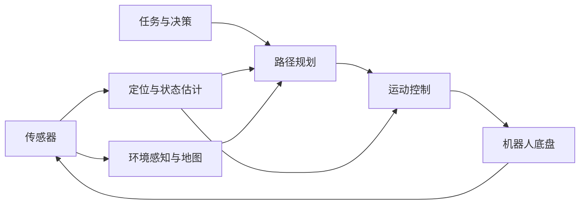

# 机器人导航系统框架

## 1. 为什么先了解导航框架

在学习 ROS 2 节点、定位、路径规划和运动控制之前，需要先了解这些技术在完整导航系统中的位置。

机器人导航不是一个程序独立完成的功能，而是多个模块持续交换数据、共同工作的结果。

这一部分不要求理解具体算法，只需要建立以下认识：

- 导航系统由哪些主要模块组成。
- 每个模块大致解决什么问题。
- 数据如何在模块之间传递。
- 一个模块异常后会影响哪些模块。
- 后续课程分别对应框架中的哪一部分。

## 2. 机器人导航需要解决的问题

请你想想，一个机器人想要自主到达目标，通常需要知什么？

1. 机器人周围有什么？
2. 机器人现在在哪里？
3. 机器人应该去哪里？
4. 应该选择什么路线？
5. 如何控制机器人沿路线运动？

能回答这些问题，就知道了机器人导航的模块划分
感知--定位--决策--路径规划--控制
## 3. 导航系统整体框架



可以将导航系统简单理解为：

```text
观察环境
→ 确定位置
→ 获取目标
→ 规划路线
→ 控制运动
→ 获取新的状态
→ 继续更新
```

这不是一次执行完成的过程，而是一个不断重复的闭环。

## 4. 主要模块

| 模块 | 主要作用 |
|---|---|
| 传感器 | 获取雷达、IMU、轮速等原始数据 |
| 定位与状态估计 | 判断机器人当前的位置、方向和运动状态 |
| 环境感知与地图 | 描述周围障碍物和可通行区域 |
| 任务与决策 | 决定机器人当前应该执行什么任务、前往哪里 |
| 路径规划 | 计算从当前位置到目标位置的路线 |
| 运动控制 | 根据路径计算机器人的运动指令 |
| 底盘执行 | 驱动电机完成运动，并返回机器人状态 |

一个实际系统中的模块可能由一个节点实现，也可能由多个节点共同实现。

## 5. 导航系统中的三种数据关系

### 5.1 感知数据向上传递

```text
传感器
→ 定位与环境感知
→ 机器人状态和环境信息
```

传感器负责获取原始数据，定位和感知模块再将原始数据转换成导航能够使用的信息。

### 5.2 任务指令向下执行

```text
任务目标
→ 路径规划
→ 运动控制
→ 机器人运动
```

任务或决策模块给出目标，规划模块生成路线，控制模块再将路线转换为机器人能够执行的运动指令。

### 5.3 机器人状态不断反馈

```text
机器人运动
→ 传感器产生新数据
→ 更新位置和环境
→ 更新规划和控制
```

机器人运动后，位置和周围环境都会发生变化，因此系统需要持续更新，而不是只计算一次。

## 6. 模块之间相互影响

导航系统是一条连续的数据链，上游模块出现问题会影响后续模块。

例如，传感器没有数据：

```text
传感器没有数据（比如雷达点云给的不足）
→ 定位无法更新
→ 规划器无法获得正确位置
→ 控制器无法正常工作
```

地图没有正常提供：

```text
先验地图不可用
→ 规划器不了解可通行区域
→ 无法生成可靠路径
→ 导致控制器不能控制机器人到达想去的位置
```

因此，排查导航问题时需要沿数据流逐步检查，不能只观察最后一个模块；同样的，你也必须要掌握debug能力，能够高效找到问题根源在哪个模块。

## 7. ROS 2 在导航系统中的作用

导航系统中的模块通常以 ROS 2 节点的形式运行。

```text
导航功能模块 ≈ 一个或多个 ROS 2 节点
模块之间的数据连接 ≈ ROS 2 通信
```

例如：

```text
定位节点
→ 规划节点
→ 控制节点
→ 底盘通信节点
```

这些节点需要持续交换位置、地图、目标、路径和控制信息。

第二天课程中学习的 Publisher 和 Subscriber，就是连接这些模块的基础。

一个简单的节点通信：

```text
发布节点
→ Topic
→ 订阅节点
```

与导航系统中的通信本质上相同：

```text
规划节点
→ 路径数据
→ 控制节点
```

后续学习自定义消息、Launch 和参数配置，也是为了能够组织和运行更完整的机器人系统。

## 8. 后续课程与导航框架的关系

| 课程 | 对应内容 |
|---|---|
| 第二天 | ROS 2 节点、通信、自定义消息和 Launch |
| 第三天 | 传感器、定位和 TF |
| 第四天 | 地图与路径规划 |
| 第五天 | 路径跟踪与运动控制 |
| 第六天 | 机器人决策、模块通信和系统联调 |

后续每学习一个模块，都可以重新回到导航框架图中，确认：

- 当前学习的是哪个模块。
- 这个模块需要什么输入。
- 它会向其他模块提供什么。
- 它出现问题后会影响谁。


机器人导航系统可以概括为：

```text
感知
→ 定位
→ 地图
→ 决策
→ 规划
→ 控制
→ 执行
→ 反馈
```

需要记住：

- 导航系统由多个模块组成。
- 模块之间通过数据连接形成完整系统。
- 导航是持续运行的闭环过程。
- 一个模块异常会影响后续模块。
- ROS 2 节点通信是连接各个模块的基础。

本节只建立系统框架。后续课程会逐步学习每个模块的具体原理、数据和实现方法。
