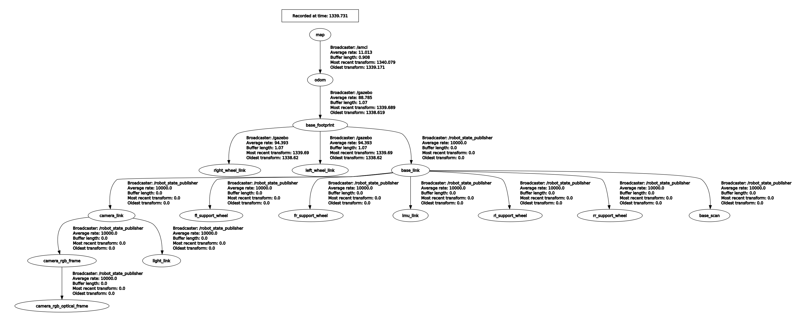
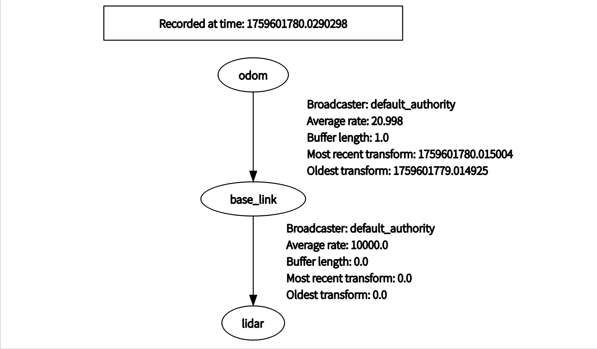
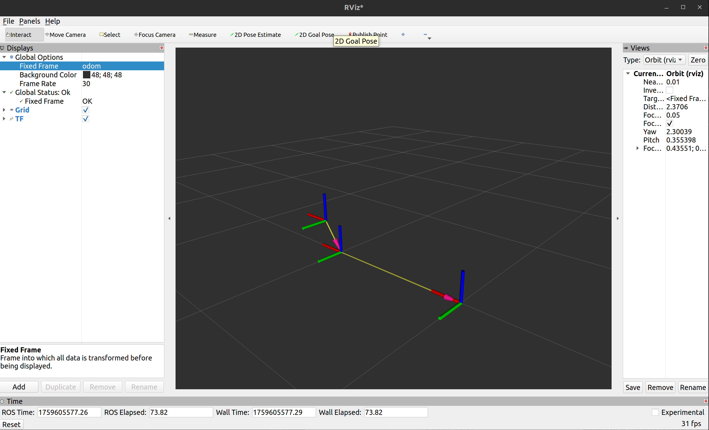
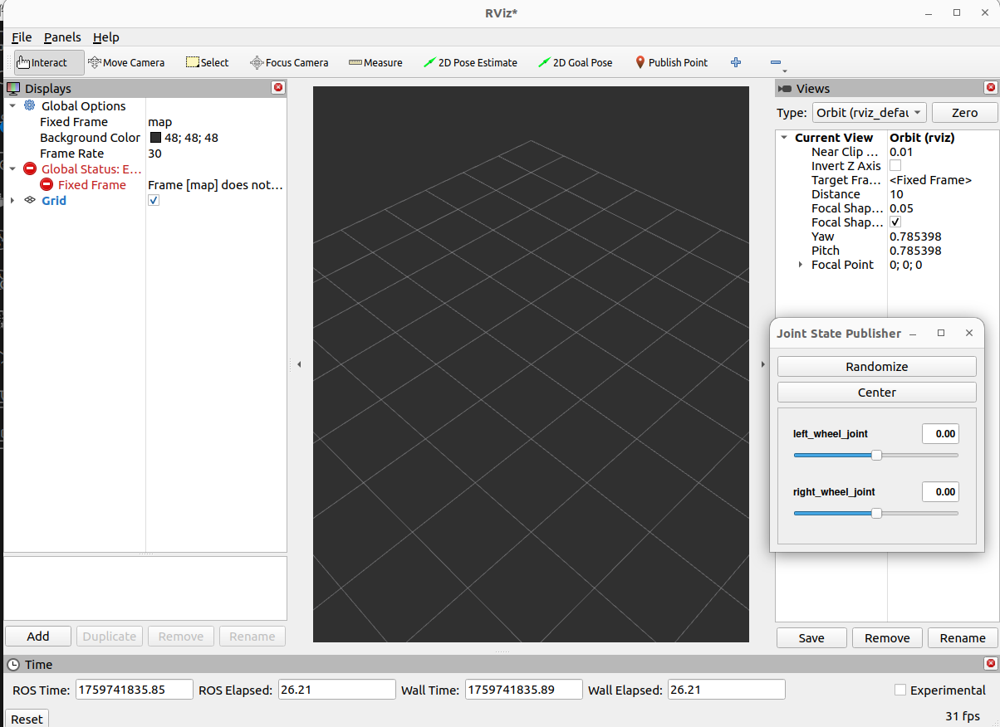
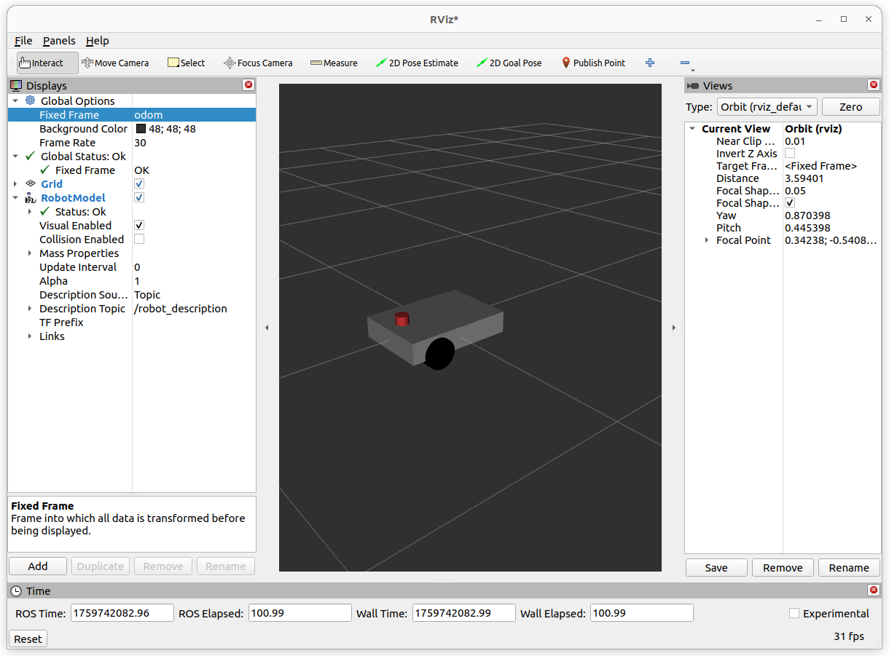

# 传感器与可视化
## 常用传感器与对应msg类型
下面列出比赛与机器人开发中常用的传感器类型与对应的 ROS2 message 类型。
**3D 点云：sensor_msgs/msg/PointCloud2**
用途：三维环境感知、障碍物检测、建图、目标分割。  

可以通过运行以下命令查看其定义：
```
ros2 interface show sensor_msgs/msg/PointCloud2
```

**IMU：sensor_msgs/msg/Imu**
用途：角速度（gyroscope）、线加速度（accelerometer）、姿态四元数（orientation），常用于姿态估计/滤波器。  

**里程计 / Odometry：nav_msgs/msg/Odometry**  
机器人局部位姿（pose）与速度（twist），用于定位与融合（如与 AMCL/SLAM 对接）。  

## 数据流中的关键要素
### Frame
frame(或frame_id / 坐标系)，是指每条消息的 `header.frame_id`。它描述的是传感器消息的来源（坐标系）。例如，imu数据的坐标原点通常是imu模块，3D点云数据的坐标原点通常是激光雷达本体。不同的传感器安装位置不同，自然要标明数据的坐标系。  
在ROS中，所有frame(坐标系)之间的关系通过TF维护，我们在接下来会详细介绍。
### 时间戳
时间戳是指每条传感器消息头部的`header.stamp`，它标记了这条数据的产生时间，可以用于不同传感器之间的数据对齐。
>**注意**，若使用仿真或播放 bag，必须启用 use_sim_time。此时时间戳的时间来自发布的/clock话题，否则来自系统时间。
### QoS
ROS2 基于 DDS，消息传输由 QoS 策略控制（可靠性、历史、深度等），发布者和订阅者的 QoS 若不匹配，**会导致无法正常接收到消息**。  

常见的 QoS 策略：
**reliability**: RELIABLE 或 BEST_EFFORT。控制命令多用 RELIABLE，高频图像/点云可用 BEST_EFFORT。

**history**: KEEP_LAST（depth）或 KEEP_ALL（全部）。

**durability**: VOLATILE 或 TRANSIENT_LOCAL（是否让后加入的订阅者收到历史数据）。  
**建议**：对“高带宽但可丢帧”的传感器可使用 BEST_EFFORT；对“关键控制”使用 RELIABLE。

### TF
TF是transformations Frames的缩写。首先我们得明白，机器人是不能直接知道自己的坐标的，但是传感器会提供自己的坐标。所以我们需要用机器人相对与传感器的相对位置来计算自身机器人坐标，然后利用传感器相对于原点（一开始在的位置），来进行定位。
#### 1. 齐次变换矩阵
为了介绍TF，首先我们需要一点点（真的只有一点点）机器人学基础。  
在机器人系统中，我们常常需要处理不同坐标系之间的转换。
例如：雷达坐标系下的一个点，如何表示到机器人底盘坐标系？这就需要齐次变换矩阵。  
$$
T =
\begin{bmatrix}
R & t \\
0 & 1
\end{bmatrix}
$$
齐次变换矩阵是一个**4x4的矩阵**，由两个部分组成，我们可以将其看作一个2*2的分块矩阵。
其中：  
左上角的$R$是$3 \times 3$的旋转矩阵
右上角的$t$ 是$3 \times 1$的平移向量
最后一行 $[0,0,0,1]$ 是“占位符”，保证矩阵可以做乘法  
>**在本套教程中  我们约定 $T_A^B$ 把点从 B 系 变换到 A 系**，也就是说：  
$T_A^B$ 是 B 相对于 A 的位姿
$T_A^B$可以把 “在 B 系表示的点” 变到 “A 系下的表示”
A 是目标/参考系（target/reference）,B 是源/原始系（source）
**在不同的场合，符号约定有可能不同，需要大家注意。**


现在，我们假设有一个测量点$^{lidar}\mathbf{P}_{l}$位于激光雷达本体为原点的坐标系下，它的齐次坐标是：  
$$
^{lidar}\mathbf{P}_{l} = 
\begin{bmatrix}
x_l \\
y_l \\
z_l \\
1 \\
\end{bmatrix}$$  
如果我们还知道**激光雷达坐标系到底盘中心坐标系的变换矩阵$T_{base}^{lidar}$**,就可以轻松计算出点$P_l$在底盘系下的坐标：
$$
^{base}\mathbf{P}_{l} = T_{base}^{lidar} ⋅ ^{lidar}\mathbf{P}_{l}
$$  

**链式变换**：
齐次矩阵的另一个强大之处是：**可以连续相乘**。
比如：  已知从 odom 到 map 的变换矩阵 $T_{map}^{odom}$  ,从 base 到 odom 的变换矩阵 $T_{odom}^{base}$。
那么机器人在 map 系下的位姿就是
$$
 T_{map}^{base} = T_{map}^{odom}  · T_{odom}^{base} 
$$
>**乘法顺序很重要：靠近被变换点的变换矩阵放在右边。**   

类似的，我们可以求出激光雷达点在map坐标系下的坐标：
$$
^{map}\mathbf{P}_{l} = T_{map}^{odom}  · T_{odom}^{base} · T_{base}^{lidar} ⋅ ^{lidar}\mathbf{P}_{l}
$$  

**逆变换**：  
若 $\mathbf{T}_{A}^{B}=\begin{bmatrix}R & t\\0&1\end{bmatrix}$，其逆为  
$$
(\mathbf{T}_{A}^{B})^{-1} \;=\; \mathbf{T}_{B}^{A} = 
\begin{bmatrix}
R^\top & -R^\top t \\
0^\top & 1
\end{bmatrix} =
\begin{bmatrix}
R^\top & -R^\top t \\
0 & 1
\end{bmatrix}
$$  
即，已知A->B的变换，要求B->A的变换，只需要对变换矩阵做简单的分块运算。而R(旋转矩阵)又是正交的，求逆只需取转置，非常方便。


#### 2. TF包简介与其性质  
让机器人按预期运动，其实就是要管理好系统中各个坐标系（frame）之间的变换关系。TF（tf2）包就是 ROS 中负责这件事的工具集：它提供一个时序化的变换缓存（transform buffer），并提供发布（broadcaster）与订阅/查询（listener/buffer）接口，方便不同节点用高度一致的方式表达和使用坐标系关系。
##### 2.1 TF 的基本性质
**TF树**
不论如何，TF 以“树”来组织坐标系（严格来说不应有环）。如下图所示的TF树：

带环的TF结构或来自不同节点发布的同一组TF关系通常会导致混乱。  
**自带时间戳**  
每个变换都有时间戳（header.stamp），TF 可以在时间轴上插值，从而把任意时刻的坐标变换出来。  
**静态与动态变换**
静态变换：两个坐标系之间恒定（例如传感器刚性安装在底盘上），用 static_transform_publisher发布一次即可。  
动态变换：随时间变化（例如 odom -> base_link 随机器人移动），需周期性发布。  
**坐标变换的方向与约定**  
在本教程中我们约定 $T_A^B$ 表示把在 B 系表示的点变换到 A 系（即 target=A，source=B）。在调用 API 时，明确 target_frame 与 source_frame 的顺序非常重要。

##### 2.2 尝试使用TF
新创建一个C++功能包，比如叫`my_tf`，在package.xml增加以下depend:  

```
<depend>tf2_ros</depend>
<depend>geometry_msgs</depend>
<depend>tf2_geometry_msgs</depend>
```

在CMakelists中寻找这些包：  
```
find_package(tf2_ros REQUIRED)
find_package(geometry_msgs REQUIRED)
find_package(tf2_geometry_msgs REQUIRED)
```

随后新建一个cpp文件，比如叫`my_tf2_broadcaster.cpp`，随后修改Cmakelists，指定可执行文件、引入依赖并声明安装。  
在cpp文件中加入以下内容：
```
#include <rclcpp/rclcpp.hpp>
#include <tf2_ros/transform_broadcaster.h>
#include <tf2_ros/static_transform_broadcaster.h>
#include <geometry_msgs/msg/transform_stamped.hpp>


class MyPublisher : public rclcpp::Node {
public:
    MyPublisher()
    : Node("my_broadcaster")
    {
        static_broadcaster_ = std::make_unique<tf2_ros::StaticTransformBroadcaster>(this);
        geometry_msgs::msg::TransformStamped t;
        t.header.stamp = this->now();
        t.header.frame_id = "base_link";
        t.child_frame_id = "lidar";
        t.transform.translation.x = 0.15;
        t.transform.translation.y = 0.0;
        t.transform.translation.z = 0.2;
        t.transform.rotation.x = 0.0;
        t.transform.rotation.y = 0.0;
        t.transform.rotation.z = 0.0;
        t.transform.rotation.w = 1.0;
        static_broadcaster_->sendTransform(t);

        tf_broadcaster_ = std::make_unique<tf2_ros::TransformBroadcaster>(this);
        timer_ = create_wall_timer(
        std::chrono::milliseconds(50),
        std::bind(&MyPublisher::on_timer, this));
        RCLCPP_INFO(this->get_logger(), "My tf2 broadcaster is running!");
    }


private:
    void on_timer() {
    geometry_msgs::msg::TransformStamped t;
        t.header.stamp = now();
        t.header.frame_id = "odom";
        t.child_frame_id = "base_link";

        t.transform.translation.x = 1.0;
        t.transform.translation.y = 0.0;
        t.transform.translation.z = 0.0;
        t.transform.rotation.x = 0.0;
        t.transform.rotation.y = 0.0;
        t.transform.rotation.z = 0.0;
        t.transform.rotation.w = 1.0;
        tf_broadcaster_->sendTransform(t);
    }


    rclcpp::TimerBase::SharedPtr timer_;
    std::unique_ptr<tf2_ros::TransformBroadcaster> tf_broadcaster_;
    std::unique_ptr<tf2_ros::StaticTransformBroadcaster> static_broadcaster_;
};

int main(int argc, char ** argv)
{
    rclcpp::init(argc, argv);
    rclcpp::spin(std::make_shared<MyPublisher>());

    rclcpp::shutdown();
    return 0;
}
```

通过编译之后，运行：
```
ros2 run my_tf my_tf2_broadcaster
```

应该可以看到终端输出类似：  

```
[INFO] [1759601554.266124536] [my_broadcaster]: My tf2 broadcaster is running!
```

我们可以借助rqt工具查看TF树，首先安装rqt-tf-tree
```
sudo apt-get install ros-humble-rqt-tf-tree
```

然后执行： 
```
ros2 run rqt_tf_tree rqt_tf_tree
```


应该可以看到可视化的TF树类似下图：  

可以看到，odom->base_link的发布频率约为20Hz，这是我们在代码中设置好的。而base_link->lidar的发布频率为10000Hz，代表这是一个静态变换。需要注意的是，如果你尝试以10kHz发布一个非静态变换，通常会发现需求的资源过多而无法达到这个频率。

接下来，我们看看一个TF关系到底是如何被发布的。注意这一段代码：  
```
static_broadcaster_ = std::make_unique<tf2_ros::StaticTransformBroadcaster>(this);
geometry_msgs::msg::TransformStamped t;
t.header.stamp = this->now();
t.header.frame_id = "base_link";
t.child_frame_id = "lidar";
t.transform.translation.x = 0.15;
t.transform.translation.y = 0.0;
t.transform.translation.z = 0.2;
t.transform.rotation.x = 0.0;
t.transform.rotation.y = 0.0;
t.transform.rotation.z = 0.0;
t.transform.rotation.w = 1.0;
static_broadcaster_->sendTransform(t);
```
`static_broadcaster_`是一个`tf2_ros::StaticTransformBroadcaster`类型的unique_ptr，初始化完成后，我们用它发布一个`geometry_msgs::msg::TransformStamped`类型的消息。注意看，这个类型由以下几部分组成：  
`t.header.stamp`即时间戳，Node基类包含的now()方法可获取当前时间  
`t.header.frame_id` 和 `t.child_frame_id`，此前已经说明  
`t.transform.translation` 一个1x3的3维坐标向量  
`t.transform.rotation` 一个用四元数表示的旋转

>**关于四元数**：
这里我们只需将旋转表示为四元数。您可以直接将其视为一个表示旋转的“黑盒子”，现在只需记住：  
x, y, z, w 是四元数的四个分量。  
[0, 0, 0, 1] 代表没有旋转（单位四元数）。  
它的数学原理非常精妙但复杂，对于编程实现而言，初期知道如何正确使用它比理解它更重要。 
**关于四元数和旋转矩阵、欧拉角的关系，碍于篇幅就不在此细讲了，有兴趣的同学可以自己去知乎上了解一下。**  
~~绝对不是因为我数学太烂了~~  

**查询TF**
要查询TF树中的任意一组TF，也非常简单。查询TF时不仅可以查询TF树上相邻的两个节点，而是能直接查询任意两个节点间的TF关系，这就是TF保持树型结构的好处，也是它要求不存在环状结构的原因。比如下面这些代码，是通过TF查询变换矩阵的节选：  
```
// 头文件成员
std::shared_ptr<tf2_ros::Buffer> tf_buffer_;
std::shared_ptr<tf2_ros::TransformListener> tf_listener_;

// 构造函数里
tf_buffer_ = std::make_shared<tf2_ros::Buffer>(this->get_clock());
tf_listener_ = std::make_shared<tf2_ros::TransformListener>(*tf_buffer_);

// 查询最新可用变换（异常安全）
try {
    // 使用 rclcpp::Time(0) 或 tf2::TimePointZero 来请求“最新”可用的变换
    auto transform = tf_buffer_->lookupTransform("odom", "lidar", tf2::TimePointZero);
    // 使用 transform ...
} catch (const tf2::TransformException & ex) {
    RCLCPP_WARN(this->get_logger(), "Transform failed: %s", ex.what());
}
```
此外，`tf2_ros::Buffer`还有`transform`方法，可以把而是把一个点/向量/姿态 直接转换到目标坐标系。  
#### 3. ROS REP-103和REP-105规范  
在使用 TF 管理坐标系时，有一个容易被忽视的问题：**每个团队、每个项目可能都习惯用不同的坐标系定义。**  
比如：有的人把 x 轴当成前进方向，有的人却把 y 轴当成前进方向；有的人觉得 z 轴朝上，有的人觉得朝下。  
如果大家都按照自己的习惯来，坐标系就会“乱套”。  
为了避免这种混乱，ROS 制定了一些统一的规范文档，最重要的就是：  
**REP-103：Standard Units of Measure and Coordinate Conventions**  
**REP-105：Coordinate Frames for Mobile Platform**  
##### 3.1 REP-103：标准单位与坐标约定
REP-103 的核心思想是：所有人都用统一的物理单位和坐标方向。
**单位统一：**  
    长度：米 (m)  
    时间：秒 (s)  
    角度：弧度 (rad)  
    速度：米每秒 (m/s)  
    角速度：弧度每秒 (rad/s)  
**右手坐标系:**  
x 轴：前进方向  
y 轴：左侧  
z 轴：竖直向上  

##### 3.2 REP-105：移动平台的坐标系定义
REP-105 在 REP-103 的基础上，进一步规范了**移动机器人常见的几个坐标系**。常见的有：
**map**
全局坐标系，静态不变。  
用于定位和导航，比如 SLAM 地图中的位置。  
**odom**
里程计坐标系，随着时间累积误差会漂移。  
通常由轮式里程计或视觉里程计提供。  
**base_link**
机器人本体的坐标系，原点一般在机器人几何中心。  
x 轴朝前，y 轴朝左，z 轴朝上。  
**laser / camera 等**
传感器坐标系，通常通过 URDF 定义并固定到 base_link。  

导航中常用的tf以及含义：
1. base_link->lidar:
这是计算机器人本体坐标系到雷达的变换，属于静态变换。由于机器人中心和雷达的坐标系不在同一个位置，但属于刚性变化，所以用一个变换矩阵就可以表示。base_link是控制算法看到的机器人位置，同时还可以将雷达扫到的点云和里程计信息转到base_link下，作为全局感知和机器人速度的来源。

2. odom->base_link
odom一般在定位算法一开始的时候创建，靠靠轮速、LiDAR 里程计、IMU 融合等方式连续积分得到。odom->base_link用来看机器人相对与原点走了多少，是定位算法提供的核心。

3. map->odom
map一般指先验地图的原点坐标，map->odom一般由重定位算法提供，一般用于计算map->base_link来知道机器人在地图上的什么位置，我们才能进行路经规划等等。


最终，总的TF树结构大致如下：  
**map->odom->baselink->（其他机器人上的frame）**  

## Rviz2的使用
### Rviz2简介
Rviz2（ROS Visualization 2）是 ROS2 中最常用的三维可视化工具。它可以实时显示机器人系统中各种传感器数据、TF 坐标系、路径规划结果和地图等信息。
我们在调试机器人程序时，往往很难直接“看到”程序内部的数据，而 Rviz2 就是一个“窗口”，帮助我们把抽象的 topic 数据以直观的三维图形展示出来。  
在终端输入：  
```
ros2 run rviz2 rviz2
```
便可以看到Rviz2的主界面。  


### 使用Rviz可视化各个topic  
Rviz2 的强大之处在于，它可以直接订阅 ROS2 的 topic 并显示内容。例如：  
/tf：显示 TF 树和各个坐标系的相对关系。  
/scan：显示二维激光雷达的扫描结果。  
/camera/color/image_raw：显示摄像头图像。  
/odom：显示机器人里程计轨迹。  
/map：显示二维地图。    

打开之前的TF发布节点，再运行rviz2，随后，在 Displays 面板中点击 Add，选择"By display type"，再选择TF，接着，在左侧的面板中将Fixed Frame改为odom，便可看到我们发布的TF变换：  
  
点开左侧面板TF边的小三角，会发现还有一些设置，大家可以自己调整，了解其功能。
### URDF、XACRO与Rviz中的可视化  
除了传感器数据，Rviz2 还可以加载机器人的三维模型，用来展示机器人结构、连杆和关节运动。这依赖于 URDF（Unified Robot Description Format） 和 XACRO（XML Macros）。  
URDF：用 XML 格式描述机器人的各个连杆（link）、关节（joint）、尺寸、惯量和坐标关系。  
XACRO：在 URDF 基础上提供“宏”，方便我们用更简洁的方式生成复杂 URDF 文件。  
#### link 与 joint
URDF（XML 格式）由 link（连杆）与 joint（关节）构成。下面给出一个示例：  
```
<!-- 最小 link 示例 -->
<link name="base_link">
  <inertial>                     <!-- 惯量信息（用于物理仿真/动力学）-->
    <mass value="5.0" />
    <origin xyz="0 0 0" rpy="0 0 0" />
    <inertia ixx="0.1" ixy="0.0" ixz="0.0" iyy="0.1" iyz="0.0" izz="0.1"/>
  </inertial>

  <visual>                       <!-- 可视化属性（rviz 用）-->
    <origin xyz="0 0 0" rpy="0 0 0"/>
    <geometry>
      <box size="0.5 0.3 0.1"/>
    </geometry>
    <material name="grey"/>
  </visual>

  <collision>                    <!-- 碰撞体（用于碰撞检测/规划）-->
    <origin xyz="0 0 0" rpy="0 0 0"/>
    <geometry>
      <box size="0.5 0.3 0.1"/>
    </geometry>
  </collision>
</link>

<!-- 最小 joint 示例 -->
<joint name="left_wheel_joint" type="continuous">
  <parent link="base_link"/>     <!-- 父连杆 -->
  <child  link="left_wheel"/>    <!-- 子连杆 -->
  <origin xyz="0.1 0.15 0" rpy="0 0 0"/> <!-- 子连杆的原点相对于父连杆的位置（x y z）和姿态（r p y）-->
  <axis xyz="0 1 0"/>            <!-- 旋转轴（轮子常绕 Y 轴旋转）-->
  <!-- 可选字段（针对 revolute/prismatic） -->
  <limit lower="-1.57" upper="1.57" effort="10.0" velocity="5.0"/>
</joint>
```  
这看起来有点长，实际上我们一项一项来看，**会发现它并不复杂**。
对于`link`，他是用来描述“刚体”的，可包含 inertial（惯量）、visual（显示）与 collision（碰撞体）。  
`inertial`：用于仿真，包含 mass、origin（质心位置）与 inertia 张量。  
`visual.geometry`：支持 `<box> <cylinder> <sphere> <mesh filename="...">`。RViz 会根据这里的几何绘制模型。  
`origin xyz rpy`：位置（米）与姿态（弧度），注意 rpy 顺序是 roll pitch yaw。  
>**对于link，我们通常不会更改他的origin xyz rpy。需要表示位移时，我们直接修改joint中的origin 参数**  

`joint`则用来描述连杆间的连接与相对运动。  
`type`：fixed（固定）、revolute（有角限）、continuous（无限旋转，轮子常用）、prismatic（平移）。  
`parent / child`：明确方向（父在前、子在后），用于建立 TF 树。  
`axis`：旋转/平移轴向量（局部坐标系）。  
`origin`：子连杆原点在父连杆坐标系下的位置与方向。  
`limit`：仅对 revolute/prismatic 有意义（角/行程约束、最大速度/力矩）。  
>**在 URDF中 parent → child 的方向直接对应 TF 的方向 —— robot_state_publisher 会把 joint 的静态/运动关系转换为 TF（父框架到子框架）。**  

#### 快速可视化一个URDF
在刚才创建的功能包下新建一个叫urdf的文件夹,并在CMakeLists中增加以下部分：  
```
install(DIRECTORY urdf
  DESTINATION share/${PROJECT_NAME}
)
```
然后，把下面内容保存为 `urdf/my_diffbot.urdf`
这是一个非常简单的视觉化模型：一个矩形底盘、两个轮子（左右）、一个前方的 lidar_link。
```
<?xml version="1.0"?>
<robot name="my_diffbot">

  <!-- 颜色定义 -->
  <material name="gray"><color rgba="0.6 0.6 0.6 1.0"/></material>
  <material name="black"><color rgba="0 0 0 1.0"/></material>
  <material name="red"><color rgba="0.8 0.2 0.2 1.0"/></material>

  <!-- 基准 link -->

  <!-- 底盘 -->
  <link name="base_link">
    <inertial>
      <mass value="8.0"/>
      <origin xyz="0 0 0" rpy="0 0 0"/>
      <inertia ixx="0.1" ixy="0" ixz="0" iyy="0.1" iyz="0" izz="0.1"/>
    </inertial>

    <visual>
      <geometry><box size="0.5 0.35 0.1"/></geometry>
      <material name="gray"/>
    </visual>

    <collision>
      <geometry><box size="0.5 0.35 0.1"/></geometry>
    </collision>
  </link>

  <!-- 左轮 -->
  <link name="left_wheel">
    <visual>
      <origin xyz="0 0 0" rpy="1.5708 0 0"/>
      <geometry>
        <cylinder length="0.05" radius="0.07"/>
      </geometry>
      <material name="black"/>
    </visual>

    <collision>
      <origin xyz="0 0 0" rpy="1.5708 0 0"/>
      <geometry>
        <cylinder length="0.05" radius="0.07"/>
      </geometry>
    </collision>
  </link>

  <joint name="left_wheel_joint" type="continuous">
    <parent link="base_link"/>
    <child link="left_wheel"/>
    <origin xyz="0.12 0.17 -0.035" rpy="0 0 0"/>
    <axis xyz="0 1 0"/>
  </joint>

  <!-- 右轮 -->
  <link name="right_wheel">
    <visual>
      <origin xyz="0 0 0" rpy="1.5708 0 0"/>
      <geometry>
        <cylinder length="0.05" radius="0.07"/>
      </geometry>
      <material name="black"/>
    </visual>

    <collision>
      <origin xyz="0 0 0" rpy="1.5708 0 0"/>
      <geometry>
        <cylinder length="0.05" radius="0.07"/>
      </geometry>
    </collision>
  </link>

  <joint name="right_wheel_joint" type="continuous">
    <parent link="base_link"/>
    <child link="right_wheel"/>
    <origin xyz="0.12 -0.17 -0.035" rpy="0 0 0"/>
    <axis xyz="0 1 0"/>
  </joint>

<!-- 支撑轮（caster）-->
  <link name="caster">
    <!-- 外观 -->
    <visual>
      <origin xyz="0 0 0" rpy="0 0 0"/>
      <geometry>
        <sphere radius="0.03"/>
      </geometry>
      <material name="black"/>
    </visual>

    <!-- 碰撞体 -->
    <collision>
      <origin xyz="0 0 0" rpy="0 0 0"/>
      <geometry>
        <sphere radius="0.03"/>
      </geometry>
    </collision>
  </link>

  <!-- 固定连接到底盘尾部偏下方 -->
  <joint name="caster_joint" type="fixed">
    <parent link="base_link"/>
    <child link="caster"/>
    <origin xyz="-0.18 0.0 -0.075" rpy="0 0 0"/>
  </joint>

  <!-- 激光雷达 -->
  <link name="lidar_link">
    <visual>
      <geometry><cylinder length="0.04" radius="0.03"/></geometry>
      <material name="red"/>
    </visual>
  </link>

  <joint name="lidar_joint" type="fixed">
    <parent link="base_link"/>
    <child link="lidar_link"/>
    <origin xyz="0.18 0.0 0.08" rpy="0 0 0"/>
  </joint>

</robot>

```

要读取并发布这个URDF小车模型，我们需要以下两个ROS自带节点的帮助： `robot_state_publisher`和`joint_state_publisher`。  
**`robot_state_publisher`** 是 ROS2 中一个非常重要的工具节点。
它的作用是：读取机器人描述（URDF 或 Xacro）;计算各个 link、joint 之间的 TF 关系;自动在 TF 树中发布这些变换。  
换句话说，它负责把URDF 中的几何结构转换成 TF。  

而 **`joint_state_publisher`** 则是另一个辅助节点：
它会发布每个关节的状态（/joint_states 话题）。我们现在可以用它的 GUI 版本快速拖动关节看看效果。 

为了方便地启动他们，我们选择编写一个launch文件，如果忘了如何编写launch，可以去回顾前面的教程部分。  
```
from launch import LaunchDescription
from launch_ros.actions import Node
from ament_index_python.packages import get_package_share_directory
import os

def generate_launch_description():
    # 获取包路径
    pkg_share = get_package_share_directory('my_tf')
    urdf_file = os.path.join(pkg_share, 'urdf', 'my_diffbot.urdf')

    # 读取 URDF 文件内容
    with open(urdf_file, 'r') as infp:
        robot_desc = infp.read()

    joint_state_publisher_gui = Node(
        package='joint_state_publisher_gui',
        executable='joint_state_publisher_gui',
        name='joint_state_publisher_gui',
        output='screen'
    )

    robot_state_publisher = Node(
        package='robot_state_publisher',
        executable='robot_state_publisher',
        name='robot_state_publisher',
        output='screen',
        parameters=[{'robot_description': robot_desc}],
    )

    rviz = Node(
        package='rviz2',
        executable='rviz2',
        name='rviz2',
        output='screen'
    )

    tf_broadcaster = Node(
        package='my_tf',
        executable='my_tf2_broadcaster',
        name='my_tf2_broadcaster',
        output='screen'
    )

    ld = LaunchDescription()
    ld.add_action(joint_state_publisher_gui)
    ld.add_action(robot_state_publisher)
    ld.add_action(rviz)
    ld.add_action(tf_broadcaster)

    return ld
```
对CMakeLists进行相应修改后并编译，尝试运行这个Launch文件，应该可以看到出现了两个窗口:`Rviz`和`joint state publisher`。

点击Rviz左下角的Add，点击By display type--rviz_default_plugins--RobotModels并将其添加到左侧。随后，将Fixed Frame改为odom,将RobotModel下的Description Topic改为/robot_description,就可以看到可视化的小车模型了。
  
>若出现Rviz 不显示 RobotModel，请检查 /robot_description 是否有内容，Rviz 的 Fixed Frame 是否设置为存在的 frame，还要注意Description Topic是否更改正确。


Rviz的可视化设置还可以被保存。我们点击左上角的File-Save Config As，就可以把此时的设置导出为一个后缀为rviz的文件，我们通常会将其保存到`[功能包路径]/rviz`文件夹下。下次启动Rviz节点时，在launch文件里修改这部分：
```
    rviz = Node(
        package='rviz2',
        executable='rviz2',
        name='rviz2',
        output='screen',
        # 如果有默认的 RViz 配置文件，启用下面一行
        arguments=['-d', os.path.join(pkg_share, 'rviz', '你的配置文件名.rviz')],
    )

```
## 作业
#### 1. 在本地按教程创建 my_tf 包并成功编译运行（包含 my_tf2_broadcaster）。
写一个 launch 文件，启动 robot_state_publisher、joint_state_publisher_gui、my_tf2_broadcaster 和 rviz2（参考教程）。在 Rviz 中截图：  
* 显示 TF 树（rqt_tf_tree 或 Rviz 的 TF）  
* 显示 RobotModel（已加载 /robot_description）  
* 显示 odom->base_link（在你发布的 TF 下）  

#### 2. 尝试发布并变换点云

**给定一份 PCD 文件，（/pcd/test.pcd）。请编写一个 ROS2 cpp功能包，目标：**
* 读取该 PCD 文件并把点云发布为 sensor_msgs/msg/PointCloud2（topic 自定，例如 /cloud/lidar）。  
* 同时对原点云进行坐标变换，再发布一份在 odom 坐标系下的点云（例如 /cloud/odom），两份点云在 Rviz 中应重合（即呈现为同一位置的点云）。  
* 编写一个简单的“自我理解”文档，写明实现思路、期间遇到的坑与解决办法（字数不限）。  
* **允许向 LLM 求助，但不得直接粘贴或提交由 LLM 直接生成的完整代码。**   
对于这个pcd点云，可以使用pcl_viewer工具进行查看，请自行搜索使用方法。
>对点云进行处理需要用到pcl库，关于它，请参照“PCL 简要科普”这份文档进行学习。