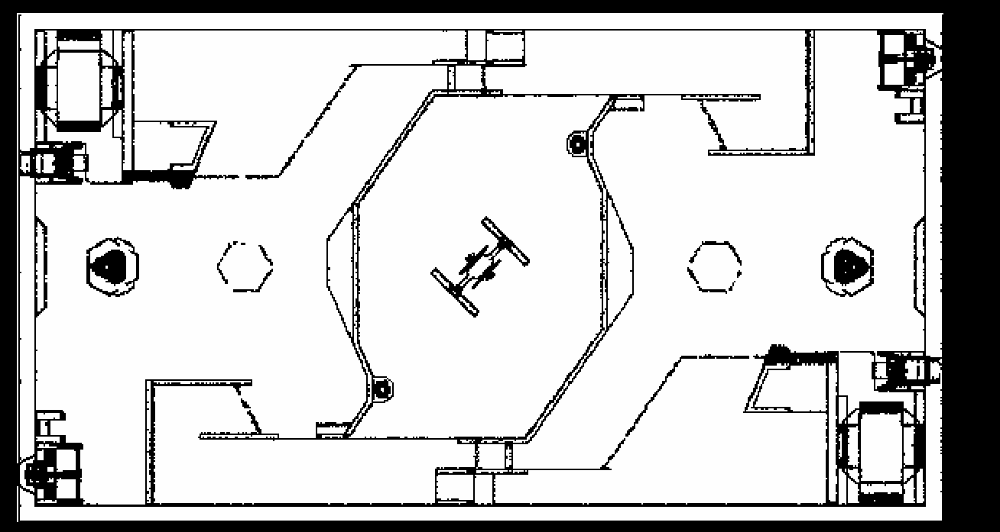
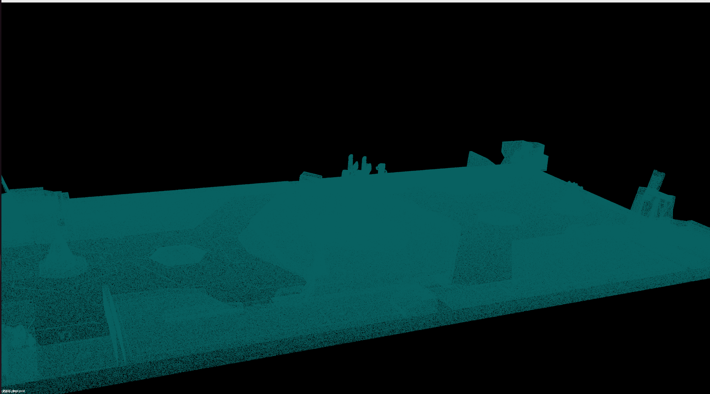
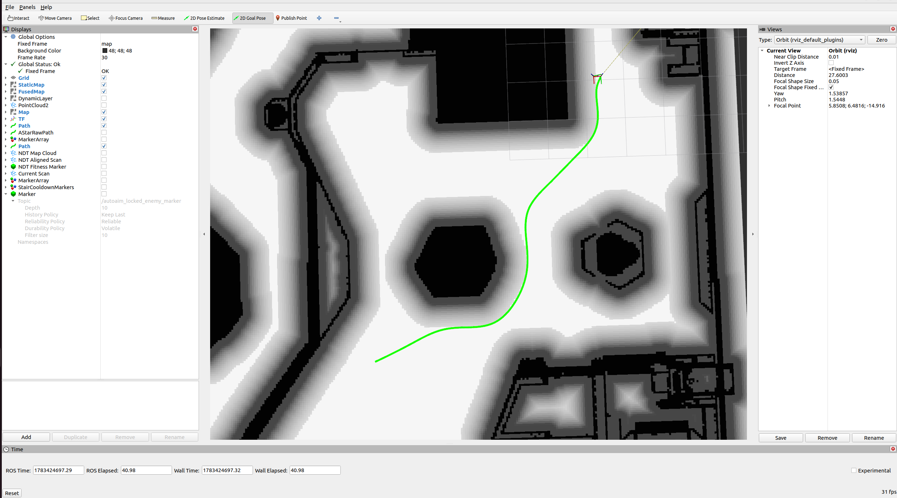
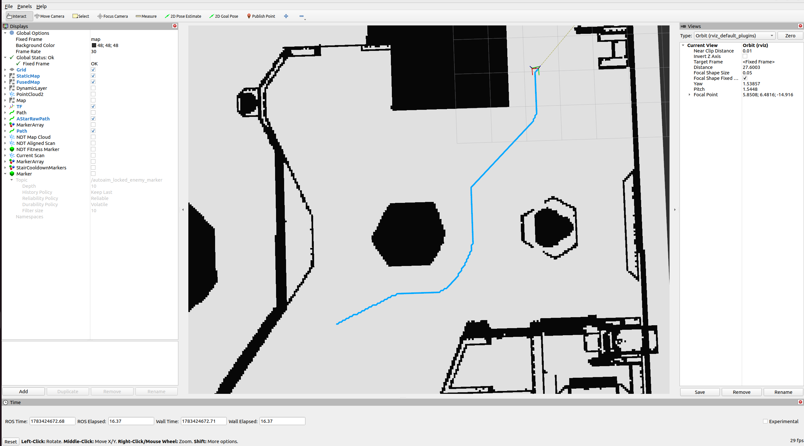
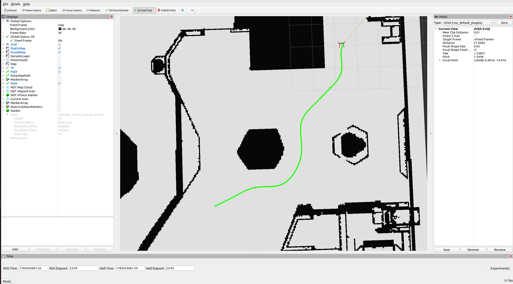
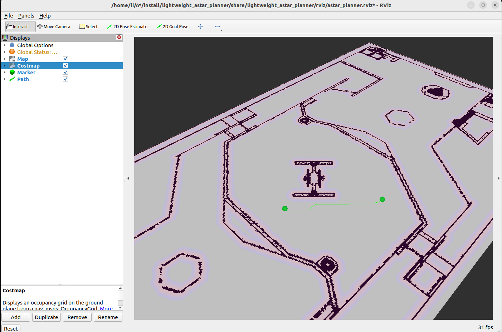

# 第四课：地图、Costmap 与路径规划

前三天我们已经了解了 ROS 2 节点通信、传感器数据、TF 和定位。

从导航系统的角度看，前面几天解决的是：

```text
传感器提供数据
TF 统一坐标关系
定位估计机器人在哪里
```

第四课要解决的是：

```text
机器人知道自己在哪里之后，如何判断哪里能走，并规划出一条路径？
```

本节课暂时不安排 rosbag 和 RViz 实验，先把地图、Costmap 和路径规划的概念讲清楚。

---

## 1. 今日目标

学完本节课后，需要能够回答以下问题：

1. 地图在导航中起什么作用？
2. 2D 栅格地图、3D 点云地图和 Costmap 有什么区别？
3. 为什么机器人不能直接在原始地图上规划？
4. 障碍物膨胀解决了什么问题？
5. A* 是如何在地图上搜索路径的？
6. 为什么规划出来的路径还需要平滑和碰撞检查？
7. 规划失败时，应该按照什么顺序排查？

---


## 2. 地图是什么

地图是机器人对环境的表达。

对人来说，地图可能是一张图片；但对机器人来说，地图必须能被程序计算。

导航中的地图通常要回答：

- 哪些地方可以走？
- 哪些地方是障碍物？
- 哪些地方未知？
- 地图的分辨率是多少？
- 地图属于哪个坐标系？

一句话：

```text
地图不是为了显示，而是为了定位、规划和避障服务。
```

---

## 3. 常见地图类型

### 3.1 2D 栅格地图

2D 栅格地图是移动机器人导航中最常见的地图之一。

它把环境划分成很多小格子，每个格子表示一种状态：

- 空闲区域：机器人可以通过；
- 占用区域：障碍物；
- 未知区域：还不知道能不能走。

在 ROS 中，2D 栅格地图常用：

```text
nav_msgs/msg/OccupancyGrid
```

常见文件形式是：

```text
map.yaml
map.pgm
```

其中：

- `.pgm` 保存地图图像；
- `.yaml` 保存分辨率、原点、占用阈值等信息。

如图：


### 3.2 3D 点云地图

3D 点云地图由大量三维点组成，通常来自 3D LiDAR、深度相机或 LIO/SLAM 算法。

常见文件形式：

```text
.pcd
```

点云地图可以表达空间中的三维结构，例如：

- 墙面；
- 地面；
- 柱子；
- 树木；
- 楼梯；
- 复杂障碍物。

典型用途：

- 3D LiDAR 定位；
- NDT / ICP 匹配；
- LIO 建图；
- 三维环境感知。

如图：

ps:这其实不是用雷达实际扫到的地图，是使用官方的场地图纸转为pcd，供重定位使用，在比赛中精度足够高。

### 3.3 Costmap

Costmap 也叫代价地图，是规划器真正关心的地图。

它不是原始传感器数据，也不是单纯的静态地图，而是把各种信息融合后得到的“通行代价地图”。

Costmap 中每个格子不只是“有障碍”或“没障碍”，还可以表示不同程度的风险。

例如：

- 离障碍物很远：代价低；
- 离障碍物较近：代价高；
- 障碍物本体：不可通行；
- 未知区域：根据配置决定是否允许通过。

一句话：

```text
Costmap 是给规划器用的地图。
```

---

## 4. 地图、点云和 Costmap 的区别

可以用下面这张表区分：

| 类型 | 表示内容 | 主要作用 | 是否直接给规划器使用 |
|---|---|---|---|
| 2D 栅格地图 | 平面占用关系 | 全局导航、AMCL、全局规划 | 可以 |
| 3D 点云地图 | 三维环境结构 | 建图、定位、环境感知 | 通常不能直接用 |
| Costmap | 通行代价 | 路径规划、避障 | 是 |

更直观地说：

```text
点云地图：环境长什么样
栅格地图：平面上哪里占用、哪里空闲
Costmap：机器人走这里的风险有多高
```

---

## 5. OccupancyGrid 基础

`OccupancyGrid` 是 ROS 中常见的二维栅格地图消息。

它主要包含：

- `header.frame_id`：地图所在坐标系，通常是 `map`；
- `info.resolution`：地图分辨率，例如 `0.05` 表示一个格子 5cm；
- `info.width` / `info.height`：地图宽高，单位是格子数量；
- `info.origin`：地图原点在世界坐标系下的位置；
- `data`：每个格子的占用值。

常见占用值：

```text
0    ：空闲
100  ：占用
-1   ：未知
```

地图分辨率非常重要。

例如：

```text
resolution = 0.05
```

表示：

```text
1 个像素 / 格子 = 0.05 米
```

分辨率越小，地图越精细，但计算量也越大。

分辨率越大，地图越粗糙，可能导致窄通道、边界和障碍物表达不准确。

---

## 6. 为什么需要 Costmap

如果机器人只是一个数学上的点，那么它可以只避开障碍物中心。

但真实机器人有尺寸。

例如机器人宽度是 0.5m，那么即使地图上某个格子本身不是障碍物，只要它离墙太近，机器人也不能安全通过，机器人的身体结构会撞到墙。

所以不能直接对原始地图做规划。


## 7. Costmap 的常见层

Costmap 通常不是单层地图，而是多层信息叠加的结果。

常见结构：

```text
Static Layer
Obstacle Layer
Inflation Layer
```

### 7.1 Static Layer

静态层来自已有地图。

例如：

- 提前建好的 2D 地图；
- 从 PGM/YAML 加载的地图；
- 已知的固定障碍物。

它描述环境中长期不变的部分，例如墙、柱子、固定设施。

### 7.2 Obstacle Layer

障碍物层来自实时传感器。

例如：

- 激光雷达；
- 深度相机；
- 点云检测结果；
- 障碍物分割结果。

它用来处理动态障碍，是机器人能否正确避障的关键。

### 7.3 Inflation Layer

膨胀层会把障碍物向外扩展一圈。

原因是：

```text
机器人不能贴着障碍物走。
```

膨胀层会让靠近障碍物的位置代价变高，让规划器更倾向于走安全区域。

---

## 8. 障碍物膨胀

障碍物膨胀是路径规划中非常关键的概念。

假设地图上有一堵墙，墙本身是障碍物。

如果不膨胀，规划器可能会生成一条非常贴墙的路径。

对真实机器人来说，这种路径风险很高，因为：

- 定位有误差；
- 控制有误差；
- 机器人本体有宽度；
- 传感器检测边界有噪声；
- 墙面或障碍物可能不是理想直线。

所以需要把障碍物周围的一圈区域也设置成较高代价。

可以这样理解：

```text
障碍物本体：绝对不能走
障碍物附近：尽量不要走
远离障碍物：优先选择
```
膨胀地图示例：

很深的黑色就是不可通行区域，比较黑的灰色的是cost=99的区域，一般来说是不可通行的，也就是危险区域，最外面是膨胀区,cost逐渐下降。
### 8.1 膨胀半径太小

如果膨胀半径太小，可能导致：

- 路径贴近墙；
- 机器人容易擦碰；
- 控制误差稍大就撞障碍；
- 窄环境中看起来能规划，但实车风险很大。

### 8.2 膨胀半径太大

如果膨胀半径太大，可能导致：

- 窄通道被封死；
- 明明能走的地方被认为不能走；
- 路径绕很远；
- 规划失败。

所以膨胀半径不是越大越好，也不是越小越好，需要结合机器人尺寸和定位控制误差设置，但我们一定要保证机器人不要撞墙。

---

## 9. 路径规划要解决什么问题

路径规划的输入通常包括：

- 起点；
- 目标点；
- 地图或 Costmap；
- 机器人尺寸；
- 规划约束。

输出通常是一条路径：

```text
Pose1 -> Pose2 -> Pose3 -> ... -> Goal
```

路径规划回答：

```text
从当前位置到目标点，是否存在一条可走路径？
如果存在，应该走哪条？
```

一条好的路径通常需要满足：

- 不碰撞；
- 尽量短；
- 尽量远离障碍物；
- 尽量平滑；
- 适合机器人运动能力。

---

## 10. 全局规划与局部规划

导航中常会区分全局规划和局部规划。

### 10.1 全局规划

全局规划在较大范围地图上规划从起点到终点的路径。

它关注：

- 从哪里走到哪里；
- 大方向怎么绕开障碍；
- 是否存在可行路线。

全局规划通常使用：

- 静态地图；
- 全局 Costmap；
- A*；
- Dijkstra；
- Hybrid A*；


### 10.2 局部规划

局部规划更关注机器人附近的一小段运动。

它关注：

- 眼前障碍物如何避开；
- 当前速度是否安全；
- 下一小段轨迹怎么走；
- 如何贴近全局路径。

局部规划可以靠更新Obstacle Layer的时候进行路径重规划，这种方法易于实现，但依赖路径计算速度以及障碍物层的更新能力。

本节课主要讲：

```text
全局路径规划的基本思想
```

---

## 11. A* 算法的基本思想

A* 是路径规划中非常经典的搜索算法。

它适合在栅格地图上寻找从起点到目标点的路径。

A* 的核心公式是：

```text
f = g + h
```

其中：

- `g`：从起点走到当前点已经花费的代价；
- `h`：从当前点到目标点的估计代价；
- `f`：综合代价。

A* 每次优先扩展 `f` 最小的点。

可以这样理解：

```text
g 让算法知道已经走了多远
h 让算法朝目标方向搜索
f 让算法在已走代价和目标方向之间做平衡
```

### 11.1 Dijkstra 和 A* 的区别

Dijkstra 只考虑：

```text
g
```

它会从起点向四周均匀扩散，直到找到目标。

A* 考虑：

```text
g + h
```

它会被目标方向引导，通常搜索效率更高。

简单理解：

```text
Dijkstra：稳，但可能搜索很多无关区域
A*：有方向感，通常更快
```
关于a*的算法介绍，在https://www.redblobgames.com/pathfinding/a-star/introduction.html中讲的很好，我强烈建议看看。

---

## 12. A* 中的地图代价

在真实导航中，A* 不只是在空白网格上搜索。

它需要考虑 Costmap 中的代价。

例如：

- 障碍物格子不能走；
- 靠近障碍物的格子代价更高；
- 未知区域可能不允许走；
- 转弯、绕路可能有额外代价。

因此，A* 找到的不一定是几何上最短的路径，而是综合代价较低的路径。

这也是为什么有时路径看起来“绕了一点”，但实际更安全。

---

## 13. 原始路径的问题

A* 在栅格地图上搜索出来的路径，通常是由一串离散格子组成的。

它常见问题包括：

- 折线明显；
- 转角尖锐；
- 不够平滑；
- 距离障碍物过近；
- 不符合机器人运动学约束；
- 直接跟踪可能导致控制不稳定。

例如，在八邻域网格中，路径可能呈现很多直线和斜线拼接。
就像这样

显然这种路径拿来控制机器人显然是不符合正常的行动的。所以我们需要对a*生成的路径做后处理。


## 14. 路径后处理

路径后处理的目的是让路径更适合真实机器人执行。

常见后处理包括：

### 14.1 路径重采样

原始路径点间距可能不均匀。

重采样会按照固定间距重新生成路径点，例如每隔 0.1m 一个点。

好处是：

- 方便控制器读取；
- 方便计算曲率；
- 方便做碰撞检查；
- 路径点分布更稳定。

### 14.2 路径平滑

对于a*这种折角很多的路径，对其平滑是非常重要的。

对一条路径进行平滑，主要有以下几种方法：
1. 曲线拟合与样条插值法
运用数学上的连续函数（如多项式）对折线顶点进行拟合，使得平滑后的曲线在数学上具有 一阶导数连续（速度连续） 甚至 二阶导数连续（加速度/曲率连续）。
    代表算法有：B 样条曲线 (B-Spline)和三次样条插值 (Cubic Spline)区别是一个不会经过所有控制点，一个要求必须经过每一个给定的控制点。
2. 基于数学优化的平滑法
将平滑问题转化为一个多目标数学优化问题。我们把路径点看作是一连串通过“虚拟弹簧”连接的质点，通过定义一个“代价函数（Cost Function）”，在满足障碍物约束的前提下，微调每个路径点的位置，使总代价最小。
代表算法：
    梯度下降平滑法：通过计算梯度，让路径点顺着“变平滑、远离障碍物”的方向不断迭代微调（在 ROS 的导航包 Nav2 中常用）。
    二次规划（Quadratic Programming, QP）平滑：如果能将优化问题建模为凸优化（如 Minimum Snap/Minimum Jerk 轨迹生成），就可以利用成熟的数学求解器在极短时间内求得全局最优解（常用于无人机轨迹规划）

此外还有其他的方法，在此就不过多赘述，一般来说，a*算法和B-spline就已经可以满足大多数情况下的要求了，但是对于需要通过特殊地形的机器人，通过对路径的代价建模进行类似机器学习的路径规划，可能是后续路径规划需要优化的方向。


---


## 15. 本节课需要记住的主线

第四课可以用这一条线串起来：

```text
地图表示环境
Costmap 表示通行代价
A* 在 Costmap 上搜索路径
路径后处理让路径更适合执行
排查问题时先看数据和坐标，再看算法
```

最重要的不是背算法，而是建立系统意识：

```text
规划失败时，不一定是规划算法错了。
```

很多时候问题来自：

- 地图；
- TF；
- 起点；
- 目标点；
- Costmap；
- 参数；
- 后处理。

---

## 16. 课堂思考题

1. 为什么机器人不能只把障碍物本身当成不可通行区域？
2. 膨胀半径设置过大会发生什么？
3. 膨胀半径设置过小会发生什么？
4. A* 中 `g`、`h`、`f` 分别代表什么？
5. 为什么 A* 规划出来的路径通常还需要平滑？
6. 如果目标点在障碍物里，应该修改算法还是修改目标点？
7. 如果 RViz 中地图正常，但规划失败，下一步应该检查什么？

## 17. 练习：

学习部署github开源路径规划项目
https://github.com/hellokea771/A-
请打开这个仓库，部署里面的路径规划算法，要求提交一张这样的rviz图片：

有起始点和目标点，还有a*规划出来的路径

**ps:** 通过这个项目，理解launch文件的作用，还有膨胀地图是如何影响路径规划的。
