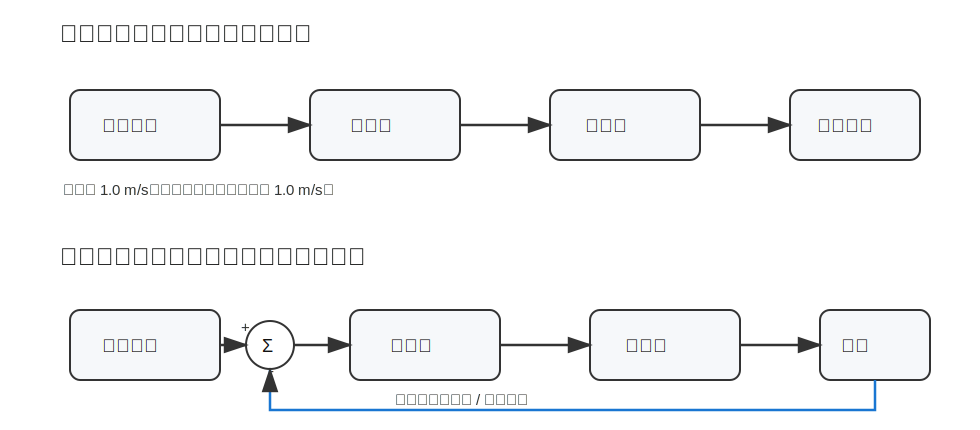
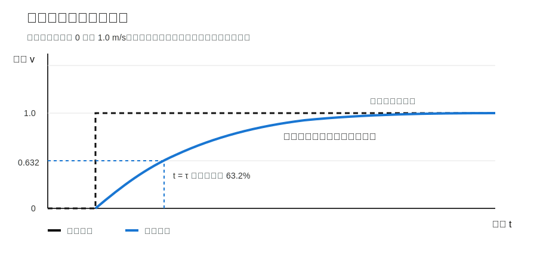
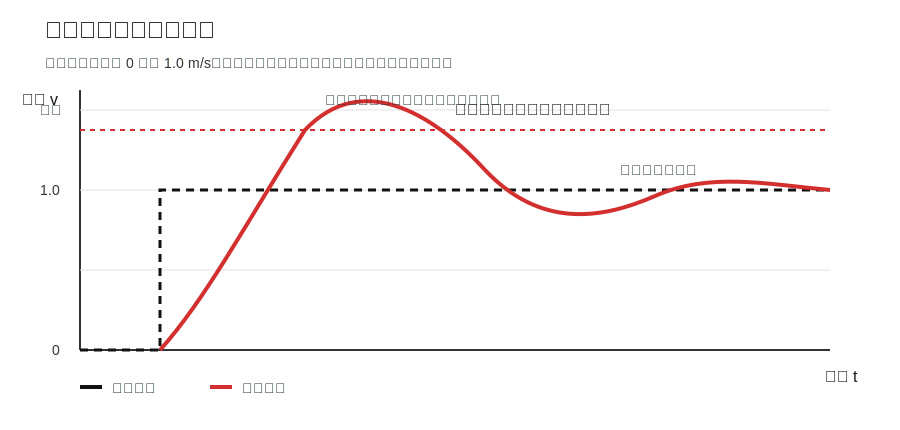
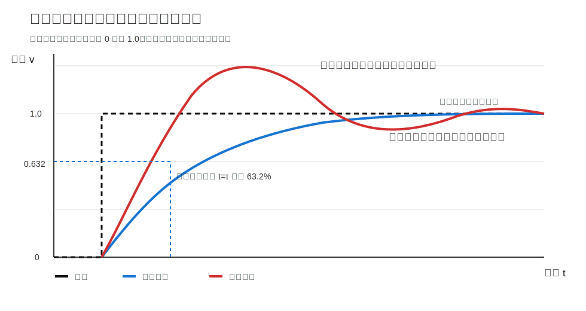
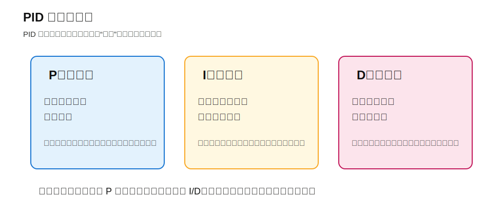

# 控制原理基础

这份文档面向没有学过自动化、控制原理的同学。

目标不是把控制理论讲成数学课，而是让大家先建立几个直觉：

- 控制器到底在控制什么；
- 为什么需要反馈；
- 为什么机器人不会立刻达到目标速度；
- 一阶模型、二阶模型、PID 这些词分别是什么意思；
- 为什么调控制器时要看曲线，而不是凭感觉。

学完这部分后，再去理解路径跟踪、轨迹跟踪、MPC/NMPC 会容易很多。

---

## 1. 为什么机器人需要控制

机器人导航里，规划器可以告诉机器人：

```text
应该往哪里走
```

但它不会直接让机器人动起来。

例如，规划器输出一条路径：

```text
当前位置 → 点1 → 点2 → 点3 → 目标点
```

控制器要解决的是：

```text
现在应该给机器人多大的速度？
应该向左转还是向右转？
速度要不要变慢？
偏离目标后怎么修正？
```

简单说：

```text
控制就是根据目标和当前状态，计算输入，让系统朝目标变化。
```

**但是在导航上位机的控制器，控制器一般只管发目标速度，如何达到这个速度是电控的事情，我们要做的是上位机的建模要和电控的模型匹配。**

---

## 2. 控制系统的基本组成

一个控制系统通常包括：

- 目标值：希望系统达到什么状态；
- 控制器：根据误差计算控制输入；
- 被控对象：真正被控制的东西，例如机器人底盘、电机；
- 输出：系统实际表现，例如实际速度、实际位置；
- 反馈：把实际输出测量回来；
- 误差：目标值和实际值的差。

最核心的一句话：

```text
误差 = 目标值 - 实际值
```

例如：

```text
目标速度 = 1.0 m/s
实际速度 = 0.6 m/s
误差 = 0.4 m/s
```

控制器要做的事情，就是让误差逐渐变小。

---

## 3. 开环控制与闭环控制

先看图：



### 3.1 开环控制

开环控制的特点是：

```text
只发命令，不看结果。
```

例如：

```text
给底盘发送 1.0 m/s
然后假设机器人真的跑到了 1.0 m/s
```

问题是，真实机器人会受到很多影响：

- 地面摩擦不同；
- 电池电压变化；
- 机器人负载变化；
- 轮子打滑；
- 电机响应有延迟；
- 机械结构有间隙。

所以开环控制简单，但抗干扰能力弱。

### 3.2 闭环控制

闭环控制的特点是：

```text
不断测量实际结果，并根据误差修正输入。
```

例如：

```text
目标速度是 1.0 m/s
实际速度只有 0.6 m/s
控制器发现误差是 0.4 m/s
于是继续修正控制输入
```

闭环控制的优势是：

- 能抵抗扰动；
- 能修正模型误差；
- 能让系统更接近期望状态。

机器人导航里的控制基本都需要闭环，用来增加输出的可信度。

---

## 4. 模型是什么

控制里常说“模型”，它不是三维模型，而是：

```text
描述输入和输出之间关系的数学表达。
```

例如：

```text
输入：当前位置，轨迹，上一次的速度
输出：控制速度
```

如果我们知道输入和输出之间大概怎么变化，就可以预测机器人接下来会怎么动。

为什么要建模？

- 理解系统响应；
- 预测未来状态；
- 设计控制器；
- 调参数；
- 判断系统是否稳定。

对新人来说，先掌握两个最常见的模型就够：

```text
一阶模型
二阶模型
```

---

## 5. 一阶模型

一阶模型常用来描述这种现象：

```text
系统不会瞬间达到目标，而是慢慢接近目标。
```

例如机器人目标速度从 0 变成 1.0 m/s，但实际速度可能是：

```text
0.0 → 0.3 → 0.5 → 0.7 → 0.85 → 0.95 → 1.0
```

只看速度曲线，大概是下面这样：



黑色虚线是输入的目标速度，蓝色曲线是机器人实际速度。

一阶系统最重要的直觉是：

```text
目标速度已经给出去了，但实际速度需要一点时间慢慢追上。
```

典型一阶模型可以写成：

```text
τ * dy/dt + y = K * u
```

也可以理解成：

```text
输出变化速度 = 当前输出和目标输出之间的差 / 时间常数
```

其中：

- `u`：输入；
- `y`：输出；
- `K`：增益；
- `τ`：时间常数。

### 5.1 时间常数 τ

`τ` 是一阶模型里最重要的参数。

可以这样理解：

```text
τ 越小，系统反应越快。
τ 越大，系统反应越慢。
```

对于一阶系统，输入发生阶跃后，输出大约会在 `t = τ` 时达到最终变化量的 63.2%。

例如目标速度从 0 变成 1.0 m/s：

```text
t = τ 时，速度大约达到 0.632 m/s
```

---

## 6. 二阶模型

二阶模型用来描述更复杂的响应。

它常见于：

- 系统有明显惯性；
- 控制太激进；
- 机械结构有弹性；
- 反馈延迟明显；
- 系统会超调或振荡。

二阶模型常见形式是：

```text
d²y/dt² + 2ζωn dy/dt + ωn²y = Kωn²u
```
在一般的机器人模型几乎都是二阶系统。
有两个关键参数：

- `ωn`：自然频率，和响应快慢有关；
- `ζ`：阻尼比，决定系统会不会振荡。

### 6.1 阻尼比 ζ

阻尼比可以理解成：

```text
系统“刹住振荡”的能力。
```

| 阻尼比 | 现象 |
|---|---|
| `ζ < 1` | 欠阻尼，容易超调和振荡 |
| `ζ = 1` | 临界阻尼，较快且不振荡 |
| `ζ > 1` | 过阻尼，稳定但响应慢 |

直觉：

```text
阻尼太小：系统太冲，容易来回摆。
阻尼太大：系统太稳，反应慢。
```

只看速度曲线，二阶系统大概是下面这样：



黑色虚线是输入的目标速度，红色曲线是机器人实际速度。

二阶系统和一阶系统最大的区别是：

```text
一阶系统通常是慢慢接近目标。
二阶系统可能先冲过目标，再来回振荡，最后才稳定下来。
```

---

## 7. 阶跃输入是什么

学完一阶模型和二阶模型后，再来看“阶跃输入”会更容易理解。

阶跃输入就是：

```text
输入突然从一个值跳到另一个值。
```

例如速度指令：

```text
0 m/s → 1.0 m/s
```

这就是一个速度阶跃。

阶跃输入最大的作用之一，就是用来观察和辨识系统模型。

通过给系统一个简单、明确的输入变化，我们可以观察：

- 系统反应快不快；
- 有没有延迟；
- 有没有超调；
- 会不会振荡；
- 最后能不能稳定下来；
- 更像一阶模型还是二阶模型。

---

## 8. 一阶模型与二阶模型的响应区别

先看图：



图中虚线是输入速度阶跃，蓝线是一阶模型输出，红线是二阶模型输出。

一阶模型的特点：

- 输出平滑接近目标；
- 通常不超调；
- 曲线比较“钝”；
- 适合描述简单滞后。

二阶模型的特点：

- 可能超过目标值；
- 可能振荡；
- 能表达更复杂的动态；
- 适合描述带惯性、弹性、延迟和控制过激的系统。

---

## 9. 如何用阶跃响应辨识一阶模型

如果我们想知道一个系统的一阶时间常数，可以这样做：

1. 给系统一个阶跃输入；
2. 记录输出随时间变化的曲线；
3. 找到输出最终稳定值；
4. 找到输出达到最终变化量 63.2% 的时间；
5. 这个时间大约就是 `τ`。

例如：

```text
输入速度从 0 变成 1.0 m/s
实际速度最终稳定在 0.9 m/s
0.9 × 63.2% ≈ 0.57 m/s
如果实际速度在 0.4 秒时到达 0.57 m/s
那么 τ ≈ 0.4 秒
```

如果系统最终输出没有达到输入值，说明系统存在增益：

```text
K = 输出最终值 / 输入最终值
```

例如：

```text
输入 1.0 m/s
最终输出 0.9 m/s
K = 0.9
```

这就是最简单的模型辨识。

---

## 10. 超调、振荡与稳定

### 10.1 超调

超调是指输出超过目标值。

例如目标速度是：

```text
1.0 m/s
```

但实际速度冲到了：

```text
1.2 m/s
```

这就是超调。

### 10.2 振荡

振荡是指输出在目标值附近来回摆动。

例如：

```text
0.9 → 1.1 → 0.95 → 1.05 → 1.0
```

机器人路径跟踪中，振荡可能表现为：

- 车头左右摆；
- 路径附近蛇形；
- 终点附近来回调整。

### 10.3 稳定

稳定是指系统不会发散，最终能收敛到某个合理状态。

控制器不是越猛越好。

好的控制器通常需要在三件事之间平衡：

```text
快
准
稳
```

---

## 11. PID 控制

PID 是最经典的反馈控制方法之一。

公式可以写成：

```text
u = Kp * e + Ki * ∫e dt + Kd * de/dt
```

其中：

- `e`：误差；
- `u`：控制输出；
- `Kp`：比例增益；
- `Ki`：积分增益；
- `Kd`：微分增益。

先看直觉图：



### 11.1 P：比例控制

P 看的是当前误差。

```text
误差越大，修正越大。
```

例如机器人朝向偏差很大，就给更大的角速度。

问题：

- `Kp` 太小：反应慢；
- `Kp` 太大：容易振荡。

### 11.2 I：积分控制

I 看的是过去累计误差。

如果系统长期差一点到不了目标，积分项会慢慢补偿。

问题：

- 积分太大可能导致超调；
- 积分累积过多叫积分饱和。

### 11.3 D：微分控制

D 看的是误差变化趋势。

如果误差正在快速变大，D 项会提前抑制。

问题：

- D 对噪声敏感；
- 传感器抖动会导致 D 项抖动。


### 11.4

我讲pid并不是说我们用的就是pid控制，目的是想让大家了解一个控制器是如何工作的，输入是什么，又是怎么得到输出的，各种参数影响什么部分。以后在调其他控制算法的时候也要有这种概念。

---

## 13. 小结

这份文档需要掌握的核心概念：

- 控制是让系统输出接近目标；
- 闭环控制依赖反馈；
- 模型描述输入和输出关系；
- 阶跃响应可以帮助我们认识系统动态；
- 一阶模型描述平滑滞后；
- 二阶模型可以描述超调和振荡；
- PID 是根据误差进行修正的经典方法；


可以用一句话总结：

```text
控制 = 目标 + 反馈 + 模型 + 控制律
```
