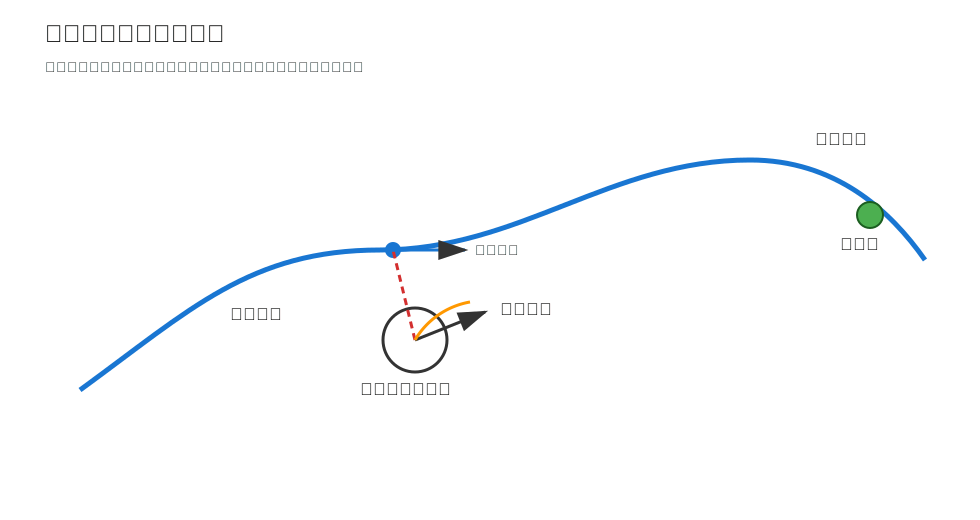
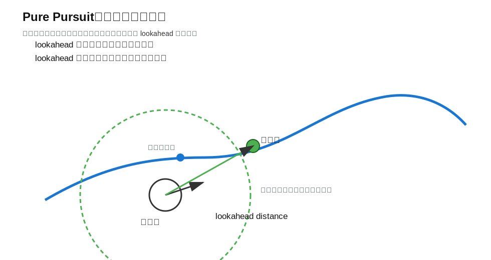
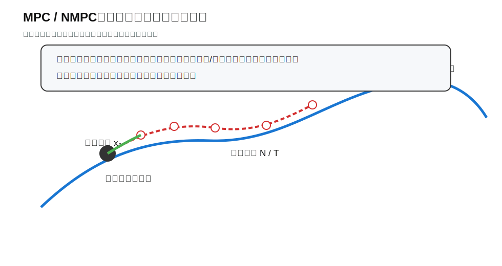

# 路径跟踪、轨迹跟踪与控制器

这份文档承接第四天的路径规划。

第四天讲的是：

```text
如何从地图上规划出一条路径
```

第五天这部分要讲的是：

```text
有了路径以后，机器人如何沿着路径运动
```

这份文档会介绍：

- 路径、轨迹、控制指令的区别；
- 路径跟踪和轨迹跟踪的区别；
- 跟踪误差是什么；
- Pure Pursuit、Stanley、PID 在跟踪中的作用；
- MPC/NMPC 的基本思想。

---

## 1. 从路径规划到控制

路径规划器输出的是一串点。

在 ROS 中，常见路径消息是：

```text
nav_msgs/msg/Path
```

它大致表示：

```text
Pose1 → Pose2 → Pose3 → ... → Goal
```

但路径本身不会让机器人运动。

机器人真正执行的是速度指令，例如：

```text
geometry_msgs/msg/Twist
```

因此导航控制器要完成的转换是：

```text
Path + 当前机器人位姿 → Controller → cmd_vel
```

也就是说：

```text
规划器负责“走哪条路”
控制器负责“现在怎么动”
```

---

## 2. `cmd_vel` 与机器人运动

在 ROS 移动机器人中，常见速度指令话题是：

```text
/cmd_vel
```

消息类型通常是：

```text
geometry_msgs/msg/Twist
```

常用字段：

```text
linear.x   前进 / 后退速度
linear.y   左右平移速度，全向底盘常用
angular.z  绕 z 轴旋转角速度
```

对于差速机器人，最常用的是：

```text
linear.x
angular.z
```

例如：

```text
linear.x = 0.5
angular.z = 0.0
```

表示向前走。

```text
linear.x = 0.0
angular.z = 1.0
```

表示原地旋转。

需要注意：

```text
cmd_vel 不是电机电流，也不是 PWM。
cmd_vel 是给底盘的期望速度。
```

将这个速度传给电控，电控再转成电机的控制信号。

---

## 3. 路径、轨迹、控制指令的区别

这三个概念很容易混。

| 概念 | 内容 | 例子 |
|---|---|---|
| 路径 Path | 空间上的路线 | 从 A 到 B 经过哪些点 |
| 轨迹 Trajectory | 路径 + 时间 / 速度信息 | 第 1 秒到哪里，第 2 秒到哪里 |
| 控制指令 Control | 当前时刻发给机器人的输入 | 当前发 0.5 m/s 和 0.2 rad/s |

简单理解：

```text
路径：走哪
轨迹：什么时候走到哪
控制：现在该怎么动
```

路径规划器一般输出路径。

轨迹生成器会进一步给路径加上速度、时间、加速度等信息。

控制器根据当前状态和目标轨迹，输出当前时刻的控制指令。

---

## 4. 路径跟踪与轨迹跟踪

### 4.1 路径跟踪

路径跟踪只关心：

```text
机器人是否沿着几何路径走
```

它不强制机器人必须在某个时间到达某个点。

例如：

```text
只要沿着这条线走到终点就可以
```

### 4.2 轨迹跟踪

轨迹跟踪不仅关心位置，还关心时间和速度。

例如：

```text
第 1 秒到点 A
第 2 秒到点 B
第 3 秒速度降到 0.2 m/s
```

轨迹跟踪比路径跟踪要求更高。

可以这样理解：

```text
路径跟踪偏几何；
轨迹跟踪偏动态系统。
```

---

## 5. 跟踪误差

控制器需要知道机器人偏得有多厉害。

常见误差包括：

- 横向误差：机器人离路径有多远；
- 航向误差：机器人朝向和路径方向差多少；
- 纵向误差：机器人在路径前后方向的偏差；
- 速度误差：实际速度和期望速度的差；
- 终点误差：机器人离目标点还有多远。

看图：



路径跟踪控制器通常会根据这些误差计算速度指令。

例如：

```text
横向误差大 → 需要转向修正
航向误差大 → 需要更大的角速度
接近终点 → 需要降低线速度
```

---

## 6. Pure Pursuit

Pure Pursuit 是一种非常经典、直观的路径跟踪方法。

它的思想是：

```text
不要追最近点，而是追路径前方的一个目标点。
```

看图：



步骤可以理解为：

1. 找到机器人距离路径最近的点；
2. 沿着路径往前找一个距离为 `lookahead` 的目标点；
3. 让机器人朝这个目标点运动；
4. 机器人前进后，不断更新新的目标点。

### 6.1 lookahead 距离

`lookahead` 是 Pure Pursuit 最重要的参数。

如果 `lookahead` 太小：

- 跟路径很紧；
- 反应灵敏；
- 容易抖动；
- 对定位噪声敏感。

如果 `lookahead` 太大：

- 运动更平滑；
- 不容易抖；
- 但转弯可能切弯；
- 复杂路径下可能跟踪不准。

简单说：

```text
lookahead 小：准但抖。
lookahead 大：稳但可能切弯。
```
后面的mpc控制器也用了这种思想

---

## 7. Stanley 方法

Stanley 也是一种路径跟踪方法。

它主要考虑两个误差：

- 航向误差；
- 横向误差。

直觉上：

```text
车头方向不对，要修正；
车离路径太远，也要修正。
```

Stanley 方法常见于自动驾驶车辆路径跟踪。

对于入门来说，只需要知道：

```text
Pure Pursuit 更像“追前方目标点”；
Stanley 更像“同时修正航向误差和横向误差”。
```

---


## 9. 速度规划

路径告诉机器人往哪里走，但没有告诉机器人应该走多快。

速度规划要考虑：

- 直道可以快；
- 弯道要慢；
- 接近终点要慢；
- 障碍物附近要慢；
- 加速度不能太大；
- 角速度不能太大。

一个很重要的直觉：

```text
路径越弯，速度应该越低。
```

原因是转弯时会产生横向加速度。

如果速度太快：

- 机器人可能甩出去；
- 跟踪误差变大；
- 控制器来不及修正；
- 实车运动不稳定。

所以控制器通常不是只输出方向，也会限制速度。

---

## 10. MPC / NMPC 基本思想

MPC 是 Model Predictive Control，模型预测控制。

NMPC 是 Nonlinear Model Predictive Control，非线性模型预测控制。

先看图：



它的核心思想是：

```text
每个控制周期都预测未来一段时间，
计算一组最优控制量，
只执行第一步，
下一周期重新预测和优化。
```

这叫滚动优化。

### 10.1 为什么要预测未来

如果控制器只看当前误差，可能会出现：

- 现在看起来对，但下一秒会撞；
- 现在速度很快，但前面马上要急转；
- 当前离路径近，但趋势正在偏离。

预测未来可以让控制器提前考虑后果。

### 10.2 MPC 与 NMPC 的区别

简单理解：

```text
MPC：使用相对简单或线性的模型。
NMPC：使用非线性模型，更适合复杂机器人系统。
```

移动机器人转弯、速度限制、复杂运动学通常都是非线性的，所以 NMPC 更灵活，但计算也更复杂。

---

## 11. 状态量和控制量

MPC/NMPC 里常说“状态量”和“控制量”。

### 11.1 状态量

状态量描述系统现在是什么样。

对于移动机器人，可以包括：

```text
x
y
yaw
v
omega
```

也就是：

- 位置；
- 朝向；
- 线速度；
- 角速度。

### 11.2 控制量

控制量描述我们能施加什么输入。

可以是：

```text
linear velocity
angular velocity
```

也可以是更底层的：

```text
linear acceleration
angular acceleration
```

区别是：

```text
状态量描述“现在怎么样”；
控制量描述“我能怎么改变它”。
```

---

## 12. 参考轨迹

MPC/NMPC 需要一个参考目标。

这个目标可以来自：

- 全局路径；
- 局部路径；
- 轨迹生成器；
- 手动设置的目标点。

参考轨迹通常包括：

- 参考位置；
- 参考航向；
- 参考速度；
- 参考时间。

控制器会尽量让预测出来的未来运动接近参考轨迹。

---

## 13. 预测时域

预测时域表示控制器往未来看多远。

例如：

```text
未来 1.5 秒
分成 50 个小步
```

预测时域太短：

- 反应快；
- 但容易只看眼前；
- 可能提前量不够。

预测时域太长：

- 考虑更远；
- 但计算量更大；
- 对模型准确性要求更高。

所以预测时域也是需要权衡的参数。

---

## 14. 代价函数

MPC/NMPC 要知道什么叫“好”。

这由代价函数定义。

代价函数可以包含：

- 离参考路径近；
- 航向误差小；
- 速度接近期望；
- 控制量不要太大；
- 加速度不要太猛；
- 离障碍物远。

可以理解为：

```text
代价函数是控制器的评分标准。
```

控制器会选择“总分最低”的控制方案。

---

## 15. 约束

MPC/NMPC 的一个优势是可以显式考虑约束。

常见约束包括：

- 最大线速度；
- 最大角速度；
- 最大线加速度；
- 最大角加速度；
- 不能穿过障碍物；
- 不能倒车；
- 不能超过机器人运动能力。

这很重要，因为真实机器人不是想怎么动就能怎么动。

```text
好的控制器必须尊重物理限制。
```

---

## 16. 控制器输出与执行

无论控制器内部多复杂，最终都要输出机器人能执行的命令。

在 ROS 移动机器人中，常见输出就是：

```text
/cmd_vel
```

也就是：

```text
geometry_msgs/msg/Twist
```

所以可以把整个导航控制链路理解为：

```text
地图 → 路径规划 → 路径/轨迹 → 控制器 → cmd_vel → 底盘
```

---

## 17. 常见跟踪失败现象

### 17.1 路径附近左右摆动

可能原因：

- 控制太激进；
- lookahead 太小；
- 速度太快；
- 定位噪声大。

### 17.2 转弯时切弯

可能原因：

- lookahead 太大；
- 速度太快；
- 弯道没有提前减速。

### 17.3 跟踪滞后

可能原因：

- 系统响应慢；
- 一阶/二阶模型参数不准；
- 底盘速度跟不上指令；
- 控制器太保守。

### 17.4 终点附近来回调整

可能原因：

- 到达容差太小；
- 控制器没有减速；
- 航向误差权重过大；
- 定位抖动。

---

## 18. 实验：ROS2 + RViz2 实现 Pure Pursuit 虚拟小车路径跟踪

这个实验不使用 Gazebo，也不连接实车。

实验目标是借助 AI 工具，编写一个轻量 ROS2 程序，在 RViz2 中显示一辆 URDF 虚拟小车，并使用 Pure Pursuit 控制器让小车沿参考路径运动。

实验中的完整链路是：

```text
/reference_path
      ↓
Pure Pursuit 控制器
      ↓
/cmd_vel
      ↓
虚拟小车运动模型
      ↓
/odom + TF + /actual_path
      ↓
RViz2 显示小车运动效果
```

这条链路和真实机器人导航很接近：

```text
路径规划器输出路径
控制器输出速度
底盘执行速度并发布里程计
RViz2 用 TF 和话题显示机器人状态
```

### 18.1 实验最终效果

运行后，RViz2 中需要看到：

- 一辆简单 URDF 小车；
- 参考路径 `/reference_path`；
- 实际运动轨迹 `/actual_path`；
- Pure Pursuit 当前追踪点 `/lookahead_point`；
- TF 坐标系 `odom -> base_link`；
- 小车沿参考路径运动。

小车模型不需要复杂。

可以只包含：

```text
base_link
body_link
front_link
left_wheel_link
right_wheel_link
```

其中 `front_link` 用不同颜色表示车头方向。

### 18.2 推荐包结构

建议创建一个 ROS2 Python 功能包。

包结构可以参考：

```text
pure_pursuit_rviz_demo/
├── package.xml
├── setup.py
├── launch/
│   └── demo.launch.py
├── urdf/
│   └── simple_car.urdf
├── rviz/
│   └── pure_pursuit_demo.rviz
└── pure_pursuit_rviz_demo/
    ├── path_publisher.py
    ├── pure_pursuit_controller.py
    ├── virtual_robot.py
    └── common.py
```

这里使用 Python 是为了降低实验难度。

这节课的重点不是 C++ 工程结构，而是理解：

```text
路径、位姿、控制器、cmd_vel、odom、TF 之间的关系。
```

### 18.3 需要实现的节点

#### 18.3.1 路径发布节点

节点功能：

```text
模拟路径规划器，发布一条参考路径。
```

发布话题：

```text
/reference_path    nav_msgs/msg/Path
```

路径可以是：

- 直线路径；
- S 形路径；
- 转弯路径。

#### 18.3.2 Pure Pursuit 控制器节点

节点功能：

```text
根据参考路径和当前机器人位姿，计算速度指令。
```

订阅：

```text
/reference_path    nav_msgs/msg/Path
/odom              nav_msgs/msg/Odometry
```

发布：

```text
/cmd_vel           geometry_msgs/msg/Twist
/lookahead_point   visualization_msgs/msg/Marker
```

控制器需要完成：

1. 找到路径上离机器人最近的点；
2. 从最近点向前寻找 `lookahead_distance` 对应的目标点；
3. 计算机器人当前朝向到目标点方向的夹角 `alpha`；
4. 根据 Pure Pursuit 公式计算角速度；
5. 发布 `/cmd_vel`；
6. 在 RViz2 中显示当前追踪的 lookahead 点。

可以使用下面的公式：

```text
curvature = 2 * sin(alpha) / target_distance
omega = v * curvature
```

其中：

- `alpha`：机器人当前朝向与目标点方向的夹角；
- `target_distance`：机器人到 lookahead 点的距离；
- `v`：线速度；
- `omega`：角速度。

#### 18.3.3 虚拟小车节点

节点功能：

```text
模拟真实底盘执行 /cmd_vel 后的运动。
```

订阅：

```text
/cmd_vel    geometry_msgs/msg/Twist
```

发布：

```text
/odom          nav_msgs/msg/Odometry
/actual_path   nav_msgs/msg/Path
TF: odom -> base_link
```

运动模型使用：

```text
x = x + v * cos(yaw) * dt
y = y + v * sin(yaw) * dt
yaw = yaw + omega * dt
```

需要注意：

```text
RViz2 中的小车不是被 /cmd_vel 直接移动的。
真正让小车移动的是虚拟小车节点发布的 odom -> base_link。
```

### 18.4 URDF 与 TF 要求

URDF 只负责描述小车长什么样。

小车运动依赖 TF：

```text
odom
 └── base_link
      ├── body_link
      ├── front_link
      ├── left_wheel_link
      └── right_wheel_link
```

其中：

- `odom -> base_link`：由虚拟小车节点动态发布；
- `base_link -> body_link`：由 URDF 固定关节描述；
- `base_link -> front_link`：由 URDF 固定关节描述；
- `base_link -> wheel_link`：由 URDF 固定关节描述。

也就是说：

```text
虚拟小车节点负责“车在哪里”
URDF 负责“车长什么样”
robot_state_publisher 负责发布车体内部固定 TF
```

### 18.5 Launch 文件要求

需要编写一个 launch 文件，一键启动：

- `robot_state_publisher`；
- 路径发布节点；
- 虚拟小车节点；
- Pure Pursuit 控制器节点；
- RViz2。

launch 文件需要支持参数：

```text
lookahead_distance
target_speed
path_type
use_rviz
```

示例运行命令：

```bash
ros2 launch pure_pursuit_rviz_demo demo.launch.py
```

修改 lookahead：

```bash
ros2 launch pure_pursuit_rviz_demo demo.launch.py lookahead_distance:=0.5
```

修改速度：

```bash
ros2 launch pure_pursuit_rviz_demo demo.launch.py target_speed:=1.2
```

切换路径：

```bash
ros2 launch pure_pursuit_rviz_demo demo.launch.py path_type:=corner
```


生成代码后，需要继续让 AI 解释：

```text
请解释这个实验中 /reference_path、/cmd_vel、/odom、TF、URDF 和 RViz2 分别起什么作用。
```

### 18.7 需要对比的参数

至少运行三组参数：

| 实验 | lookahead_distance | target_speed | 观察重点 |
|---|---:|---:|---|
| A | 0.5 | 0.6 | 是否更贴近路径，是否更容易抖动 |
| B | 1.2 | 0.6 | 是否更平滑，转弯是否切弯 |
| C | 1.2 | 1.2 | 速度变快后跟踪误差是否增大 |


### 18.8 需要掌握的 ROS2 命令

查看节点：

```bash
ros2 node list
```

查看话题：

```bash
ros2 topic list
```

查看速度指令：

```bash
ros2 topic echo /cmd_vel
```

查看里程计：

```bash
ros2 topic echo /odom
```

查看路径：

```bash
ros2 topic echo /reference_path
```

查看 TF：

```bash
ros2 run tf2_tools view_frames
```

### 18.9 实验提交内容

最终需要提交：

```text
1. ROS2 功能包源码
2. launch 文件
3. URDF 小车模型
4. RViz2 运行截图
5. /reference_path、/cmd_vel、/odom、TF 的命令行查看截图
6. 三组参数对比结果
7. 简短实验分析
```

实验分析至少回答：

```text
1. /reference_path 在这个实验中代表什么？
2. Pure Pursuit 为什么要追 lookahead 点，而不是最近点？
3. /cmd_vel 是谁发布的？谁订阅的？
4. /odom 是谁发布的？RViz2 为什么需要 TF？
5. URDF 负责什么？TF 负责什么？
6. lookahead_distance 变大后，小车运动有什么变化？
7. target_speed 变大后，跟踪效果有什么变化？
8. 这个实验和真实机器人导航控制有什么相同点和不同点？
```

### 18.10 验收标准

实验验收重点不是代码量，而是能否说清楚这条链路：

```text
路径 Path + 当前位姿 Odom
        ↓
Pure Pursuit 找到 lookahead 目标点
        ↓
计算 v 和 omega
        ↓
发布 /cmd_vel
        ↓
虚拟小车根据速度更新 /odom 和 TF
        ↓
RViz2 显示 URDF 小车运动效果
```

如果能在 RViz2 中看到小车沿路径运动，并能解释 `/reference_path`、`/cmd_vel`、`/odom`、TF、URDF 的作用，就说明实验达到目的。

---

## 19. 小结

这份文档需要掌握的主线：

```text
路径规划解决“走哪条路”
路径跟踪解决“沿路走”
轨迹跟踪解决“按速度和时间走”
Pure Pursuit 是直观的几何跟踪方法
PID 可以修正单个误差
MPC/NMPC 在模型、约束和预测的基础上做优化控制
```

一句话总结：

```text
控制器的任务，是把路径或轨迹变成机器人当前能执行的速度指令。
```
