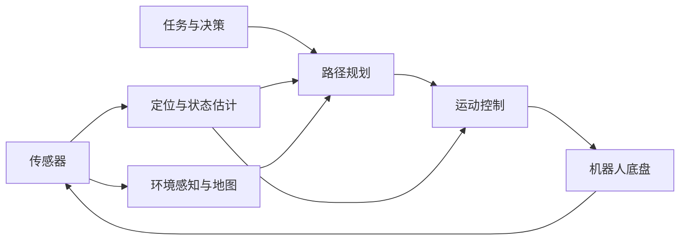

# 机器人导航入门六日课程 - 完整版

> 本文档汇总了机器人导航入门课程的全部内容，保留原始结构。

---


# 第一部分：课程总览

# 机器人导航入门六日教学方案

## 1. 课程定位

- 面向没有机器人导航经验的学员。
- 以概念、工具和系统关系为主，不直接讲完整导航源码。
- 不安排实车实验。
- 只使用两个 rosbag：TF 演示包和路径规划演示包。
- 每天的课程制作成 GitHub 仓库中的一个独立文件夹。
- 建议每天 6 小时：上午讲解，下午演示、练习和讨论。

## 2. 六天课程总览

| 天数 | 主题 | 当日成果 |
|---|---|---|
| 第一天 | Ubuntu、Git、GitHub、AI | 完成一次分支、提交和 PR |
| 第二天 | ROS 2 与导航系统全景 | 画出导航模块和数据流 |
| 第三天 | 传感器、定位与 TF | 解释 TF 主链 |
| 第四天 | 地图、Costmap 与路径规划 | 判断规划成功或失败原因 |
| 第五天 | 路径跟踪、控制与导航状态机 | 解释路径如何变成速度 |
| 第六天 | 决策、跨模块通信与联调 | 完成接口表和模拟联调 |

## 3. GitHub 仓库结构

```text
robot-navigation-course/
├── README.md
├── day01_dev_tools/
│   ├── README.md
│   ├── exercises.md
│   └── demo/
├── day02_ros2_overview/
│   ├── README.md
│   ├── exercises.md
│   └── demo_nodes/
├── day03_tf_localization/
│   ├── README.md
│   ├── exercises.md
│   ├── bags/tf_demo/
│   └── rviz/tf_demo.rviz
├── day04_map_planning/
│   ├── README.md
│   ├── exercises.md
│   ├── bags/planning_demo/
│   └── rviz/planning_demo.rviz
├── day05_control_navigation/
│   ├── README.md
│   ├── exercises.md
│   └── assets/
├── day06_decision_integration/
│   ├── README.md
│   ├── interface_contract.md
│   ├── exercises.md
│   ├── diagrams/
│   └── mock_nodes/
└── instructor/
    ├── answers/
    └── teaching_notes.md
```

每个每日 `README.md` 使用同一模板：

```markdown
# 当日主题
## 学习目标
## 核心内容
## 演示步骤
## 练习任务
## 预期结果
## 常见问题
```

---

## 4. 每日内容

### 第一天：Ubuntu、Git、GitHub 与 AI

#### 学习目标

- 能使用 Ubuntu 终端进行基本操作。
- 理解 Git 与 GitHub 的区别。
- 完成 `clone → branch → edit → commit → push → PR`。
- 能安全地使用 AI 辅助排错。

#### 课程内容

上午：

- Ubuntu 目录、路径、文件、权限、进程和环境变量。
- 常用命令：`pwd`、`ls`、`cd`、`mkdir`、`cp`、`mv`、`cat`、`rg`、`ps`、`source`。
- Git 的工作区、暂存区、本地仓库和远程仓库。
- `git status`、`diff`、`add`、`commit`、`switch`、`pull`、`push`。

下午：

- GitHub Repository、Issue、Pull Request 和 Code Review。
- AI 用于解释命令、分析报错、审查修改和生成测试步骤。
- 不向 AI 提交密码、Token、私钥和机密代码。
- 不盲目执行 `sudo`、删除或覆盖命令。
- 修改后必须查看 `git diff` 并实际验证。

#### 仓库内容

```text
day01_dev_tools/
├── README.md
├── exercises.md
└── demo/
    ├── hello_robot.py
    ├── config.yaml
    └── student.md
```

在 `hello_robot.py` 中只设置一个简单问题，例如配置路径错误。

#### 练习与验收

学员 Clone 仓库、创建分支、运行程序、使用 AI 分析报错、修复、提交并创建 PR。验收重点是操作正确和能够解释修改。

---

### 第二天：ROS 2 与机器人导航全景

#### 学习目标

- 理解 ROS 2 在机器人系统中的作用。
- 区分 Node、Topic、Service、Action、Parameter 和 Launch。
- 认识导航系统的主要模块和消息。

#### 课程内容

上午：

- ROS 2 通信模型。
- `ros2 node/topic/service/action/param/interface` 常用命令。
- 使用最小发布、订阅、Service 和 Action 示例。

下午：

```text
LiDAR/IMU
→ LIO/里程计
→ 全局重定位
→ 地图与动态障碍
→ Costmap
→ 路径规划
→ 路径跟踪
→ cmd_vel
→ 底盘反馈
```

认识以下消息：

- `sensor_msgs/PointCloud2`
- `sensor_msgs/Imu`
- `nav_msgs/Odometry`
- `nav_msgs/OccupancyGrid`
- `nav_msgs/Path`
- `geometry_msgs/PoseStamped`
- `geometry_msgs/Twist`

#### 仓库内容

```text
day02_ros2_overview/
├── README.md
├── exercises.md
└── demo_nodes/
    ├── publisher_node.py
    ├── subscriber_node.py
    ├── service_demo.py
    └── action_demo.py
```

每个示例只演示一个概念，不依赖导航工程。

#### 练习与验收

学员查看节点、Topic、消息类型和频率，并绘制导航数据流。验收时要求解释 Topic、Service 和 Action 的区别。

---

### 第三天：传感器、定位与 TF

#### 学习目标

- 理解 LiDAR、IMU、Odometry 和 LIO。
- 区分局部里程计与全局定位。
- 理解 `map→odom→base_link→lidar`。

#### 课程内容

上午：

- LiDAR 提供空间点，IMU 提供角速度和加速度。
- Odometry 短期连续，但可能长期漂移。
- LIO 融合 LiDAR 与 IMU 估计运动。
- 重定位负责将机器人放入全局地图。
- `map`、`odom`、`base_link`、`lidar_frame` 的职责。
- 静态 TF、动态 TF、时间戳和外参。

下午：

- 回放 `tf_demo`。
- 在 RViz 中显示 TF、点云和 Odometry。
- 切换 Fixed Frame。
- 讨论 TF 断链、外参错误和时间戳不匹配。

#### 仓库内容

```text
day03_tf_localization/
├── README.md
├── exercises.md
├── bags/tf_demo/
└── rviz/tf_demo.rviz
```

录包只保留：

```text
/tf
/tf_static
/cloud_registered
/Odometry
/localization/status
```

#### 练习与验收

学员画 TF 树，说明每段 TF 的作用，并判断几张错误截图。验收时要求解释 `map` 与 `odom` 的区别。

---

### 第四天：地图、Costmap 与路径规划

#### 学习目标

- 区分点云地图、二维地图和 Costmap。
- 理解障碍膨胀、A* 和路径平滑。
- 能按固定顺序分析规划失败。

#### 课程内容

上午：

- PCD、PGM/YAML 和 OccupancyGrid。
- 空闲、占用和未知区域。
- 静态层、动态障碍层和膨胀层。
- A* 中的起点、终点、`g`、`h` 和 `f`。
- 原始路径、重采样、平滑和碰撞检查。

下午：

- 回放 `planning_demo`。
- 在 RViz 中显示地图、Costmap、原始路径和平滑路径。
- 观察动态障碍出现后的路径变化。
- 分析目标在障碍物、通道被膨胀封闭等问题。

#### 仓库内容

```text
day04_map_planning/
├── README.md
├── exercises.md
├── bags/planning_demo/
└── rviz/planning_demo.rviz
```

录包建议保留：

```text
/tf
/tf_static
/Odometry
/static_map
/fused_map
/costmap
/plan
/plan_astar_raw
```

#### 练习与验收

按以下顺序排查案例：

```text
地图 → TF/机器人位置 → 目标 → Costmap → 原始路径 → 平滑路径
```

验收时要求解释膨胀半径和规划失败的关系。

---

### 第五天：路径跟踪、控制与导航状态机

#### 学习目标

- 理解路径不会直接驱动机器人。
- 理解反馈控制和 `cmd_vel`。
- 认识 PID、Pure Pursuit 和 NMPC。
- 理解导航任务状态机。

#### 课程内容

上午：

```text
当前位姿 + 当前速度 + 路径
             ↓
           控制器
             ↓
           cmd_vel
             ↓
       机器人与状态反馈
```

- PID 根据误差进行修正。
- Pure Pursuit 跟踪路径前方的前视点。
- NMPC 预测未来运动并考虑约束。
- 讨论振荡、切弯、过冲、延迟和速度限制。

下午：

- 导航 Action 的 Goal、Feedback 和 Result。
- `IDLE → PLANNING → CONTROLLING → SUCCEEDED`。
- 规划或控制失败后进入 `RECOVERY`。
- 有路径但机器人不动的检查顺序。

#### 仓库内容

```text
day05_control_navigation/
├── README.md
├── exercises.md
└── assets/
    ├── control_loop.png
    ├── navigation_fsm.png
    ├── normal_tracking.png
    └── oscillation.png
```

不新增 rosbag，使用曲线、截图和短视频。

#### 练习与验收

学员根据曲线判断振荡、延迟或速度受限，并为状态机转换补充条件。验收时要求解释 Path 与 `cmd_vel` 的区别。

---

### 第六天：机器人决策、通信与联调

#### 学习目标

- 理解决策层与导航层的边界。
- 理解决策的输入、状态和输出。
- 理解视觉、裁判系统、导航、串口和底盘之间的通信。
- 掌握接口定义和分层联调方法。

#### 上午：机器人决策

决策输入：

- 本方和敌方机器人状态。
- 比赛阶段、时间、血量和弹量。
- 视觉目标和当前全局位置。
- 导航任务反馈。

决策输出：

- 导航目标。
- 云台、射击、旋转和姿态模式。
- 当前行为和决策原因。

决策方法只做概览：

- 条件规则。
- 有限状态机。
- 行为树。
- 黑板系统。
- 优先级和任务抢占。

结合现有系统说明：

```text
OurRobotState + EnemyRobotState + GameState
                    ↓
             决策黑板与状态机
                    ↓
     /sentry/target_position + /sentry/control
```

#### 下午：通信与联调

```text
裁判系统 ─┐
视觉系统 ─┼→ 决策 → 导航目标 → 导航服务器 → cmd_vel
定位/TF  ─┘     └→ 云台/姿态控制
                                      ↓
                              串口或网络节点
                                      ↓
                                底盘与云台
                                      ↓
                                  状态反馈
```

联调接口必须明确：

| 项目 | 内容 |
|---|---|
| 接口 | Topic、Service 或 Action |
| 类型 | 消息类型和字段 |
| 方向 | 发布者与订阅者 |
| 坐标 | `map`、`odom` 或车体坐标 |
| 单位 | 米/厘米、弧度/角度 |
| 时序 | 频率、时间戳和超时 |
| QoS | reliable 或 best-effort |
| 安全 | 断联后的默认行为 |

推荐联调顺序：

```text
接口文档
→ 单节点自测
→ 假数据节点
→ 决策与导航
→ 导航与串口
→ 视觉和裁判系统
→ 完整系统
```

#### 仓库内容

```text
day06_decision_integration/
├── README.md
├── interface_contract.md
├── exercises.md
├── diagrams/
│   ├── decision_dataflow.png
│   └── integration_sequence.png
└── mock_nodes/
    ├── mock_game_state.py
    ├── mock_decision.py
    └── mock_navigation.py
```

三个假节点完成以下无实车流程：

1. 发布比赛和机器人状态。
2. 决策发布目标。
3. 模拟导航返回执行中、成功或失败。
4. 决策根据结果切换任务。
5. 模拟数据超时、单位错误和通信中断。

#### 练习与验收

学员填写接口表并完成模拟联调。验收时要求：

- 解释决策层为什么不直接计算底盘速度。
- 画出决策、导航、串口和底盘的数据流。
- 找出坐标系、单位、频率或超时错误。

---

## 5. 两个 rosbag 的制作

### `tf_demo`

- 60—90 秒，包含静止、直行和转弯。
- 录制 `/tf`、`/tf_static`、`/cloud_registered`、`/Odometry` 和定位状态。

### `planning_demo`

- 60—120 秒，包含发送目标、生成路径和一次明显重规划。
- 录制地图、Costmap、Odometry、原始路径和平滑路径。

录制完成后：

1. 使用 `ros2 bag info` 检查消息。
2. 在不启动导航工程的电脑上试播。
3. 验证配套 RViz 配置。
4. 为每个录包保存一段备用屏幕录像。

## 6. 仓库制作流程

1. 建立六个每日目录和根目录 README。
2. 先写每日 README，再制作课件，避免内容不一致。
3. 每天只制作一个最小演示和一个练习。
4. 所有命令在干净环境重新验证。
5. 不使用教师电脑的绝对路径。
6. 每个练习写清预期结果和常见错误。
7. 学员通过分支和 Pull Request 提交结果。
8. 教师答案放在 `instructor/` 或私有分支。

## 7. 最终清单

- [ ] 根目录课程说明。
- [ ] 六个每日文件夹及 README。
- [ ] 每天一份练习。
- [ ] 第一天 Git/GitHub 示例。
- [ ] 第二天 ROS 2 最小节点。
- [ ] `tf_demo` 和 RViz 配置。
- [ ] `planning_demo` 和 RViz 配置。
- [ ] 第五天控制曲线和状态机图。
- [ ] 第六天决策数据流图。
- [ ] 第六天接口协议表。
- [ ] 第六天三个模拟节点。
- [ ] 教师答案和讲课备注。

该方案可以直接作为后续建设 GitHub 教学仓库的目录与任务清单。

---

# 第二部分：Day 1 - 开发工具与环境

# 第一天：Ubuntu、Git、GitHub 与 AI

## 1. 今日目标

今天不学习机器人导航算法，而是建立后续开发需要的基本工作流。

完成课程后，你应当能够：

- 使用 Ubuntu 终端完成基本文件操作。
- 看懂命令中的路径，区分绝对路径和相对路径。
- 运行程序、保存完整报错并进行初步排查。
- 理解 Git 与 GitHub 的区别。
- 完成 `clone → branch → edit → commit → push → Pull Request`。
- 使用 AI 辅助分析问题，并验证 AI 给出的建议。

今天的最终任务是：

```text
获取教学仓库
→ 创建个人分支
→ 运行一个存在问题的程序
→ 保存报错
→ 使用 AI 辅助分析
→ 修复并验证
→ 查看 Git diff
→ 提交代码
→ 创建 Pull Request
```


## 2. 开发工具全景

机器人开发通常会同时接触以下工具：

| 工具 | 作用 |
|---|---|
| Ubuntu | 机器人软件常用的开发和运行环境 |
| Terminal/Shell | 输入命令、运行程序和查看日志 |
| VS Code | 编辑代码、搜索文件和查看 Git 修改 |
| Git | 在本地记录代码版本 |
| GitHub | 托管仓库、协作和代码审查 |
| AI | 辅助理解、排错、生成和审查 |
| ROS 2 | 机器人软件模块之间的通信框架 |
| colcon/CMake | 编译和组织 ROS 2 工程 |
| RViz | 显示地图、点云、路径和坐标系 |
| rosbag | 记录和回放 ROS 2 数据 |

需要特别区分：

```text
Git：本地版本管理工具
GitHub：托管 Git 仓库的在线协作平台
```

即使没有 GitHub，Git 仍然可以在本地使用。

## 3. Ubuntu 基础

### 3.1 打开终端

Ubuntu 中可以使用快捷键：

```text
Ctrl + Alt + T
```

终端提示符通常包含用户名、主机名和当前目录。复制教程中的命令时，不要复制提示符 `$`。

### 3.2 确认当前环境

进入第一天课程目录：

```bash
cd ~/navigation_teach/day01_dev_tools
pwd
ls
```

预期 `pwd` 末尾为：

```text
/navigation_teach/day01_dev_tools
```

运行环境检查：

```bash
./check_env.sh
```

脚本会检查 Ubuntu、Git、Python、文本搜索工具和 Git 用户信息，不会安装或删除任何软件。

### 3.3 目录和路径

常用符号：

| 写法 | 含义 |
|---|---|
| `/` | Linux 根目录 |
| `~` | 当前用户的主目录 |
| `.` | 当前目录 |
| `..` | 上一级目录 |

绝对路径从 `/` 开始：

```text
/home/user/navigation_teach/day01_dev_tools
```

相对路径以当前工作目录为起点：

```text
demo/hello_robot.py
```

同一个相对路径，在不同工作目录中可能指向不同文件。这是开发中常见的问题来源。


### 3.4 运行程序和停止进程

查看 Python 版本：

```bash
python3 --version
```

运行示例程序：

```bash
python3 demo/hello_robot.py
```

现在程序应当失败。不要立即修改，先完成三件事：

1. 找到报错类型。
2. 找到报错涉及的文件路径。
3. 从第一行到最后一行保存完整报错。

运行持续工作的程序时，通常使用：

```text
Ctrl + C
```


### 3.5 Ubuntu 中的软件安装

#### 3.5.1 常见安装方式

Ubuntu 中的软件可能来自不同渠道：

| 方式 | 常见形式 | 特点 |
|---|---|---|
| APT 软件源 | `sudo apt install ...` | 自动处理 Ubuntu 软件源中的依赖，优先使用 |
| 本地 Debian 包 | `xxx.deb` | 已经编译好的 Ubuntu 安装包 |
| 语言包管理器 | `pip`、`npm` | 安装特定语言生态中的库，例如 pip 是安装 Python 库的工具 |
| 源码编译 | `CMakeLists.txt`、`Makefile` | 灵活，但需要自行处理依赖、编译和安装 |

安装软件前先确认：

1. 是否支持当前 Ubuntu 版本。
2. 是否支持当前 CPU 架构。
3. 是否会与已有版本冲突。


#### 3.5.2 使用 APT

APT 是 Ubuntu 常用的软件包管理工具。

更新本地的软件包索引：

```bash
sudo apt update
```

这条命令更新“有哪些软件和版本可用”的信息，不会自动升级所有软件。


安装软件：

```bash
sudo apt install cmake
```

同时安装多个开发工具：

```bash
sudo apt install build-essential cmake git
```

其中：

- `build-essential` 提供 GCC、G++、Make 等基础编译工具。
- `cmake` 用于配置和生成构建系统。
- `git` 用于版本管理。

查看一个包安装了哪些文件：

```bash
dpkg -L cmake
```

卸载软件：

```bash
sudo apt remove cmake
```

`remove` 通常保留系统级配置；`purge` 会同时删除包管理器记录的配置：

```bash
sudo apt purge cmake
```

不要为了练习而卸载当前课程依赖。

需要区分：

```text
apt update：更新软件包索引
apt upgrade：升级已经安装的软件(一般不用)
apt install：安装指定软件
```

课程期间不要未经确认执行整个系统的 `apt upgrade`，因为大范围升级可能改变开发环境。

#### 3.5.3 安装本地 `.deb` 包

先查看 CPU 架构：

```bash
dpkg --print-architecture
```

常见结果是：

```text
amd64
arm64
```

安装本地包时，推荐使用 APT：

```bash
sudo apt install ./example.deb
```

命令中的 `./` 表明这是当前目录中的文件，而不是软件源中的包名。

与直接运行 `dpkg -i` 相比，APT 更容易处理依赖关系。

安装前应检查：

- 文件来源。
- Ubuntu 版本。
- CPU 架构。
- 软件签名或官方校验值。
- 是否已经安装其他版本。

#### 3.5.4 Python 包

不要默认使用：

```bash
sudo pip install ...
```

它可能覆盖 Ubuntu 或 ROS 依赖的 Python 包。

项目开发更推荐虚拟环境：

```bash
python3 -m venv .venv
source .venv/bin/activate
python -m pip install --upgrade pip
python -m pip install <package-name>
```

查看当前环境安装的包：

```bash
python -m pip list
python -m pip freeze
```

退出虚拟环境：

```bash
deactivate
```

虚拟环境的作用是隔离项目依赖，减少不同项目之间的版本冲突，但是实际开发接触比较少，在使用一些独立工具的时候可能会用到。

### 3.6 从源码编译和安装

#### 3.6.1 为什么需要源码编译

以下情况可能需要源码编译：

- 软件源中没有该软件。
- 软件源版本过旧。
- 需要开启或关闭某些编译选项。
- 需要修改源码。
- 目标平台没有官方安装包。

源码安装比 APT 更灵活，但也意味着开发者需要自己管理：

- 编译器。
- 依赖库。
- 编译参数。
- 安装位置。
- 版本更新。
- 卸载方式。

当你拿到一个源码压缩包之后，
确认路径安全后再解压：

```bash
tar -xf project.tar.gz
cd project
```

#### 3.6.2 CMake 项目的标准流程

机器人项目常用 CMake。一个典型流程是：

```text
准备依赖 → 配置 → 编译 → 测试 → 安装
```

流程大致如下：

```bash
cd <项目根目录>

mkdir build

cd build

cmake ..

make -j$(nproc)

sudo make install
```


#### 3.6.3 ROS 2 工作空间

ROS 2 的 `colcon` 会调用各个包的构建系统：

```bash
colcon build --symlink-install
```

常见目录：

```text
src/      源码
build/    构建中间文件
install/  安装结果和环境脚本
log/      构建日志
```

构建后通常需要：

```bash
source install/setup.bash
```

这样当前终端才能找到新编译的 ROS 2 包。

### 3.7 环境变量

#### 3.7.1 环境变量是什么

环境变量是由“名称”和“值”组成的运行环境配置，例如：

```text
HOME=/home/user
PATH=/usr/local/bin:/usr/bin:/bin
```

程序可以读取环境变量来决定：

- 去哪里寻找可执行文件。
- 去哪里寻找动态库。
- 去哪里寻找 Python 模块。
- 使用哪个配置或工作空间。
- 当前使用哪个 ROS 2 发行版。


查看环境变量：

```bash
echo "$HOME"
echo "$PATH"
printenv HOME
env | head
```


#### 3.7.2 临时设置与永久设置

终端中执行：

```bash
export COURSE_DAY=1
```

通常只对当前终端及其子进程有效。关闭终端后，该设置消失。

如果希望每次打开 Bash 都自动设置，可以写入 `~/.bashrc`。使用下面的命令打开：

```bash
nano ~/.bashrc
```

例如：

```bash
export PATH="$HOME/.local/bin:$PATH"
```

修改后让当前终端重新加载：

```bash
source ~/.bashrc
```

写入 `.bashrc` 前应注意：

- 先备份原文件。
- 不重复添加同一行。
- 不覆盖整个 `PATH`。
- 一次只修改一项。
- 修改后重新打开终端验证。

错误写法：

```bash
export PATH="$HOME/my_tools"
```

它会丢失系统原来的 `PATH`，导致 `ls`、`python3` 等命令可能无法找到。

更合理的写法：

```bash
export PATH="$HOME/my_tools:$PATH"
```

#### 3.7.3 常见环境变量

| 变量 | 作用 |
|---|---|
| `HOME` | 当前用户主目录 |
| `USER` | 当前用户名 |
| `SHELL` | 当前用户默认 Shell |
| `PATH` | 查找可执行程序 |
| `LD_LIBRARY_PATH` | 额外的动态库搜索路径 |
| `PYTHONPATH` | 额外的 Python 模块搜索路径 |
| `CMAKE_PREFIX_PATH` | CMake 查找已安装项目的前缀 |
| `ROS_DISTRO` | 当前 ROS 2 发行版名称 |
| `AMENT_PREFIX_PATH` | ROS 2/ament 包的安装前缀 |

#### 3.7.4 `source` 的作用

直接执行脚本通常会创建一个子进程。子进程修改的环境变量不会返回当前终端。

`source` 会让脚本在当前 Shell 中执行，因此脚本设置的环境变量能保留在当前终端：

```bash
source /opt/ros/<发行版>/setup.bash
source install/setup.bash
```

第一行把系统 ROS 2 环境加入当前终端；第二行再叠加当前工作空间。

这种顺序称为环境叠加：

```text
Ubuntu 基础环境
→ 系统 ROS 2
→ 当前工作空间
```

在新的终端中，如果没有重新 `source`，可能出现：

```text
ros2: command not found
Package '<name>' not found
```

工作空间第一次编译完成后，每次打开新终端都需要重新加载它的环境。如果这是日常固定使用的工作空间，可以将加载命令写入 `~/.bashrc`。

先打开文件：

```bash
nano ~/.bashrc
```

在文件末尾加入以下内容，并将 `<工作空间>` 替换成自己的实际目录：

```bash
if [ -f "$HOME/<工作空间>/install/setup.bash" ]; then
  source "$HOME/<工作空间>/install/setup.bash"
fi
```

保存后让当前终端立即加载：

```bash
source ~/.bashrc
```


## 4. Git 基础

### 4.1 Git 管理的四个位置

```text
工作区
  │ git add
  ▼
暂存区
  │ git commit
  ▼
本地仓库
  │ git push
  ▼
远程仓库
```

常用命令：

| 命令 | 作用 |
|---|---|
| `git clone` | 获取远程仓库 |
| `git status` | 查看当前状态 |
| `git diff` | 查看尚未暂存的修改 |
| `git add` | 将修改放入暂存区 |
| `git commit` | 创建本地版本记录 |
| `git log` | 查看提交历史 |
| `git switch` | 切换或创建分支 |
| `git pull` | 获取并合并远程修改 |
| `git push` | 推送本地提交 |

在日常使用时，主要会使用 VS Code 上的 Git 扩展。


## 5. GitHub

### 5.1 GitHub 概念

形象地说，GitHub 类似“程序员的社交软件”，程序就是我们交流的内容，其他人可以通过 Star 表达认可。实际上，GitHub 是一个远程代码托管平台，你可以上传代码供其保存，其他人可以克隆你的仓库，也可以修复代码中的 Bug，然后申请将修改合并到原仓库，这就是 Pull Request（简称 PR）。

之后的开发可能在自己的电脑上完成，而程序运行在车载计算机上，也可能由多人共同开发，所以掌握 GitHub 协作尤为重要。


### 5.2 GitHub 中的主要对象

- Repository：项目仓库。
- Issue：任务、问题或讨论。
- Branch：相互隔离的开发分支。
- Pull Request：申请将一个分支的修改合并到另一个分支。
- Review：对 Pull Request 进行检查和评论。

使用 GitHub 合作开发，不只是学会把代码上传到网站，还需要理解一套团队工作流程：

```text
创建 Issue
→ 分配负责人
→ 同步主分支
→ 创建个人功能分支
→ 开发和本地验证
→ Commit
→ Push
→ 创建 Pull Request
→ 自动检查和人工 Review
→ 修改问题
→ 合并到主分支
→ 删除已经完成的功能分支
```

需要学习的内容可以分为以下几部分：

| 内容 | 需要掌握什么 |
|---|---|
| 仓库与权限 | 谁能查看、修改、审核和管理仓库 |
| Issue | 如何描述任务、错误和验收标准 |
| Branch | 为什么每项任务使用独立分支 |
| Commit | 如何把修改拆成清晰、可回退的记录 |
| Push/Pull | 如何上传自己的修改并同步他人的修改 |
| Pull Request | 如何说明修改目的、内容、测试和风险 |
| Code Review | 如何检查他人的代码并提出具体意见 |
| Conflict | 为什么产生冲突，以及如何逐处解决 |
| Merge | PR 通过后如何进入主分支 |
| CI | 如何自动执行编译、测试和格式检查 |
| Release | 如何给可使用的版本打 Tag 并发布 |
| 安全 | 如何避免上传密码、Token、私钥和机密配置 |


#### 5.2.1 Branch：每项任务使用独立分支

主分支通常用于保存经过验证、能够正常使用的代码。假如你是多人开发，每个人最好有一个分支，觉得差不多就可以合并到主分支上。假如是一个人开发就不需要额外开分支。


#### 5.2.2 Commit：记录一个完整的小步骤

**一次 Commit 应只完成一件事情，并且在提交前完成基本验证。**

推荐格式：

```text
类型: 简短说明
```

例如：

```text
feat: add map loading service
fix: handle missing map to odom transform
docs: add GitHub collaboration guide
test: cover invalid navigation goal
```

解释
feat:表示添加新功能

Commit 不是越多越好或越少越好，重点是每个 Commit 都能解释、检查和回退。

#### 5.2.3 Pull Request：把修改交给团队检查

一个 Pull Request 至少应说明：

```text
为什么修改：
修改了什么：
没有修改什么：
如何验证：
可能的风险：
关联的 Issue：
```

提交 PR 前应检查：

1. 修改是否仍在个人分支。
2. 是否包含无关文件。
3. 是否误提交日志、编译产物或大文件。
4. 是否包含密码、Token、私钥或本地绝对路径。
5. 是否已经查看完整 Diff。
6. 程序是否能够编译或运行。
7. 是否完成与本次修改有关的测试。

#### 5.2.4 Code Review：检查代码而不是评价个人

Review 时重点检查：

- 修改是否实现了 Issue 的目标。
- 接口、坐标系、单位和消息类型是否正确。
- 是否存在异常输入、超时和空数据问题。
- 是否破坏已有功能。
- 是否有必要的日志和测试。
- 代码是否容易理解和维护。

#### 5.2.5 同步、冲突与合并

多人修改同一文件或相邻代码时可能产生冲突。冲突表示 Git 无法自动判断应该保留哪一部分，不代表仓库损坏。

解决冲突时应：

1. 先确认自己的分支和工作区状态。
2. 保存未完成的工作。
3. 获取主分支的最新修改。
4. 逐个阅读冲突位置。
5. 与相关开发者确认最终逻辑。
6. 删除冲突标记。
7. 重新编译和测试。
8. 提交冲突解决结果。

有一套完整的处理冲突的流程，具体遇到了冲突可以去问ai,加深印象


## 6. AI 辅助开发


现在 AI 的发展越来越快，从聊天 Bot 进化成了可以完成多种任务的“助手”。在日常开发中，合理使用 AI 能够显著提高效率。

### 6.1 用什么

对于工程开发，最好还是使用外国的“御三家”，但是想使用好他们都需要开会员，所以你们看看自己的经济能力和需求看看需不需要开会员。
对于国内的 AI，我使用 DeepSeek 比较多，使用起来也比较方便，所以也可以根据实际需求选择国内的 AI。

如何使用？
>**使用网页端**    网页端的好处是不需要花额外的钱，缺点是不能很好的帮你写代码，所以平时使用网页端主要是进行问题的提问，还有搜索资料。


>**使用 Agent** 为什么我建议使用“御三家”，因为它们都有自家的代码 Agent，并针对自家模型进行了适配，所以使用体验通常更完整。

### 6.2 怎么用 Agent

以 Codex 为例，首先需要找到 Codex 的 GitHub 仓库：
```
https://github.com/openai/codex
```

按照仓库教程下载 CLI 版本（Ubuntu 没有 Codex 桌面应用版本，主要使用 CLI 版本）。

安装完成后进入命令行，输入 `codex`，就可以看到这个界面：

现在有两种方法。如果你购买了 ChatGPT Plus 或 Pro 等套餐，其中会包含一定额度；Plus 约为 120 元，可能会有些贵，如果已经购买，可以使用第一种登录方式。

我重点介绍第二种：使用 API 中转站。
现在有很多提供 API 的中转站，会向你提供 API 密钥，根据使用的 Token 数量计费，使用量较少的用户可以考虑。

例如我使用的米醋 API，直接在浏览器中搜索即可找到：


进入后配置需要的 API（例如 GPT，选择对应分组）：


接下来需要下载一个名为 CC Switch 的应用，它可以统一管理 Agent 的 API 配置和历史对话，使用比较方便，可以自行搜索并下载。

然后进入这个界面，输入 API 密钥和请求地址（默认请求地址可能存在问题，应以服务公告提供的地址为准）：


添加之后启用对应供应商，再打开 Codex 即可使用。

使用 AI 的注意事项：

1. 在你的工作空间下打开 Codex，先让它知道你在做什么。
2. 让 AI 写代码之前，一定要明确需求和目标。例如想编写机器人路径规划算法时，不能只说“请帮我写一个路径规划算法，要求能规划出一条适合机器人导航的路径”。在自己不了解问题的情况下直接让它编写，很难得到符合需求的结果，也很难判断实现是否正确。应该逐步拆解问题，问清楚需要使用什么技术、如何实现，并在开始编写前了解整体方案。
3. 写完的代码要会审查，问清楚最终实现了什么效果，是不是符合你的预期。
4. 有时候 AI 会建议加入很多非必要功能，需要自己判断哪些是必须的，优先使用尽量少且清晰的代码实现需求。
5. 使用 AI 修改代码时尽量控制范围，每次只改一点并及时验证，确认没有问题后再继续。
6. 剩下的可以去看一些视频了解一下
https://github.com/ryanhanwu/How-To-Ask-Questions-The-Smart-Way
前任学长发给我的，还没有认真看过

### 6.3 如何向 AI 描述开发问题

提问时尽量提供以下信息：

```text
环境：
Ubuntu、ROS 2、Python/C++ 等版本，以及当前工作目录。

目标：
程序原本应该实现什么。

操作：
执行了哪些命令，修改了哪些文件。

实际现象：
从第一行到最后一行的完整报错或异常输出。

已经检查：
自己已经确认过哪些内容。

限制：
例如不要删除文件、不要使用 sudo、不要修改其他模块。

期望回答：
先分析原因，再给检查步骤；每一步说明预期结果。
```

例如：

```text
我在 Ubuntu 22.04 中运行 day01_dev_tools/demo/hello_robot.py。
目标是读取同一目录中的 config.yaml。
我执行了 python3 demo/hello_robot.py，出现 FileNotFoundError。
请先解释程序实际寻找了哪个路径，再给出检查步骤。
不要删除文件，也不要修改配置文件内容。
```
实际使用中不需要每次都输入这么复杂的提示词，只需要第一次问的时候问的详细一点，后续根据它的回答来调整提示词的颗粒度。

## 7. 综合练习

### 7.1 提前准备

1. 安装好 Ubuntu 上必要的开发软件。
2. 安装并配置好 Codex。
3. 将课程代码克隆到本地（中间可能遇到下载时需要输入用户名或下载速度慢等问题，需要自己搜索资料解决）。
### 7.2 问题背景

`demo/hello_robot.py` 应读取 `demo/config.yaml`，然后打印机器人信息。

运行：

```bash
cd ~/navigation_teach/day01_dev_tools
python3 demo/hello_robot.py
```

当前程序会报错，这是课程故意保留的问题。

### 7.3 任务要求

1. 保存完整报错。
2. 阅读 `demo/hello_robot.py`。
3. 使用推荐模板向 AI 提问。
4. 判断 AI 建议是否安全。
5. 修改程序，使它能正确运行。
6. 比较实际输出与 `demo/expected_output.txt`。
7. 分别从以下两个目录运行，两次都必须成功：

   ```bash
   cd ~/navigation_teach/day01_dev_tools
   python3 demo/hello_robot.py

   cd ~/navigation_teach/day01_dev_tools/demo
   python3 hello_robot.py
   ```

8. 创建自己的分支，将修改好的代码推送到 GitHub。
9. 在 GitHub 创建 Pull Request。

### 7.4 验收标准

- 输出与 `expected_output.txt` 一致。
- 只修改完成任务所必需的文件。
- Commit 信息能说明修改目的。
- Pull Request 包含问题原因和验证方法。
- 能说明 AI 提供了什么建议，以及如何验证。


## 8. 课程结束检查

你应当能够回答：

1. 绝对路径和相对路径有什么区别？
2. CMake 配置、编译、测试和安装分别做什么？
3. 为什么推荐使用独立的 `build/` 目录和用户安装前缀？
4. 临时环境变量与写入 `.bashrc` 有什么区别？
5. `source` 与直接运行脚本有什么区别？
6. Git 与 GitHub 有什么区别？
7. 工作区、暂存区和 Commit 分别是什么？
8. 一个有效的 AI 排错问题应包含哪些信息？
9. 如何证明程序已经被正确修复？
10. Pull Request 中应当写明哪些内容？

完成综合练习并提交 Pull Request 后，第一天课程结束。

---

# 第三部分：Day 2 - ROS 2 节点与通信

## 2.1 节点基础

# 节点与节点编写
---
## ROS2 重要概念与常用命令

在正式写节点前，先把 ROS2 开发中最常接触的几个概念理清楚。

**工作空间（Workspace）**  
工作空间是一组 ROS2 功能包的集合，通常包含 `src`、`build`、`install`、`log` 等目录。我们平时写代码主要放在 `src` 中，编译后结果会进入 `install`。


**功能包（Package）**  
功能包是 ROS2 代码组织的基本单位。一个功能包里通常包含源码、配置文件、launch 文件、消息定义等。

创建 C++ 功能包：
```
cd ~/my_ws/src
ros2 pkg create my_pkg --build-type ament_cmake --dependencies rclcpp
```

编译指定功能包：
```
cd ~/my_ws
colcon build --packages-select my_pkg
source install/setup.bash
```

**节点（Node）**  
节点是 ROS 中的最小执行单元（常常对应一个可执行程序或进程），负责完成一项具体任务（例如：相机驱动、目标识别、底盘控制、串口读写）。暂且可以认为一个节点负责完成一项任务。例如“相机驱动节点”、“串口通信节点”、“导航节点”。
节点由包（package）里的可执行文件启动。

查看所有的ROS2节点：
```
ros2 node list 
```
常用命令：
```
ros2 node list
ros2 node info /node_name //查看某个节点的具体信息
ros2 run package_name executable_name  //运行某个节点
```

**Topic 通信**  
Topic 是发布/订阅通信，适合连续数据流，例如雷达点云、IMU、里程计、控制指令。

常用命令：
```
ros2 topic list
ros2 topic echo /topic_name
ros2 topic info /topic_name
ros2 topic hz /topic_name
ros2 interface show std_msgs/msg/String
```
实际过程中，大部分节点之间的通信都可以使用topic,因为大部分的任务都是连续的，且一个节点的信息，可能会有很多其他不同的节点来使用。
**Service 通信**  
Service 是请求/响应通信，你发出一个需求，它就给你相应一次，例如保存地图、切换模式、请求一次计算。

常用命令：
```
ros2 service list
ros2 service type /service_name
ros2 service call /service_name service_type "{}"
```

**Action 通信**  
Action 适合持续一段时间、并且需要反馈和取消的任务，例如导航到目标点、执行机械臂动作。

常用命令：
```
ros2 action list
ros2 action info /action_name
ros2 action send_goal /action_name action_type "{}"
```

**参数（Parameter）**  
参数用于配置节点运行行为，例如发布频率、话题名称、机器人半径、是否使用仿真时间。

常用命令：
```
ros2 param list
ros2 param get /node_name param_name
ros2 param set /node_name param_name value
```


## 创建功能包  
接下来进入到实际操作环节：
在day02_node文件夹下打开终端，输入
```
cd ./src
ros2 pkg create my_first_package --build-type ament_cmake --dependencies rclcpp
```
`--build-type ament_cmake` 表示使用 CMake 构建
`--dependencies rclcpp` 表示依赖 ROS2 的 C++ 客户端库
运行后，系统会生成一个标准的包结构:
```
day02_node
└── my_first_package
    ├── CMakeLists.txt
    ├── include
    │   └── my_first_package
    ├── package.xml
    └── src

```
## 查看依赖
在 package.xml 里，可以看到 ROS2 自动帮我们写入了依赖：
```
<depend>rclcpp</depend>
```
如果未来要用到其他库，比如 std_msgs（标准消息类型），也需要在这里添加：  
```
<depend>std_msgs</depend>
```
现在，请你手动加入std_msgs作为依赖项。

## 编写源文件
进入my_first_package/src文件夹，创建一个名为`helloworld.cpp`的文件，随后写入
```
// 包含必要的ROS2头文件
#include "rclcpp/rclcpp.hpp"              // ROS2客户端库的核心功能
#include "std_msgs/msg/string.hpp"        // 标准字符串消息类型

// 定义自定义的发布者节点类，继承自rclcpp::Node
class MyPublisher: public rclcpp::Node
{
public:
    // 构造函数：初始化节点和成员变量
    MyPublisher(): Node("my_publisher"),  // 调用基类构造函数，设置节点名为"my_publisher"
                   count_(0)              // 初始化计数器为0
    {
        // 创建发布者（Publisher）
        // 参数说明：
        // - "my_message": 话题名称
        // - 10: 队列大小（缓存的消息数量）
        publisher_ = this->create_publisher<std_msgs::msg::String>("my_message", 10);
        
        // 创建定时器（Timer），每秒触发一次
        // 参数说明：
        // - std::chrono::seconds(1): 定时器周期为1秒
        // - std::bind(...): 绑定回调函数，当定时器触发时调用timer_callback方法
        timer_ = this->create_wall_timer(
            std::chrono::seconds(1),
            std::bind(&MyPublisher::timer_callback, this)
        );
    }

private:
    // 定时器回调函数 - 当定时器触发时自动调用
    void timer_callback()
    {
        // 创建一个字符串消息对象
        auto message = std_msgs::msg::String();
        
        // 设置消息内容：包含问候语和计数器值
        message.data = "Hello, ROS2! " + std::to_string(count_++);
        
        // 在终端输出日志信息（INFO级别）
        // RCLCPP_INFO是ROS2的日志宏，类似于printf但功能更强大
        RCLCPP_INFO(this->get_logger(), "Publishing: '%s'", message.data.c_str());
        
        // 发布消息到话题
        publisher_->publish(message);
    }

    // 成员变量声明
    rclcpp::Publisher<std_msgs::msg::String>::SharedPtr publisher_;  // 发布者指针
    rclcpp::TimerBase::SharedPtr timer_;                             // 定时器指针
    size_t count_;                                                   // 消息计数器
};

// 主函数 - 程序的入口点
int main(int argc, char * argv[])
{
    // 初始化ROS2客户端库
    // 必须在使用任何ROS2功能之前调用
    rclcpp::init(argc, argv);
    
    // 创建节点对象
    // std::make_shared是智能指针，用于自动管理内存
    auto node = std::make_shared<MyPublisher>();
    
    // 进入事件循环，保持节点运行
    // spin()会阻塞当前线程，等待和处理事件（如定时器、订阅消息等）
    rclcpp::spin(node);
    
    // 关闭ROS2客户端库，清理资源
    rclcpp::shutdown();
    
    return 0;
}
```
以上代码会定时1s发布一次话题，并在终端中打印一句话。
需要注意的是，ROS2节点采用了OOP思想，并且常常使用c++11、14的一些新特性（但不多），如果发现有哪一行看不懂，需要自己再去了解一下。

## 修改CMakelists
打开 CMakeLists.txt，添加以下内容  
```
find_package(rclcpp REQUIRED)
# 新增下面部分
#需要 std_msgs包
find_package(std_msgs REQUIRED)  

#指定编译 src/helloworld.cpp 生成可执行文件
add_executable(helloworld src/helloworld.cpp)  

#把依赖库的头文件、库文件、编译选项一次性加到目标可执行文件里
ament_target_dependencies(helloworld rclcpp std_msgs)

#安装到 ROS2 的默认路径，方便 ros2 run 调用
install(TARGETS
  helloworld
  DESTINATION lib/${PROJECT_NAME})
```
就像我们在写 CMakeLists 时会写 target_link_libraries 来链接依赖库，ROS 里我们用 ament_target_dependencies 一次性引入 ROS2 的依赖。

## 编译和安装
回到工作空间根目录，编译功能包：
```
cd ~/navigation_teach
colcon build --packages-select my_first_package
```

编译完成后，执行：
```
source install/setup.bash
```
这样系统就能找到我们编译好的新节点。
## 尝试运行

运行刚才编译好的节点：
```
ros2 run my_first_package helloworld
```

终端应该输出类似如下的内容：
```
[INFO] [1759326268.267211126] [my_publisher]: Publishing: 'Hello, ROS2! 0'
[INFO] [1759326269.267227238] [my_publisher]: Publishing: 'Hello, ROS2! 1'
[INFO] [1759326270.267342887] [my_publisher]: Publishing: 'Hello, ROS2! 2'
```

此时我们另外打开一个终端，输入：
```
ros2 topic echo /my_message
```

应该可以看到类似以下内容：
```
data: Hello, ROS2! 0
---
data: Hello, ROS2! 1
---
data: Hello, ROS2! 2
```

**恭喜 🎉 你已经完成了第一个 ROS2 节点！**  

## rqt工具 
### 为什么使用rqt？
在使用ROS的过程中，有不少小工具可以帮助我们检查编写的节点。虽然ros2 topic echo可以打印出具体的消息，但是并不直观。所以我们需要一种图形化的方法来看到节点和话题的状态，这就是rqt这个工具的意义。
### rqt是什么？
rqt 是 ROS 自带的 图形化工具框架，它就像一个“工具箱”。它的每个功能是一个“小插件”，你可以按需加载。常用的插件有：  

>rqt_graph：查看节点之间的连接关系
rqt_topic：查看话题的实时数据
rqt_plot：把数值型数据画成曲线图

### rqt的使用
运行之前编写的发送节点，另外开启一个终端，输入：
```
ros2 run rqt_topic rqt_topic
```
可以看到之前发布的`/my_message`话题，在话题前的方框打勾，便可以看到`/my_message`具体内容和频率。  
如果是自定义消息类型，在使用rqt查看之前，需要先source你的工作空间。


## 自定义消息类型
ROS中的topic非常强大，不仅可以传输各种基本数据类型如int、float、string（利用std_msgs库），也可以传输复杂的自定义类型，（如以后会用到的imu数据类型、pointcloud数据类型）。接下来，我们将教会大家如何创建自己的消息类型。  

### 创建功能包
习惯上，我们会单独为消息创建一个独立的包（消息包和功能逻辑分开）
```
ros2 pkg create my_msgs --build-type ament_cmake --dependencies std_msgs
```

随后在my_msgs目录下创建msg文件夹，目录结构如下：
```
my_msgs/
├── CMakeLists.txt
├── package.xml
└── msg/
```

### 定义消息
在/msg文件夹下创建一个新的.msg文件，例如Sentry.msg，写入
```
uint8 id
int32 hp
float32 x
float32 y
```
这就定义了一种新的消息类型my_msgs/msg/Sentry，它包含了四种字段
**注意：.msg 文件必须放在 msg/ 文件夹下，否则编译不会识别。**
### 修改package.xml
在 package.xml 里添加对消息生成工具的依赖：
```
<buildtool_depend>ament_cmake</buildtool_depend>

<!-- 这里声明自己是接口包 -->
<member_of_group>rosidl_interface_packages</member_of_group>

<!-- 消息生成需要 -->
<build_depend>rosidl_default_generators</build_depend>
<exec_depend>rosidl_default_runtime</exec_depend>
```

### 修改 CMakeLists.txt
找到 CMakeLists.txt，添加以下内容：
```
find_package(rosidl_default_generators REQUIRED)

rosidl_generate_interfaces(${PROJECT_NAME}
  "msg/Sentry.msg"
  DEPENDENCIES std_msgs
)

ament_export_dependencies(rosidl_default_runtime)
```
这样就告诉 CMake：编译时需要生成消息接口。

### 编译消息包
回到工作空间并编译：
```
colcon build --packages-select my_msgs
```

编译成功并source后，可以检查新消息是否生成：
```
ros2 interface show my_msgs/msg/Sentry
```

可以看到返回：
```
~/tutorial_ws$ ros2 interface show my_msgs/msg/Sentry
uint8 id
int32 hp
float32 x
float32 y
```

## 优化
为了告诉电脑编译完成后安装的文件在哪里，每次打开一个新的终端后，我们都要执行以下操作：
```
source {你的工作空间}/install/setup.bash
```
显然这是一个非常麻烦的事，所以我们可以执行以下操作：
```
echo "source {你的工作空间路径}/install/setup.bash" >> ~/.bashrc
```
比如说
```
echo "source /home/lehan/tutorial_ws/install/setup.bash" >> ~/.bashrc
```
以后再启动终端时，就不用再手动刷新环境变量了。


## 作业

1. 你已经掌握了最简单的topic发布者写法，接下来，请你修改之前编写的helloworld节点，使其发送我们刚才新定义的Sentry类型消息，并在命令行中查看。
2. 查阅rclcpp::Subscription的使用方法，尝试在navigation_teach包下再编写一个节点，用于接收刚才发送的自定义消息，并打印到屏幕上。
3. 运行发布者节点和接收者节点，随后在命令行中输入`ros2 run rqt_graph rqt_graph`，理解节点和话题的连接关系。
4. 使用agent了解并尝试编写一对使用service和action的节点。

## 2.2 节点进阶

# ROS2 节点进阶
在上一课中，我们已经学习了如何编写基本的发布/订阅节点，并且使用了自定义消息类型完成通信。但在实际项目中，单个节点往往不足以支撑整个系统。我们需要一种方法来统一启动、配置和管理多个节点。

## Launch文件
### 为什么我们需要Launch文件？
当我们有多个节点时，如果每次都要开一堆终端运行`ros2 run`，会非常麻烦。而Launch 文件允许我们用一个`.launch.py` 文件来统一启动所有节点，并且可以实现“**启动、传参、重映射、命名空间、环境变量、延时、包含其它 launch**”等功能。它的语法基于 Python，灵活可扩展。  
我不会再详细介绍launch相关的python语法与接口，在绝大部分实际使用中，询问LLM即可。

### launch文件的使用  
在之前编写的my_first_package中创建一个新的文件夹`launch`，在`launch`文件夹下创建`launch_nodes.launch.py`。  
一个最小的launch文件通常如下：
```
from launch import LaunchDescription
from launch_ros.actions import Node

def generate_launch_description():
    ld = LaunchDescription()
    node = Node(
        package='my_first_package',
        executable='helloworld',   # CMakeLists 中 add_executable 的 target 名
        name='my_publisher',
        output='screen',
        emulate_tty=True
    )
    ld.add_action(node)
    return ld
```

对于`Node`,常用的配置参数有以下这些，现阶段了解即可：
```
Node(
    package='my_pkg',                # package 名
    executable='my_node',            # 可执行名 (C++ 对应 target 名)
    name='node_name',                # 覆盖节点名（可选）
    namespace='robot1',              # 命名空间（可选）
    output='screen',                 # 'screen' 或 'log'
    emulate_tty=True,                # 终端仿真（保留彩色日志，建议 screen 时加）
    parameters=[                     # 参数支持 yaml 路径或 dict
        'config/params.yaml',
        {'rate': 10}
    ],
    remappings=[('/old','/new')],    # 话题重映射列表
    arguments=['--ros-args','--log-level','info'], # 传给节点的命令行 args
    respawn=False,                   # 节点挂掉后是否重启
)
```
这些参数多数情况用不到，最常用的就是 **package / executable / name / parameters / remappings**

仅仅编写新的launch文件还不够，我们还要对应修改CMakelists，让功能包在编译时正确处理这个launch文件。  
在CMakelist中加入以下内容：
```
install(
  DIRECTORY launch
  DESTINATION share/${PROJECT_NAME}
)
```
install(DIRECTORY ...) 会把 launch/ 和 config/ 下的文件复制到 `install/share/{pkg}/`，ros2 launch 根据 package 的 share 路径查找 launch 文件。

修改完之后，编译你的代码，source后尝试运行：
```
ros2 launch my_first_package launch_nodes.launch.py
```

若一切顺利，可以看到控制台的输出类似：
```
[INFO] [launch]: All log files can be found below /home/lehan/.ros/log/2025-10-02-14-36-50-272975-lehan-57384
[INFO] [launch]: Default logging verbosity is set to INFO
[INFO] [helloworld-1]: process started with pid [57385]
[helloworld-1] [INFO] [1759387011.321331345] [my_publisher]: Publishing: 'Hello, ROS2! 0'
[helloworld-1] [INFO] [1759387012.321335475] [my_publisher]: Publishing: 'Hello, ROS2! 1'
[helloworld-1] [INFO] [1759387013.321241405] [my_publisher]: Publishing: 'Hello, ROS2! 2'
```

## yaml参数设置
在前面我们写节点时，参数大多是写死在代码里的，比如
```

publisher_ = this->create_publisher<std_msgs::msg::String>("my_message", 10);

......

timer_ = this->create_wall_timer(
    std::chrono::seconds(1),
    std::bind(&MyPublisher::timer_callback, this)
);
```
此处的话题名称和发布频率是定死的。
问题是：
改参数要重新编译，麻烦。    
一个节点可能有几十个参数，写死在代码里不便于管理。  
把参数写在一个独立的配置文件（通常是 YAML 文件）里，运行节点时再加载进去，这样就能做到灵活调参、一份参数多次复用。  

### ROS2的参数YAML文件结构
在 ROS2 中，参数 YAML 文件必须遵循一定格式：
```
my_node_name:               # 节点的名字（必须匹配）
  ros__parameters:          # 固定写法，表示参数列表
    publish_rate: 10
    use_sim_time: true
    robot_radius: 0.25
```
参数的类型可以是整数、浮点、布尔、字符串、列表。

### 在launch文件中加载YAML
假设我们现在在功能包的`/config`文件夹下有一个params.yaml：
```
my_publisher:               
  ros__parameters:    
    publish_rate: 10
    use_sim_time: true
    robot_radius: 0.25
    topic_name: "your_message"
```
>**注意，有时我们会看到话题名称前带"/"，有时则不带。带 / 的话题名称是全局绝对路径，在整个ROS系统中唯一；而不带 / 的是相对路径，会基于节点所在的命名空间自动扩展成完整路径。**

并配置好CMakelists：
```
install(
  DIRECTORY config
  DESTINATION share/${PROJECT_NAME}
)
```
>这表示把功能包目录下的`config`文件夹安装到share/{包名}目录下。  

之后，修改之前的launch文件。首先import需要用到的模块
```
from launch.substitutions import PathJoinSubstitution
from launch_ros.substitutions import FindPackageShare
```
然后在generate_launch_description函数中增加：
```
    # 拼接 config 文件路径
    config = PathJoinSubstitution([
        FindPackageShare('my_first_package'),
        'config',
        'params.yaml'
    ])
```
`FindPackageShare`函数返回my_first_package的真实路径，这样拼接可以避免功能包移动后因找不到路径而无法正常工作。  

并且将node更改为以下形式：
```
node = Node(
    package='my_first_package',
    executable='helloworld',
    name='my_publisher',
    parameters=[config],   # 注意这里传的是一个列表
    output='screen'
)
```
此时，yaml文件就已被正常加载了。

### 在代码中读取参数
在节点的构造函数中新增以下代码:  
```
#如果不 declare_parameter，launch 传进来的参数也会报错找不到；declare_parameter 是告诉 ROS2 “我的节点需要这个参数”。
this->declare_parameter<int>("publish_rate", 10);
int rate = this->get_parameter("publish_rate").as_int();

this->declare_parameter<std::string>("topic_name", "/default_topic");
std::string topic = this->get_parameter("topic_name").as_string();
```

**并同步更改发布者的话题名和timer的周期为对应变量**。若设置正确，就可以看到现在发布的话题是这样的：


## 作业
1. 尝试自己编写功能更多的launch文件，例如使用一个launch文件一并启动前面撰写的消息收发节点，并且让接收节点先启动，发送节点延迟5s启动。
## 2.3 导航框架概述

# 机器人导航系统框架

## 1. 为什么先了解导航框架

在学习 ROS 2 节点、定位、路径规划和运动控制之前，需要先了解这些技术在完整导航系统中的位置。

机器人导航不是一个程序独立完成的功能，而是多个模块持续交换数据、共同工作的结果。

这一部分不要求理解具体算法，只需要建立以下认识：

- 导航系统由哪些主要模块组成。
- 每个模块大致解决什么问题。
- 数据如何在模块之间传递。
- 一个模块异常后会影响哪些模块。
- 后续课程分别对应框架中的哪一部分。

## 2. 机器人导航需要解决的问题

请你想想，一个机器人想要自主到达目标，通常需要知什么？

1. 机器人周围有什么？
2. 机器人现在在哪里？
3. 机器人应该去哪里？
4. 应该选择什么路线？
5. 如何控制机器人沿路线运动？

能回答这些问题，就知道了机器人导航的模块划分
感知--定位--决策--路径规划--控制
## 3. 导航系统整体框架



可以将导航系统简单理解为：

```text
观察环境
→ 确定位置
→ 获取目标
→ 规划路线
→ 控制运动
→ 获取新的状态
→ 继续更新
```

这不是一次执行完成的过程，而是一个不断重复的闭环。

## 4. 主要模块

| 模块 | 主要作用 |
|---|---|
| 传感器 | 获取雷达、IMU、轮速等原始数据 |
| 定位与状态估计 | 判断机器人当前的位置、方向和运动状态 |
| 环境感知与地图 | 描述周围障碍物和可通行区域 |
| 任务与决策 | 决定机器人当前应该执行什么任务、前往哪里 |
| 路径规划 | 计算从当前位置到目标位置的路线 |
| 运动控制 | 根据路径计算机器人的运动指令 |
| 底盘执行 | 驱动电机完成运动，并返回机器人状态 |

一个实际系统中的模块可能由一个节点实现，也可能由多个节点共同实现。

## 5. 导航系统中的三种数据关系

### 5.1 感知数据向上传递

```text
传感器
→ 定位与环境感知
→ 机器人状态和环境信息
```

传感器负责获取原始数据，定位和感知模块再将原始数据转换成导航能够使用的信息。

### 5.2 任务指令向下执行

```text
任务目标
→ 路径规划
→ 运动控制
→ 机器人运动
```

任务或决策模块给出目标，规划模块生成路线，控制模块再将路线转换为机器人能够执行的运动指令。

### 5.3 机器人状态不断反馈

```text
机器人运动
→ 传感器产生新数据
→ 更新位置和环境
→ 更新规划和控制
```

机器人运动后，位置和周围环境都会发生变化，因此系统需要持续更新，而不是只计算一次。

## 6. 模块之间相互影响

导航系统是一条连续的数据链，上游模块出现问题会影响后续模块。

例如，传感器没有数据：

```text
传感器没有数据（比如雷达点云给的不足）
→ 定位无法更新
→ 规划器无法获得正确位置
→ 控制器无法正常工作
```

地图没有正常提供：

```text
先验地图不可用
→ 规划器不了解可通行区域
→ 无法生成可靠路径
→ 导致控制器不能控制机器人到达想去的位置
```

因此，排查导航问题时需要沿数据流逐步检查，不能只观察最后一个模块；同样的，你也必须要掌握debug能力，能够高效找到问题根源在哪个模块。

## 7. ROS 2 在导航系统中的作用

导航系统中的模块通常以 ROS 2 节点的形式运行。

```text
导航功能模块 ≈ 一个或多个 ROS 2 节点
模块之间的数据连接 ≈ ROS 2 通信
```

例如：

```text
定位节点
→ 规划节点
→ 控制节点
→ 底盘通信节点
```

这些节点需要持续交换位置、地图、目标、路径和控制信息。

第二天课程中学习的 Publisher 和 Subscriber，就是连接这些模块的基础。

一个简单的节点通信：

```text
发布节点
→ Topic
→ 订阅节点
```

与导航系统中的通信本质上相同：

```text
规划节点
→ 路径数据
→ 控制节点
```

后续学习自定义消息、Launch 和参数配置，也是为了能够组织和运行更完整的机器人系统。

## 8. 后续课程与导航框架的关系

| 课程 | 对应内容 |
|---|---|
| 第二天 | ROS 2 节点、通信、自定义消息和 Launch |
| 第三天 | 传感器、定位和 TF |
| 第四天 | 地图与路径规划 |
| 第五天 | 路径跟踪与运动控制 |
| 第六天 | 机器人决策、模块通信和系统联调 |

后续每学习一个模块，都可以重新回到导航框架图中，确认：

- 当前学习的是哪个模块。
- 这个模块需要什么输入。
- 它会向其他模块提供什么。
- 它出现问题后会影响谁。


机器人导航系统可以概括为：

```text
感知
→ 定位
→ 地图
→ 决策
→ 规划
→ 控制
→ 执行
→ 反馈
```

需要记住：

- 导航系统由多个模块组成。
- 模块之间通过数据连接形成完整系统。
- 导航是持续运行的闭环过程。
- 一个模块异常会影响后续模块。
- ROS 2 节点通信是连接各个模块的基础。

本节只建立系统框架。后续课程会逐步学习每个模块的具体原理、数据和实现方法。

---

# 第四部分：Day 3 - TF 坐标变换与定位

## 3.1 TF 基础

# 传感器与可视化
## 常用传感器与对应msg类型
下面列出比赛与机器人开发中常用的传感器类型与对应的 ROS2 message 类型。
**3D 点云：sensor_msgs/msg/PointCloud2**
用途：三维环境感知、障碍物检测、建图、目标分割。  

可以通过运行以下命令查看其定义：
```
ros2 interface show sensor_msgs/msg/PointCloud2
```

**IMU：sensor_msgs/msg/Imu**
用途：角速度（gyroscope）、线加速度（accelerometer）、姿态四元数（orientation），常用于姿态估计/滤波器。  

**里程计 / Odometry：nav_msgs/msg/Odometry**  
机器人局部位姿（pose）与速度（twist），用于定位与融合（如与 AMCL/SLAM 对接）。  

## 数据流中的关键要素
### Frame
frame(或frame_id / 坐标系)，是指每条消息的 `header.frame_id`。它描述的是传感器消息的来源（坐标系）。例如，imu数据的坐标原点通常是imu模块，3D点云数据的坐标原点通常是激光雷达本体。不同的传感器安装位置不同，自然要标明数据的坐标系。  
在ROS中，所有frame(坐标系)之间的关系通过TF维护，我们在接下来会详细介绍。
### 时间戳
时间戳是指每条传感器消息头部的`header.stamp`，它标记了这条数据的产生时间，可以用于不同传感器之间的数据对齐。
>**注意**，若使用仿真或播放 bag，必须启用 use_sim_time。此时时间戳的时间来自发布的/clock话题，否则来自系统时间。
### QoS
ROS2 基于 DDS，消息传输由 QoS 策略控制（可靠性、历史、深度等），发布者和订阅者的 QoS 若不匹配，**会导致无法正常接收到消息**。  

常见的 QoS 策略：
**reliability**: RELIABLE 或 BEST_EFFORT。控制命令多用 RELIABLE，高频图像/点云可用 BEST_EFFORT。

**history**: KEEP_LAST（depth）或 KEEP_ALL（全部）。

**durability**: VOLATILE 或 TRANSIENT_LOCAL（是否让后加入的订阅者收到历史数据）。  
**建议**：对“高带宽但可丢帧”的传感器可使用 BEST_EFFORT；对“关键控制”使用 RELIABLE。

### TF
TF是transformations Frames的缩写。首先我们得明白，机器人是不能直接知道自己的坐标的，但是传感器会提供自己的坐标。所以我们需要用机器人相对与传感器的相对位置来计算自身机器人坐标，然后利用传感器相对于原点（一开始在的位置），来进行定位。
#### 1. 齐次变换矩阵
为了介绍TF，首先我们需要一点点（真的只有一点点）机器人学基础。  
在机器人系统中，我们常常需要处理不同坐标系之间的转换。
例如：雷达坐标系下的一个点，如何表示到机器人底盘坐标系？这就需要齐次变换矩阵。  
$$
T =
\begin{bmatrix}
R & t \\
0 & 1
\end{bmatrix}
$$
齐次变换矩阵是一个**4x4的矩阵**，由两个部分组成，我们可以将其看作一个2*2的分块矩阵。
其中：  
左上角的$R$是$3 \times 3$的旋转矩阵
右上角的$t$ 是$3 \times 1$的平移向量
最后一行 $[0,0,0,1]$ 是“占位符”，保证矩阵可以做乘法  
>**在本套教程中  我们约定 $T_A^B$ 把点从 B 系 变换到 A 系**，也就是说：  
$T_A^B$ 是 B 相对于 A 的位姿
$T_A^B$可以把 “在 B 系表示的点” 变到 “A 系下的表示”
A 是目标/参考系（target/reference）,B 是源/原始系（source）
**在不同的场合，符号约定有可能不同，需要大家注意。**


现在，我们假设有一个测量点$^{lidar}\mathbf{P}_{l}$位于激光雷达本体为原点的坐标系下，它的齐次坐标是：  
$$
^{lidar}\mathbf{P}_{l} = 
\begin{bmatrix}
x_l \\
y_l \\
z_l \\
1 \\
\end{bmatrix}$$  
如果我们还知道**激光雷达坐标系到底盘中心坐标系的变换矩阵$T_{base}^{lidar}$**,就可以轻松计算出点$P_l$在底盘系下的坐标：
$$
^{base}\mathbf{P}_{l} = T_{base}^{lidar} ⋅ ^{lidar}\mathbf{P}_{l}
$$  

**链式变换**：
齐次矩阵的另一个强大之处是：**可以连续相乘**。
比如：  已知从 odom 到 map 的变换矩阵 $T_{map}^{odom}$  ,从 base 到 odom 的变换矩阵 $T_{odom}^{base}$。
那么机器人在 map 系下的位姿就是
$$
 T_{map}^{base} = T_{map}^{odom}  · T_{odom}^{base} 
$$
>**乘法顺序很重要：靠近被变换点的变换矩阵放在右边。**   

类似的，我们可以求出激光雷达点在map坐标系下的坐标：
$$
^{map}\mathbf{P}_{l} = T_{map}^{odom}  · T_{odom}^{base} · T_{base}^{lidar} ⋅ ^{lidar}\mathbf{P}_{l}
$$  

**逆变换**：  
若 $\mathbf{T}_{A}^{B}=\begin{bmatrix}R & t\\0&1\end{bmatrix}$，其逆为  
$$
(\mathbf{T}_{A}^{B})^{-1} \;=\; \mathbf{T}_{B}^{A} = 
\begin{bmatrix}
R^\top & -R^\top t \\
0^\top & 1
\end{bmatrix} =
\begin{bmatrix}
R^\top & -R^\top t \\
0 & 1
\end{bmatrix}
$$  
即，已知A->B的变换，要求B->A的变换，只需要对变换矩阵做简单的分块运算。而R(旋转矩阵)又是正交的，求逆只需取转置，非常方便。


#### 2. TF包简介与其性质  
让机器人按预期运动，其实就是要管理好系统中各个坐标系（frame）之间的变换关系。TF（tf2）包就是 ROS 中负责这件事的工具集：它提供一个时序化的变换缓存（transform buffer），并提供发布（broadcaster）与订阅/查询（listener/buffer）接口，方便不同节点用高度一致的方式表达和使用坐标系关系。
##### 2.1 TF 的基本性质
**TF树**
不论如何，TF 以“树”来组织坐标系（严格来说不应有环）。如下图所示的TF树：

带环的TF结构或来自不同节点发布的同一组TF关系通常会导致混乱。  
**自带时间戳**  
每个变换都有时间戳（header.stamp），TF 可以在时间轴上插值，从而把任意时刻的坐标变换出来。  
**静态与动态变换**
静态变换：两个坐标系之间恒定（例如传感器刚性安装在底盘上），用 static_transform_publisher发布一次即可。  
动态变换：随时间变化（例如 odom -> base_link 随机器人移动），需周期性发布。  
**坐标变换的方向与约定**  
在本教程中我们约定 $T_A^B$ 表示把在 B 系表示的点变换到 A 系（即 target=A，source=B）。在调用 API 时，明确 target_frame 与 source_frame 的顺序非常重要。

##### 2.2 尝试使用TF
新创建一个C++功能包，比如叫`my_tf`，在package.xml增加以下depend:  

```
<depend>tf2_ros</depend>
<depend>geometry_msgs</depend>
<depend>tf2_geometry_msgs</depend>
```

在CMakelists中寻找这些包：  
```
find_package(tf2_ros REQUIRED)
find_package(geometry_msgs REQUIRED)
find_package(tf2_geometry_msgs REQUIRED)
```

随后新建一个cpp文件，比如叫`my_tf2_broadcaster.cpp`，随后修改Cmakelists，指定可执行文件、引入依赖并声明安装。  
在cpp文件中加入以下内容：
```
#include <rclcpp/rclcpp.hpp>
#include <tf2_ros/transform_broadcaster.h>
#include <tf2_ros/static_transform_broadcaster.h>
#include <geometry_msgs/msg/transform_stamped.hpp>


class MyPublisher : public rclcpp::Node {
public:
    MyPublisher()
    : Node("my_broadcaster")
    {
        static_broadcaster_ = std::make_unique<tf2_ros::StaticTransformBroadcaster>(this);
        geometry_msgs::msg::TransformStamped t;
        t.header.stamp = this->now();
        t.header.frame_id = "base_link";
        t.child_frame_id = "lidar";
        t.transform.translation.x = 0.15;
        t.transform.translation.y = 0.0;
        t.transform.translation.z = 0.2;
        t.transform.rotation.x = 0.0;
        t.transform.rotation.y = 0.0;
        t.transform.rotation.z = 0.0;
        t.transform.rotation.w = 1.0;
        static_broadcaster_->sendTransform(t);

        tf_broadcaster_ = std::make_unique<tf2_ros::TransformBroadcaster>(this);
        timer_ = create_wall_timer(
        std::chrono::milliseconds(50),
        std::bind(&MyPublisher::on_timer, this));
        RCLCPP_INFO(this->get_logger(), "My tf2 broadcaster is running!");
    }


private:
    void on_timer() {
    geometry_msgs::msg::TransformStamped t;
        t.header.stamp = now();
        t.header.frame_id = "odom";
        t.child_frame_id = "base_link";

        t.transform.translation.x = 1.0;
        t.transform.translation.y = 0.0;
        t.transform.translation.z = 0.0;
        t.transform.rotation.x = 0.0;
        t.transform.rotation.y = 0.0;
        t.transform.rotation.z = 0.0;
        t.transform.rotation.w = 1.0;
        tf_broadcaster_->sendTransform(t);
    }


    rclcpp::TimerBase::SharedPtr timer_;
    std::unique_ptr<tf2_ros::TransformBroadcaster> tf_broadcaster_;
    std::unique_ptr<tf2_ros::StaticTransformBroadcaster> static_broadcaster_;
};

int main(int argc, char ** argv)
{
    rclcpp::init(argc, argv);
    rclcpp::spin(std::make_shared<MyPublisher>());

    rclcpp::shutdown();
    return 0;
}
```

通过编译之后，运行：
```
ros2 run my_tf my_tf2_broadcaster
```

应该可以看到终端输出类似：  

```
[INFO] [1759601554.266124536] [my_broadcaster]: My tf2 broadcaster is running!
```

我们可以借助rqt工具查看TF树，首先安装rqt-tf-tree
```
sudo apt-get install ros-humble-rqt-tf-tree
```

然后执行： 
```
ros2 run rqt_tf_tree rqt_tf_tree
```


应该可以看到可视化的TF树类似下图：  

可以看到，odom->base_link的发布频率约为20Hz，这是我们在代码中设置好的。而base_link->lidar的发布频率为10000Hz，代表这是一个静态变换。需要注意的是，如果你尝试以10kHz发布一个非静态变换，通常会发现需求的资源过多而无法达到这个频率。

接下来，我们看看一个TF关系到底是如何被发布的。注意这一段代码：  
```
static_broadcaster_ = std::make_unique<tf2_ros::StaticTransformBroadcaster>(this);
geometry_msgs::msg::TransformStamped t;
t.header.stamp = this->now();
t.header.frame_id = "base_link";
t.child_frame_id = "lidar";
t.transform.translation.x = 0.15;
t.transform.translation.y = 0.0;
t.transform.translation.z = 0.2;
t.transform.rotation.x = 0.0;
t.transform.rotation.y = 0.0;
t.transform.rotation.z = 0.0;
t.transform.rotation.w = 1.0;
static_broadcaster_->sendTransform(t);
```
`static_broadcaster_`是一个`tf2_ros::StaticTransformBroadcaster`类型的unique_ptr，初始化完成后，我们用它发布一个`geometry_msgs::msg::TransformStamped`类型的消息。注意看，这个类型由以下几部分组成：  
`t.header.stamp`即时间戳，Node基类包含的now()方法可获取当前时间  
`t.header.frame_id` 和 `t.child_frame_id`，此前已经说明  
`t.transform.translation` 一个1x3的3维坐标向量  
`t.transform.rotation` 一个用四元数表示的旋转

>**关于四元数**：
这里我们只需将旋转表示为四元数。您可以直接将其视为一个表示旋转的“黑盒子”，现在只需记住：  
x, y, z, w 是四元数的四个分量。  
[0, 0, 0, 1] 代表没有旋转（单位四元数）。  
它的数学原理非常精妙但复杂，对于编程实现而言，初期知道如何正确使用它比理解它更重要。 
**关于四元数和旋转矩阵、欧拉角的关系，碍于篇幅就不在此细讲了，有兴趣的同学可以自己去知乎上了解一下。**  
~~绝对不是因为我数学太烂了~~  

**查询TF**
要查询TF树中的任意一组TF，也非常简单。查询TF时不仅可以查询TF树上相邻的两个节点，而是能直接查询任意两个节点间的TF关系，这就是TF保持树型结构的好处，也是它要求不存在环状结构的原因。比如下面这些代码，是通过TF查询变换矩阵的节选：  
```
// 头文件成员
std::shared_ptr<tf2_ros::Buffer> tf_buffer_;
std::shared_ptr<tf2_ros::TransformListener> tf_listener_;

// 构造函数里
tf_buffer_ = std::make_shared<tf2_ros::Buffer>(this->get_clock());
tf_listener_ = std::make_shared<tf2_ros::TransformListener>(*tf_buffer_);

// 查询最新可用变换（异常安全）
try {
    // 使用 rclcpp::Time(0) 或 tf2::TimePointZero 来请求“最新”可用的变换
    auto transform = tf_buffer_->lookupTransform("odom", "lidar", tf2::TimePointZero);
    // 使用 transform ...
} catch (const tf2::TransformException & ex) {
    RCLCPP_WARN(this->get_logger(), "Transform failed: %s", ex.what());
}
```
此外，`tf2_ros::Buffer`还有`transform`方法，可以把而是把一个点/向量/姿态 直接转换到目标坐标系。  
#### 3. ROS REP-103和REP-105规范  
在使用 TF 管理坐标系时，有一个容易被忽视的问题：**每个团队、每个项目可能都习惯用不同的坐标系定义。**  
比如：有的人把 x 轴当成前进方向，有的人却把 y 轴当成前进方向；有的人觉得 z 轴朝上，有的人觉得朝下。  
如果大家都按照自己的习惯来，坐标系就会“乱套”。  
为了避免这种混乱，ROS 制定了一些统一的规范文档，最重要的就是：  
**REP-103：Standard Units of Measure and Coordinate Conventions**  
**REP-105：Coordinate Frames for Mobile Platform**  
##### 3.1 REP-103：标准单位与坐标约定
REP-103 的核心思想是：所有人都用统一的物理单位和坐标方向。
**单位统一：**  
    长度：米 (m)  
    时间：秒 (s)  
    角度：弧度 (rad)  
    速度：米每秒 (m/s)  
    角速度：弧度每秒 (rad/s)  
**右手坐标系:**  
x 轴：前进方向  
y 轴：左侧  
z 轴：竖直向上  

##### 3.2 REP-105：移动平台的坐标系定义
REP-105 在 REP-103 的基础上，进一步规范了**移动机器人常见的几个坐标系**。常见的有：
**map**
全局坐标系，静态不变。  
用于定位和导航，比如 SLAM 地图中的位置。  
**odom**
里程计坐标系，随着时间累积误差会漂移。  
通常由轮式里程计或视觉里程计提供。  
**base_link**
机器人本体的坐标系，原点一般在机器人几何中心。  
x 轴朝前，y 轴朝左，z 轴朝上。  
**laser / camera 等**
传感器坐标系，通常通过 URDF 定义并固定到 base_link。  

导航中常用的tf以及含义：
1. base_link->lidar:
这是计算机器人本体坐标系到雷达的变换，属于静态变换。由于机器人中心和雷达的坐标系不在同一个位置，但属于刚性变化，所以用一个变换矩阵就可以表示。base_link是控制算法看到的机器人位置，同时还可以将雷达扫到的点云和里程计信息转到base_link下，作为全局感知和机器人速度的来源。

2. odom->base_link
odom一般在定位算法一开始的时候创建，靠靠轮速、LiDAR 里程计、IMU 融合等方式连续积分得到。odom->base_link用来看机器人相对与原点走了多少，是定位算法提供的核心。

3. map->odom
map一般指先验地图的原点坐标，map->odom一般由重定位算法提供，一般用于计算map->base_link来知道机器人在地图上的什么位置，我们才能进行路经规划等等。


最终，总的TF树结构大致如下：  
**map->odom->baselink->（其他机器人上的frame）**  

## Rviz2的使用
### Rviz2简介
Rviz2（ROS Visualization 2）是 ROS2 中最常用的三维可视化工具。它可以实时显示机器人系统中各种传感器数据、TF 坐标系、路径规划结果和地图等信息。
我们在调试机器人程序时，往往很难直接“看到”程序内部的数据，而 Rviz2 就是一个“窗口”，帮助我们把抽象的 topic 数据以直观的三维图形展示出来。  
在终端输入：  
```
ros2 run rviz2 rviz2
```
便可以看到Rviz2的主界面。  


### 使用Rviz可视化各个topic  
Rviz2 的强大之处在于，它可以直接订阅 ROS2 的 topic 并显示内容。例如：  
/tf：显示 TF 树和各个坐标系的相对关系。  
/scan：显示二维激光雷达的扫描结果。  
/camera/color/image_raw：显示摄像头图像。  
/odom：显示机器人里程计轨迹。  
/map：显示二维地图。    

打开之前的TF发布节点，再运行rviz2，随后，在 Displays 面板中点击 Add，选择"By display type"，再选择TF，接着，在左侧的面板中将Fixed Frame改为odom，便可看到我们发布的TF变换：  
  
点开左侧面板TF边的小三角，会发现还有一些设置，大家可以自己调整，了解其功能。
### URDF、XACRO与Rviz中的可视化  
除了传感器数据，Rviz2 还可以加载机器人的三维模型，用来展示机器人结构、连杆和关节运动。这依赖于 URDF（Unified Robot Description Format） 和 XACRO（XML Macros）。  
URDF：用 XML 格式描述机器人的各个连杆（link）、关节（joint）、尺寸、惯量和坐标关系。  
XACRO：在 URDF 基础上提供“宏”，方便我们用更简洁的方式生成复杂 URDF 文件。  
#### link 与 joint
URDF（XML 格式）由 link（连杆）与 joint（关节）构成。下面给出一个示例：  
```
<!-- 最小 link 示例 -->
<link name="base_link">
  <inertial>                     <!-- 惯量信息（用于物理仿真/动力学）-->
    <mass value="5.0" />
    <origin xyz="0 0 0" rpy="0 0 0" />
    <inertia ixx="0.1" ixy="0.0" ixz="0.0" iyy="0.1" iyz="0.0" izz="0.1"/>
  </inertial>

  <visual>                       <!-- 可视化属性（rviz 用）-->
    <origin xyz="0 0 0" rpy="0 0 0"/>
    <geometry>
      <box size="0.5 0.3 0.1"/>
    </geometry>
    <material name="grey"/>
  </visual>

  <collision>                    <!-- 碰撞体（用于碰撞检测/规划）-->
    <origin xyz="0 0 0" rpy="0 0 0"/>
    <geometry>
      <box size="0.5 0.3 0.1"/>
    </geometry>
  </collision>
</link>

<!-- 最小 joint 示例 -->
<joint name="left_wheel_joint" type="continuous">
  <parent link="base_link"/>     <!-- 父连杆 -->
  <child  link="left_wheel"/>    <!-- 子连杆 -->
  <origin xyz="0.1 0.15 0" rpy="0 0 0"/> <!-- 子连杆的原点相对于父连杆的位置（x y z）和姿态（r p y）-->
  <axis xyz="0 1 0"/>            <!-- 旋转轴（轮子常绕 Y 轴旋转）-->
  <!-- 可选字段（针对 revolute/prismatic） -->
  <limit lower="-1.57" upper="1.57" effort="10.0" velocity="5.0"/>
</joint>
```  
这看起来有点长，实际上我们一项一项来看，**会发现它并不复杂**。
对于`link`，他是用来描述“刚体”的，可包含 inertial（惯量）、visual（显示）与 collision（碰撞体）。  
`inertial`：用于仿真，包含 mass、origin（质心位置）与 inertia 张量。  
`visual.geometry`：支持 `<box> <cylinder> <sphere> <mesh filename="...">`。RViz 会根据这里的几何绘制模型。  
`origin xyz rpy`：位置（米）与姿态（弧度），注意 rpy 顺序是 roll pitch yaw。  
>**对于link，我们通常不会更改他的origin xyz rpy。需要表示位移时，我们直接修改joint中的origin 参数**  

`joint`则用来描述连杆间的连接与相对运动。  
`type`：fixed（固定）、revolute（有角限）、continuous（无限旋转，轮子常用）、prismatic（平移）。  
`parent / child`：明确方向（父在前、子在后），用于建立 TF 树。  
`axis`：旋转/平移轴向量（局部坐标系）。  
`origin`：子连杆原点在父连杆坐标系下的位置与方向。  
`limit`：仅对 revolute/prismatic 有意义（角/行程约束、最大速度/力矩）。  
>**在 URDF中 parent → child 的方向直接对应 TF 的方向 —— robot_state_publisher 会把 joint 的静态/运动关系转换为 TF（父框架到子框架）。**  

#### 快速可视化一个2

在刚才创建的功能包下新建一个叫urdf的文件夹,并在CMakeLists中增加以下部分：  
```
install(DIRECTORY urdf
  DESTINATION share/${PROJECT_NAME}
)
```
然后，把下面内容保存为 `urdf/my_diffbot.urdf`
这是一个非常简单的视觉化模型：一个矩形底盘、两个轮子（左右）、一个前方的 lidar_link。
```
<?xml version="1.0"?>
<robot name="my_diffbot">

  <!-- 颜色定义 -->
  <material name="gray"><color rgba="0.6 0.6 0.6 1.0"/></material>
  <material name="black"><color rgba="0 0 0 1.0"/></material>
  <material name="red"><color rgba="0.8 0.2 0.2 1.0"/></material>

  <!-- 基准 link -->

  <!-- 底盘 -->
  <link name="base_link">
    <inertial>
      <mass value="8.0"/>
      <origin xyz="0 0 0" rpy="0 0 0"/>
      <inertia ixx="0.1" ixy="0" ixz="0" iyy="0.1" iyz="0" izz="0.1"/>
    </inertial>

    <visual>
      <geometry><box size="0.5 0.35 0.1"/></geometry>
      <material name="gray"/>
    </visual>

    <collision>
      <geometry><box size="0.5 0.35 0.1"/></geometry>
    </collision>
  </link>

  <!-- 左轮 -->
  <link name="left_wheel">
    <visual>
      <origin xyz="0 0 0" rpy="1.5708 0 0"/>
      <geometry>
        <cylinder length="0.05" radius="0.07"/>
      </geometry>
      <material name="black"/>
    </visual>

    <collision>
      <origin xyz="0 0 0" rpy="1.5708 0 0"/>
      <geometry>
        <cylinder length="0.05" radius="0.07"/>
      </geometry>
    </collision>
  </link>

  <joint name="left_wheel_joint" type="continuous">
    <parent link="base_link"/>
    <child link="left_wheel"/>
    <origin xyz="0.12 0.17 -0.035" rpy="0 0 0"/>
    <axis xyz="0 1 0"/>
  </joint>

  <!-- 右轮 -->
  <link name="right_wheel">
    <visual>
      <origin xyz="0 0 0" rpy="1.5708 0 0"/>
      <geometry>
        <cylinder length="0.05" radius="0.07"/>
      </geometry>
      <material name="black"/>
    </visual>

    <collision>
      <origin xyz="0 0 0" rpy="1.5708 0 0"/>
      <geometry>
        <cylinder length="0.05" radius="0.07"/>
      </geometry>
    </collision>
  </link>

  <joint name="right_wheel_joint" type="continuous">
    <parent link="base_link"/>
    <child link="right_wheel"/>
    <origin xyz="0.12 -0.17 -0.035" rpy="0 0 0"/>
    <axis xyz="0 1 0"/>
  </joint>

<!-- 支撑轮（caster）-->
  <link name="caster">
    <!-- 外观 -->
    <visual>
      <origin xyz="0 0 0" rpy="0 0 0"/>
      <geometry>
        <sphere radius="0.03"/>
      </geometry>
      <material name="black"/>
    </visual>

    <!-- 碰撞体 -->
    <collision>
      <origin xyz="0 0 0" rpy="0 0 0"/>
      <geometry>
        <sphere radius="0.03"/>
      </geometry>
    </collision>
  </link>

  <!-- 固定连接到底盘尾部偏下方 -->
  <joint name="caster_joint" type="fixed">
    <parent link="base_link"/>
    <child link="caster"/>
    <origin xyz="-0.18 0.0 -0.075" rpy="0 0 0"/>
  </joint>

  <!-- 激光雷达 -->
  <link name="lidar_link">
    <visual>
      <geometry><cylinder length="0.04" radius="0.03"/></geometry>
      <material name="red"/>
    </visual>
  </link>

  <joint name="lidar_joint" type="fixed">
    <parent link="base_link"/>
    <child link="lidar_link"/>
    <origin xyz="0.18 0.0 0.08" rpy="0 0 0"/>
  </joint>

</robot>

```

要读取并发布这个URDF小车模型，我们需要以下两个ROS自带节点的帮助： `robot_state_publisher`和`joint_state_publisher`。  
**`robot_state_publisher`** 是 ROS2 中一个非常重要的工具节点。
它的作用是：读取机器人描述（URDF 或 Xacro）;计算各个 link、joint 之间的 TF 关系;自动在 TF 树中发布这些变换。  
换句话说，它负责把URDF 中的几何结构转换成 TF。  

而 **`joint_state_publisher`** 则是另一个辅助节点：
它会发布每个关节的状态（/joint_states 话题）。我们现在可以用它的 GUI 版本快速拖动关节看看效果。 

为了方便地启动他们，我们选择编写一个launch文件，如果忘了如何编写launch，可以去回顾前面的教程部分。  
```
from launch import LaunchDescription
from launch_ros.actions import Node
from ament_index_python.packages import get_package_share_directory
import os

def generate_launch_description():
    # 获取包路径
    pkg_share = get_package_share_directory('my_tf')
    urdf_file = os.path.join(pkg_share, 'urdf', 'my_diffbot.urdf')

    # 读取 URDF 文件内容
    with open(urdf_file, 'r') as infp:
        robot_desc = infp.read()

    joint_state_publisher_gui = Node(
        package='joint_state_publisher_gui',
        executable='joint_state_publisher_gui',
        name='joint_state_publisher_gui',
        output='screen'
    )

    robot_state_publisher = Node(
        package='robot_state_publisher',
        executable='robot_state_publisher',
        name='robot_state_publisher',
        output='screen',
        parameters=[{'robot_description': robot_desc}],
    )

    rviz = Node(
        package='rviz2',
        executable='rviz2',
        name='rviz2',
        output='screen'
    )

    tf_broadcaster = Node(
        package='my_tf',
        executable='my_tf2_broadcaster',
        name='my_tf2_broadcaster',
        output='screen'
    )

    ld = LaunchDescription()
    ld.add_action(joint_state_publisher_gui)
    ld.add_action(robot_state_publisher)
    ld.add_action(rviz)
    ld.add_action(tf_broadcaster)

    return ld
```
对CMakeLists进行相应修改后并编译，尝试运行这个Launch文件，应该可以看到出现了两个窗口:`Rviz`和`joint state publisher`。

点击Rviz左下角的Add，点击By display type--rviz_default_plugins--RobotModels并将其添加到左侧。随后，将Fixed Frame改为odom,将RobotModel下的Description Topic改为/robot_description,就可以看到可视化的小车模型了。
  
>若出现Rviz 不显示 RobotModel，请检查 /robot_description 是否有内容，Rviz 的 Fixed Frame 是否设置为存在的 frame，还要注意Description Topic是否更改正确。


Rviz的可视化设置还可以被保存。我们点击左上角的File-Save Config As，就可以把此时的设置导出为一个后缀为rviz的文件，我们通常会将其保存到`[功能包路径]/rviz`文件夹下。下次启动Rviz节点时，在launch文件里修改这部分：
```
    rviz = Node(
        package='rviz2',
        executable='rviz2',
        name='rviz2',
        output='screen',
        # 如果有默认的 RViz 配置文件，启用下面一行
        arguments=['-d', os.path.join(pkg_share, 'rviz', '你的配置文件名.rviz')],
    )

```
## 作业
#### 1. 在本地按教程创建 my_tf 包并成功编译运行（包含 my_tf2_broadcaster）。
写一个 launch 文件，启动 robot_state_publisher、joint_state_publisher_gui、my_tf2_broadcaster 和 rviz2（参考教程）。在 Rviz 中截图：  
* 显示 TF 树（rqt_tf_tree 或 Rviz 的 TF）  
* 显示 RobotModel（已加载 /robot_description）  
* 显示 odom->base_link（在你发布的 TF 下）  

#### 2. 尝试发布并变换点云

**给定一份 PCD 文件，（/pcd/test.pcd）。请编写一个 ROS2 cpp功能包，目标：**
* 读取该 PCD 文件并把点云发布为 sensor_msgs/msg/PointCloud2（topic 自定，例如 /cloud/lidar）。  
* 同时对原点云进行坐标变换，再发布一份在 odom 坐标系下的点云（例如 /cloud/odom），两份点云在 Rviz 中应重合（即呈现为同一位置的点云）。  
* 编写一个简单的“自我理解”文档，写明实现思路、期间遇到的坑与解决办法（字数不限）。  
* **允许向 LLM 求助，但不得直接粘贴或提交由 LLM 直接生成的完整代码。**   
对于这个pcd点云，可以使用pcl_viewer工具进行查看，请自行搜索使用方法。
>对点云进行处理需要用到pcl库，关于它，请参照“PCL 简要科普”这份文档进行学习。
## 3.2 定位技术

# 建图、定位与 rosbag 实验

这份文档是第三天课程的补充内容，重点不是深入推导 SLAM 算法，而是帮助大家理解：

- 建图在导航系统中解决什么问题；
- 定位算法大致经历了怎样的发展；
- rosbag 在教学和调试中的作用；
- 如何用录制好的传感器数据运行 Point-LIO，并在 RViz 中观察 TF 和定位结果。

本节最后的实践目标是：

> 使用老师提供的 Point-LIO 算法运行录制好的 rosbag，观察 RViz 中的点云、Odometry 和 TF，理解 `odom -> base_link` 是如何产生的。

---

## 1. 建图是什么

建图是指机器人利用传感器（一般是雷达）数据，构建对周围环境的表示。

简单来说，建图回答的是：

> 机器人周围的环境长什么样？

在导航系统中，地图不是为了“好看”，而是为了后续的定位、规划和避障服务。

常见地图类型包括：

| 地图类型 | 常见形式 | 主要用途 |
|---|---|---|
| 2D 栅格地图 | `OccupancyGrid`、`.pgm + .yaml` | 室内导航、AMCL、Nav2 |
| 3D 点云地图 | `.pcd` 点云地图 | 激光定位、NDT、ICP、LIO |
| 局部障碍物地图 | costmap、局部点云 | 避障、局部规划 |
| 拓扑地图 | 点和边组成的路径网络 | 任务决策、站点导航 |

常见建图技术：

- 2D SLAM：GMapping、Cartographer、Hector SLAM；
- 3D LiDAR SLAM：LOAM、LeGO-LOAM、FAST-LIO、Point-LIO；
- 视觉 SLAM：ORB-SLAM、VINS、RTAB-Map；
- 多传感器融合 SLAM：LiDAR + IMU、视觉 + IMU、LiDAR + 轮速。

我们机器人使用的建图技术主要是通过雷达收集点云，然后使用LIO算法导出得到的3D点云（pcd）。通过对pcd文件进行二维处理压成pgm文件，这个pgm文件就是我们用来导航的地图

本课程中只需要先记住：

```text
建图的作用是建立环境参考，定位和规划都依赖这个参考。
```

如果没有地图，机器人可以依靠里程计短时间运动；但如果要在一个已知环境中稳定执行任务，就需要地图作为全局参考。

---

## 2. 定位是什么

定位是指机器人估计自己在某个坐标系下的位置和姿态。

简单来说，定位回答的是：

> 机器人现在在哪里？

在导航中，经常会看到三个容易混淆的概念：

| 概念 | 含义 | 特点 |
|---|---|---|
| Odometry | 里程计，根据连续运动估计当前位置 | 连续、短期好用、长期会漂移 |
| Localization | 在地图中估计机器人位置 | 依赖地图或全局参考 |
| Relocalization | 定位丢失后重新找回位置 | 常用于初始化、机器人被搬动、定位失败恢复 |

## 3. 定位算法的发展

早期移动机器人定位主要依赖编码器和陀螺仪。机器人根据轮子转了多少、转向角变化多少，推算自己移动了多远。这种方法简单、实时性好，但容易受轮子打滑、地面不平、机械误差影响，长期运行会产生累计误差。

后来，机器人开始使用激光雷达和地图进行定位。当时还只有二维激光雷达，只能扫描一个平面，典型方法是 AMCL，它会用粒子滤波估计机器人在 2D 地图中的位置。AMCL 在室内 2D 导航中非常常见，适合平面环境和二维激光雷达。

随着 3D 激光雷达和 IMU 的使用，定位逐渐发展为三维、多传感器融合问题。例如：

- ICP：通过点云之间的几何匹配估计位姿；
- NDT：将点云地图划分成概率分布，再进行匹配；
- LOAM / FAST-LIO / Point-LIO：利用 LiDAR 和 IMU 估计连续运动；
- LiDAR + IMU + 轮速融合：提高复杂运动和短时遮挡下的鲁棒性。

需要注意：

```text
LIO 算法通常更接近 odometry，负责输出连续的 odom -> base_link。
```

它可以在运行过程中构建局部地图，并利用点云匹配减小漂移，但这不等于完整的全局重定位系统。

如果希望机器人长期保持在全局地图中的准确位置，通常还需要额外的全局定位或重定位模块。

---

## 4. 重定位是什么

重定位是指机器人在不知道自己初始位置，或者定位已经丢失的情况下，重新确定自己在地图中的位置。

常见场景：

- 机器人刚开机，不知道自己在地图哪里；
- 机器人被人为搬动；
- 里程计漂移过大；
- 定位算法跟丢；
- 系统重启后需要恢复当前位置。

重定位算法通常会做一件事：

```text
把当前传感器观测和已有地图进行匹配，估计机器人在 map 下的位置。
```

如果系统中同时存在：

```text
odom -> base_link
map -> base_link
```

那么可以计算：

```text
map -> odom = map -> base_link × inverse(odom -> base_link)
```

这样既能保留 `odom -> base_link` 的连续性，又能让机器人在 `map` 下的位置被全局定位修正。

本节实验使用 Point-LIO，重点观察的是：

```text
odom -> base_link
```

也就是说，本实验主要展示连续里程计和 TF，不重点展示 `map -> odom` 的全局修正。

---

## 5. rosbag 的作用

rosbag 可以理解为 ROS 系统里的“数据录像机”。

它可以把真实机器人运行时的话题数据录下来，例如：

- LiDAR 点云；
- IMU 数据；
- TF；
- Odometry；
- 图像；
- 机器人状态。

在教学和调试中，rosbag 很重要，原因是：

- 不需要每次都上实车；
- 所有学员使用同一份数据，实验结果更容易对比；
- 可以重复播放同一段数据；
- 可以慢速播放，方便观察细节；
- 算法修改后可以用同一份数据验证效果。

常用命令：

```bash
ros2 bag info <bag_path>
```

查看 bag 中包含哪些 topic。

```bash
ros2 bag play <bag_path> --clock
```

播放 bag，并发布 `/clock`。

```bash
ros2 bag play <bag_path> --clock -r 0.5
```

以 0.5 倍速播放，适合教学演示和调试。

录制 bag 的基本命令：

```bash
ros2 bag record -o point_lio_raw_bag /livox/lidar /imu /tf_static
```

具体 topic 名称需要根据实际传感器驱动和算法配置决定。Point-LIO 运行时需要的是原始传感器输入，而不是已经处理好的 `/Odometry` 或 `/cloud_registered`。

播放 bag 时要注意：

```text
如果节点使用仿真时间，必须设置 use_sim_time=true。
```

否则节点使用系统时间，而 bag 中的数据使用录制时间，容易导致 TF 查询失败或数据不同步。

---

## 6. Point-LIO 跑 rosbag 实验

### 6.1 实验目标

本实验目标是让大家观察：

- Point-LIO 如何根据 LiDAR 和 IMU 数据输出里程计；
- RViz 中点云如何随机器人运动变化；
- TF 树中 `odom -> base_link` 如何出现；
- `base_link -> livox_frame` 这类静态外参有什么作用。

在当前工程中，Point-LIO 节点主要发布：

```text
/Odometry
/cloud_registered
odom -> base_link
```

launch 文件中还会发布雷达外参：

```text
base_link -> livox_frame
```

所以 RViz 中建议重点观察：

```text
odom -> base_link -> livox_frame
```

### 6.2 实验前检查

进入工作空间，并 source 环境：

```bash
cd /home/li/navigation2026
source install/setup.bash
```

查看 bag 信息：

```bash
ros2 bag info <bag_path>
```

确认 bag 中至少包含 Point-LIO 所需的原始输入，例如：

```text
/livox/lidar
/imu
```

如果 topic 名称和配置文件不一致，需要修改 Point-LIO 配置文件，或者在 launch 中做 remap。

### 6.3 启动 Point-LIO

使用录制数据时，建议开启仿真时间：

```bash
ros2 launch small_point_lio small_point_lio.launch.py use_sim_time:=true
```

如果使用固定安装的雷达，默认参数即可：

```bash
ros2 launch small_point_lio small_point_lio.launch.py use_sim_time:=true lidar_mount_mode:=fixed
```

如果雷达安装在云台上，则需要根据实际系统使用：

```bash
ros2 launch small_point_lio small_point_lio.launch.py use_sim_time:=true lidar_mount_mode:=gimbal_yaw
```

本课程实验如果没有特别说明，默认使用 `fixed` 模式。

### 6.4 播放 rosbag

另开一个终端：

```bash
cd /home/li/navigation2026
source install/setup.bash
ros2 bag play <bag_path> --clock
```

如果数据播放太快，可以降速：

```bash
ros2 bag play <bag_path> --clock
```

### 6.5 打开 RViz

另开一个终端：

```bash
rviz2
```

建议设置：

- Fixed Frame：`odom`
- 添加 `TF`
- 添加 `PointCloud2`，topic 选择 `/cloud_registered`
- 添加 `Odometry`，topic 选择 `/Odometry`

如果点云不显示，优先检查：

- Fixed Frame 是否设置为 `odom`；
- `/cloud_registered` 是否有数据；
- `/tf` 是否存在 `odom -> base_link`；
- `/tf_static` 是否存在 `base_link -> livox_frame`；
- 是否设置了 `use_sim_time=true`；
- rosbag 播放时是否带了 `--clock`。

### 6.6 命令行观察

查看 topic：

```bash
ros2 topic list
```

查看 Point-LIO 输出的里程计：

```bash
ros2 topic echo /Odometry
```

查看点云发布频率：

```bash
ros2 topic hz /cloud_registered
```

查看 TF：

```bash
ros2 run tf2_ros tf2_echo odom base_link
```

查看雷达外参：

```bash
ros2 run tf2_ros tf2_echo base_link livox_frame
```

生成 TF 树：

```bash
ros2 run tf2_tools view_frames
```

生成后可以查看输出的 PDF，观察当前 TF 树结构。

---

## 7. 实验中应该观察什么

### 7.1 观察 TF 树

理想情况下，应该能看到类似结构：

```text
odom
 └── base_link
      └── livox_frame
```

其中：

- `odom -> base_link`：Point-LIO 根据传感器数据估计出的机器人运动；
- `base_link -> livox_frame`：雷达安装在机器人上的位置和朝向；
- `/cloud_registered`：Point-LIO 输出的配准后点云。

### 7.2 观察点云

在 RViz 中观察 `/cloud_registered`：

- 点云是否稳定；
- 点云是否跟随机器人运动；
- 点云是否出现明显旋转错误；
- 点云是否整体偏移或倒置。

如果外参错误，点云可能会出现明显异常，例如：

- 前方环境显示到侧面；
- 点云朝向不对；
- 地面倾斜严重；
- 机器人运动时点云抖动明显。


---

## 8. 常见问题

### 8.1 RViz 中没有点云

优先检查：

```bash
ros2 topic list
ros2 topic hz /cloud_registered
ros2 run tf2_ros tf2_echo odom base_link
```

常见原因：

- Point-LIO 没有正常输出点云；
- Fixed Frame 设置错误；
- TF 断链；
- 没有开启 `use_sim_time`；
- bag 播放没有加 `--clock`。

### 8.2 TF 中没有 `odom -> base_link`

说明 Point-LIO 可能没有正常输出里程计。

检查：

- LiDAR topic 是否正确；
- IMU topic 是否正确；
- 配置文件中的话题名是否和 bag 中一致；
- Point-LIO 终端是否有报错；
- 时间戳是否正常。

### 8.3 TF 中没有 `base_link -> livox_frame`

说明雷达外参没有发布。

检查：

- launch 是否正常启动；
- `lidar_mount_mode` 是否设置正确；
- `static_transform_publisher` 是否运行；
- frame 名称是否和点云消息里的 `frame_id` 一致。

### 8.4 点云显示了，但姿态明显不对

可能原因：

- 雷达外参错误；
- IMU 坐标系方向错误；
- 雷达安装角度和 launch 中参数不一致；
- bag 数据与当前配置不匹配。

---

## 9. 作业

使用老师提供的 Point-LIO 算法和 rosbag(ros2 bag play livox_bag_20260523_183327/livox_bag_20260523_183327_0.mcap
)，完成一次定位实验。


**ps：**
在使用Point-LIO算法之前，请自行在github上搜索livox_ros_driver，下载并编译，把source加到bashrc里，才能正确使用rosbag里的点云信息。
要求提交：

1. RViz 截图，截图中需要显示：
   - TF；
   - `/cloud_registered`；
   - `/Odometry`。

2. TF 树截图或 `view_frames` 生成结果，说明至少以下两段 TF：
   - `odom -> base_link`；
   - `base_link -> livox_frame`。

3. 简短回答以下问题：
   - Point-LIO 发布的是 `map -> odom` 还是 `odom -> base_link`？
   - `odom -> base_link` 为什么通常是连续的？
   - `base_link -> livox_frame` 表示什么？
   - 如果 RViz 中点云不显示，你会优先检查哪些内容？

4. 如果实验过程中遇到问题，记录：
   - 现象；
   - 你检查了哪些 topic 或 TF；
   - 最后如何解决。

验收标准：

- 能成功运行 Point-LIO 和 rosbag；
- RViz 中能看到点云和 TF；
- 能解释 `odom -> base_link -> livox_frame` 的含义；

## 3.3 点云处理

# PCL 简要科普
## 1. 安装 PCL 库（Ubuntu 22.04 + ROS 2 Humble/Foxy 示例）

在 Ubuntu 22.04 上，PCL 可以通过系统包安装，也可以通过源码安装，但为了简单，推荐 **apt 安装**：

```bash
# 更新软件源
sudo apt update
sudo apt upgrade -y

# 安装 PCL 基础库
sudo apt install -y libpcl-dev

# 安装 ROS2 与 PCL 交互所需依赖（假设已安装 ROS 2）
sudo apt install -y ros-humble-pcl-ros
```

安装完成后，可以通过以下命令检查：

```bash
pkg-config --modversion pcl_common
```

应该输出 PCL 版本号，比如 `1.12.1`。

---

## 2. PCL 基本概念

### 2.1 什么是 PCL

PCL（Point Cloud Library）是一个开源的 C++ 点云处理库。  
在 ROS 里，点云数据一般以 `sensor_msgs/msg/PointCloud2` 的形式传输，但直接操作这种消息比较麻烦，PCL 提供了 **友好的点云数据结构和处理方法**。

### 2.2 点云基本类型

* `pcl::PointXYZ`：每个点包含 `x, y, z` 坐标  
* `pcl::PointXYZI`：每个点包含 `x, y, z` + 强度 `intensity`  
* `pcl::PointXYZRGB`：每个点包含 `x, y, z` + 颜色信息  

点云通常这样存储：

```cpp
pcl::PointCloud<pcl::PointXYZ>::Ptr cloud(new pcl::PointCloud<pcl::PointXYZ>);
```

---

## 3. 读取 PCD 文件

PCL 提供了读取 `.pcd` 文件的接口：

```cpp
#include <pcl/io/pcd_io.h>
#include <pcl/point_types.h>

pcl::PointCloud<pcl::PointXYZ>::Ptr cloud(new pcl::PointCloud<pcl::PointXYZ>);

if (pcl::io::loadPCDFile<pcl::PointXYZ>("example.pcd", *cloud) == -1) {
    PCL_ERROR("Couldn't read file example.pcd\n");
    return -1;
}

std::cout << "Loaded " << cloud->width * cloud->height 
          << " points from example.pcd" << std::endl;
```

## 4. 与 ROS2 PointCloud2 的互转

ROS2 中点云消息类型是 `sensor_msgs/msg/PointCloud2`，PCL 提供了转换方法：

```cpp
#include <sensor_msgs/msg/point_cloud2.hpp>
#include <pcl_conversions/pcl_conversions.h>

// PCL -> ROS2
sensor_msgs::msg::PointCloud2 ros_cloud;
pcl::toROSMsg(*cloud, ros_cloud);
ros_cloud.header.frame_id = "lidar_link";

// ROS2 -> PCL
pcl::PointCloud<pcl::PointXYZ>::Ptr pcl_cloud(new pcl::PointCloud<pcl::PointXYZ>);
pcl::fromROSMsg(ros_cloud, *pcl_cloud);
```


## 5. 坐标系变换

如果希望对点云进行坐标变换，可以用`Eigen::Affine3f`配合`pcl::transformPointCloud`函数：

```cpp
#include <Eigen/Geometry>
#include <pcl/common/transforms.h>

// 创建齐次变换矩阵
Eigen::Affine3f transform = Eigen::Affine3f::Identity();

// 沿x轴平移1米
transform.translation() << 1.0, 0.0, 0.0;

Eigen::Quaternionf quat;
quat = Eigen::AngleAxisf(0, Eigen::Vector3f::UnitX())      // 绕X轴旋转角度
     * Eigen::AngleAxisf(0, Eigen::Vector3f::UnitY())      // 绕Y轴旋转角度  
     * Eigen::AngleAxisf(M_PI/6, Eigen::Vector3f::UnitZ()); // 绕Z轴旋转30度
transform.rotate(quat);

pcl::PointCloud<pcl::PointXYZ>::Ptr cloud_odom(new pcl::PointCloud<pcl::PointXYZ>);
pcl::transformPointCloud(*cloud_, *cloud_odom, transform);
```

## 6. TIPS

* RViz 里要打开 `PointCloud2` 显示，设置 `Fixed Frame` 对应 frame_id。
* 可以用 LLM 查函数用法，但**禁止直接生成整段作业代码**。
---

# 第五部分：Day 4 - 地图、Costmap 与路径规划

# 第四课：地图、Costmap 与路径规划

前三天我们已经了解了 ROS 2 节点通信、传感器数据、TF 和定位。

从导航系统的角度看，前面几天解决的是：

```text
传感器提供数据
TF 统一坐标关系
定位估计机器人在哪里
```

第四课要解决的是：

```text
机器人知道自己在哪里之后，如何判断哪里能走，并规划出一条路径？
```

本节课暂时不安排 rosbag 和 RViz 实验，先把地图、Costmap 和路径规划的概念讲清楚。

---

## 1. 今日目标

学完本节课后，需要能够回答以下问题：

1. 地图在导航中起什么作用？
2. 2D 栅格地图、3D 点云地图和 Costmap 有什么区别？
3. 为什么机器人不能直接在原始地图上规划？
4. 障碍物膨胀解决了什么问题？
5. A* 是如何在地图上搜索路径的？
6. 为什么规划出来的路径还需要平滑和碰撞检查？
7. 规划失败时，应该按照什么顺序排查？

---


## 2. 地图是什么

地图是机器人对环境的表达。

对人来说，地图可能是一张图片；但对机器人来说，地图必须能被程序计算。

导航中的地图通常要回答：

- 哪些地方可以走？
- 哪些地方是障碍物？
- 哪些地方未知？
- 地图的分辨率是多少？
- 地图属于哪个坐标系？

一句话：

```text
地图不是为了显示，而是为了定位、规划和避障服务。
```

---

## 3. 常见地图类型

### 3.1 2D 栅格地图

2D 栅格地图是移动机器人导航中最常见的地图之一。

它把环境划分成很多小格子，每个格子表示一种状态：

- 空闲区域：机器人可以通过；
- 占用区域：障碍物；
- 未知区域：还不知道能不能走。

在 ROS 中，2D 栅格地图常用：

```text
nav_msgs/msg/OccupancyGrid
```

常见文件形式是：

```text
map.yaml
map.pgm
```

其中：

- `.pgm` 保存地图图像；
- `.yaml` 保存分辨率、原点、占用阈值等信息。

如图：


### 3.2 3D 点云地图

3D 点云地图由大量三维点组成，通常来自 3D LiDAR、深度相机或 LIO/SLAM 算法。

常见文件形式：

```text
.pcd
```

点云地图可以表达空间中的三维结构，例如：

- 墙面；
- 地面；
- 柱子；
- 树木；
- 楼梯；
- 复杂障碍物。

典型用途：

- 3D LiDAR 定位；
- NDT / ICP 匹配；
- LIO 建图；
- 三维环境感知。

如图：

ps:这其实不是用雷达实际扫到的地图，是使用官方的场地图纸转为pcd，供重定位使用，在比赛中精度足够高。

### 3.3 Costmap

Costmap 也叫代价地图，是规划器真正关心的地图。

它不是原始传感器数据，也不是单纯的静态地图，而是把各种信息融合后得到的“通行代价地图”。

Costmap 中每个格子不只是“有障碍”或“没障碍”，还可以表示不同程度的风险。

例如：

- 离障碍物很远：代价低；
- 离障碍物较近：代价高；
- 障碍物本体：不可通行；
- 未知区域：根据配置决定是否允许通过。

一句话：

```text
Costmap 是给规划器用的地图。
```

---

## 4. 地图、点云和 Costmap 的区别

可以用下面这张表区分：

| 类型 | 表示内容 | 主要作用 | 是否直接给规划器使用 |
|---|---|---|---|
| 2D 栅格地图 | 平面占用关系 | 全局导航、AMCL、全局规划 | 可以 |
| 3D 点云地图 | 三维环境结构 | 建图、定位、环境感知 | 通常不能直接用 |
| Costmap | 通行代价 | 路径规划、避障 | 是 |

更直观地说：

```text
点云地图：环境长什么样
栅格地图：平面上哪里占用、哪里空闲
Costmap：机器人走这里的风险有多高
```

---

## 5. OccupancyGrid 基础

`OccupancyGrid` 是 ROS 中常见的二维栅格地图消息。

它主要包含：

- `header.frame_id`：地图所在坐标系，通常是 `map`；
- `info.resolution`：地图分辨率，例如 `0.05` 表示一个格子 5cm；
- `info.width` / `info.height`：地图宽高，单位是格子数量；
- `info.origin`：地图原点在世界坐标系下的位置；
- `data`：每个格子的占用值。

常见占用值：

```text
0    ：空闲
100  ：占用
-1   ：未知
```

地图分辨率非常重要。

例如：

```text
resolution = 0.05
```

表示：

```text
1 个像素 / 格子 = 0.05 米
```

分辨率越小，地图越精细，但计算量也越大。

分辨率越大，地图越粗糙，可能导致窄通道、边界和障碍物表达不准确。

---

## 6. 为什么需要 Costmap

如果机器人只是一个数学上的点，那么它可以只避开障碍物中心。

但真实机器人有尺寸。

例如机器人宽度是 0.5m，那么即使地图上某个格子本身不是障碍物，只要它离墙太近，机器人也不能安全通过，机器人的身体结构会撞到墙。

所以不能直接对原始地图做规划。


## 7. Costmap 的常见层

Costmap 通常不是单层地图，而是多层信息叠加的结果。

常见结构：

```text
Static Layer
Obstacle Layer
Inflation Layer
```

### 7.1 Static Layer

静态层来自已有地图。

例如：

- 提前建好的 2D 地图；
- 从 PGM/YAML 加载的地图；
- 已知的固定障碍物。

它描述环境中长期不变的部分，例如墙、柱子、固定设施。

### 7.2 Obstacle Layer

障碍物层来自实时传感器。

例如：

- 激光雷达；
- 深度相机；
- 点云检测结果；
- 障碍物分割结果。

它用来处理动态障碍，是机器人能否正确避障的关键。

### 7.3 Inflation Layer

膨胀层会把障碍物向外扩展一圈。

原因是：

```text
机器人不能贴着障碍物走。
```

膨胀层会让靠近障碍物的位置代价变高，让规划器更倾向于走安全区域。

---

## 8. 障碍物膨胀

障碍物膨胀是路径规划中非常关键的概念。

假设地图上有一堵墙，墙本身是障碍物。

如果不膨胀，规划器可能会生成一条非常贴墙的路径。

对真实机器人来说，这种路径风险很高，因为：

- 定位有误差；
- 控制有误差；
- 机器人本体有宽度；
- 传感器检测边界有噪声；
- 墙面或障碍物可能不是理想直线。

所以需要把障碍物周围的一圈区域也设置成较高代价。

可以这样理解：

```text
障碍物本体：绝对不能走
障碍物附近：尽量不要走
远离障碍物：优先选择
```
膨胀地图示例：

很深的黑色就是不可通行区域，比较黑的灰色的是cost=99的区域，一般来说是不可通行的，也就是危险区域，最外面是膨胀区,cost逐渐下降。
### 8.1 膨胀半径太小

如果膨胀半径太小，可能导致：

- 路径贴近墙；
- 机器人容易擦碰；
- 控制误差稍大就撞障碍；
- 窄环境中看起来能规划，但实车风险很大。

### 8.2 膨胀半径太大

如果膨胀半径太大，可能导致：

- 窄通道被封死；
- 明明能走的地方被认为不能走；
- 路径绕很远；
- 规划失败。

所以膨胀半径不是越大越好，也不是越小越好，需要结合机器人尺寸和定位控制误差设置，但我们一定要保证机器人不要撞墙。

---

## 9. 路径规划要解决什么问题

路径规划的输入通常包括：

- 起点；
- 目标点；
- 地图或 Costmap；
- 机器人尺寸；
- 规划约束。

输出通常是一条路径：

```text
Pose1 -> Pose2 -> Pose3 -> ... -> Goal
```

路径规划回答：

```text
从当前位置到目标点，是否存在一条可走路径？
如果存在，应该走哪条？
```

一条好的路径通常需要满足：

- 不碰撞；
- 尽量短；
- 尽量远离障碍物；
- 尽量平滑；
- 适合机器人运动能力。

---

## 10. 全局规划与局部规划

导航中常会区分全局规划和局部规划。

### 10.1 全局规划

全局规划在较大范围地图上规划从起点到终点的路径。

它关注：

- 从哪里走到哪里；
- 大方向怎么绕开障碍；
- 是否存在可行路线。

全局规划通常使用：

- 静态地图；
- 全局 Costmap；
- A*；
- Dijkstra；
- Hybrid A*；


### 10.2 局部规划

局部规划更关注机器人附近的一小段运动。

它关注：

- 眼前障碍物如何避开；
- 当前速度是否安全；
- 下一小段轨迹怎么走；
- 如何贴近全局路径。

局部规划可以靠更新Obstacle Layer的时候进行路径重规划，这种方法易于实现，但依赖路径计算速度以及障碍物层的更新能力。

本节课主要讲：

```text
全局路径规划的基本思想
```

---

## 11. A* 算法的基本思想

A* 是路径规划中非常经典的搜索算法。

它适合在栅格地图上寻找从起点到目标点的路径。

A* 的核心公式是：

```text
f = g + h
```

其中：

- `g`：从起点走到当前点已经花费的代价；
- `h`：从当前点到目标点的估计代价；
- `f`：综合代价。

A* 每次优先扩展 `f` 最小的点。

可以这样理解：

```text
g 让算法知道已经走了多远
h 让算法朝目标方向搜索
f 让算法在已走代价和目标方向之间做平衡
```

### 11.1 Dijkstra 和 A* 的区别

Dijkstra 只考虑：

```text
g
```

它会从起点向四周均匀扩散，直到找到目标。

A* 考虑：

```text
g + h
```

它会被目标方向引导，通常搜索效率更高。

简单理解：

```text
Dijkstra：稳，但可能搜索很多无关区域
A*：有方向感，通常更快
```
关于a*的算法介绍，在https://www.redblobgames.com/pathfinding/a-star/introduction.html中讲的很好，我强烈建议看看。

---

## 12. A* 中的地图代价

在真实导航中，A* 不只是在空白网格上搜索。

它需要考虑 Costmap 中的代价。

例如：

- 障碍物格子不能走；
- 靠近障碍物的格子代价更高；
- 未知区域可能不允许走；
- 转弯、绕路可能有额外代价。

因此，A* 找到的不一定是几何上最短的路径，而是综合代价较低的路径。

这也是为什么有时路径看起来“绕了一点”，但实际更安全。

---

## 13. 原始路径的问题

A* 在栅格地图上搜索出来的路径，通常是由一串离散格子组成的。

它常见问题包括：

- 折线明显；
- 转角尖锐；
- 不够平滑；
- 距离障碍物过近；
- 不符合机器人运动学约束；
- 直接跟踪可能导致控制不稳定。

例如，在八邻域网格中，路径可能呈现很多直线和斜线拼接。
就像这样

显然这种路径拿来控制机器人显然是不符合正常的行动的。所以我们需要对a*生成的路径做后处理。


## 14. 路径后处理

路径后处理的目的是让路径更适合真实机器人执行。

常见后处理包括：

### 14.1 路径重采样

原始路径点间距可能不均匀。

重采样会按照固定间距重新生成路径点，例如每隔 0.1m 一个点。

好处是：

- 方便控制器读取；
- 方便计算曲率；
- 方便做碰撞检查；
- 路径点分布更稳定。

### 14.2 路径平滑

对于a*这种折角很多的路径，对其平滑是非常重要的。

对一条路径进行平滑，主要有以下几种方法：
1. 曲线拟合与样条插值法
运用数学上的连续函数（如多项式）对折线顶点进行拟合，使得平滑后的曲线在数学上具有 一阶导数连续（速度连续） 甚至 二阶导数连续（加速度/曲率连续）。
    代表算法有：B 样条曲线 (B-Spline)和三次样条插值 (Cubic Spline)区别是一个不会经过所有控制点，一个要求必须经过每一个给定的控制点。
2. 基于数学优化的平滑法
将平滑问题转化为一个多目标数学优化问题。我们把路径点看作是一连串通过“虚拟弹簧”连接的质点，通过定义一个“代价函数（Cost Function）”，在满足障碍物约束的前提下，微调每个路径点的位置，使总代价最小。
代表算法：
    梯度下降平滑法：通过计算梯度，让路径点顺着“变平滑、远离障碍物”的方向不断迭代微调（在 ROS 的导航包 Nav2 中常用）。
    二次规划（Quadratic Programming, QP）平滑：如果能将优化问题建模为凸优化（如 Minimum Snap/Minimum Jerk 轨迹生成），就可以利用成熟的数学求解器在极短时间内求得全局最优解（常用于无人机轨迹规划）

此外还有其他的方法，在此就不过多赘述，一般来说，a*算法和B-spline就已经可以满足大多数情况下的要求了，但是对于需要通过特殊地形的机器人，通过对路径的代价建模进行类似机器学习的路径规划，可能是后续路径规划需要优化的方向。


---


## 15. 本节课需要记住的主线

第四课可以用这一条线串起来：

```text
地图表示环境
Costmap 表示通行代价
A* 在 Costmap 上搜索路径
路径后处理让路径更适合执行
排查问题时先看数据和坐标，再看算法
```

最重要的不是背算法，而是建立系统意识：

```text
规划失败时，不一定是规划算法错了。
```

很多时候问题来自：

- 地图；
- TF；
- 起点；
- 目标点；
- Costmap；
- 参数；
- 后处理。

---

## 16. 课堂思考题

1. 为什么机器人不能只把障碍物本身当成不可通行区域？
2. 膨胀半径设置过大会发生什么？
3. 膨胀半径设置过小会发生什么？
4. A* 中 `g`、`h`、`f` 分别代表什么？
5. 为什么 A* 规划出来的路径通常还需要平滑？
6. 如果目标点在障碍物里，应该修改算法还是修改目标点？
7. 如果 RViz 中地图正常，但规划失败，下一步应该检查什么？

## 17. 练习：

学习部署github开源路径规划项目
https://github.com/hellokea771/A-
请打开这个仓库，部署里面的路径规划算法，要求提交一张这样的rviz图片：

有起始点和目标点，还有a*规划出来的路径

**ps:** 通过这个项目，理解launch文件的作用，还有膨胀地图是如何影响路径规划的。

## 4.2 Pure Pursuit 路径跟踪

• ## 实验完成

  Pure Pursuit 虚拟小车路径跟踪实验的 ROS2 功能包已创建完毕，路径在：

  /home/infinity/navigation_teach/day04_purepursuit/

  ———

  ### 包结构

  pure_pursuit_rviz_demo/
  ├── CMakeLists.txt
  ├── package.xml
  ├── launch/
  │   └── demo.launch.py
  ├── urdf/
  │   └── simple_car.urdf
  ├── rviz/
  │   └── pure_pursuit_demo.rviz
  └── scripts/
      ├── common.py              # 共享常量、工具函数
      ├── path_publisher         # 路径发布节点
      ├── pure_pursuit_controller # Pure Pursuit 控制器
      └── virtual_robot          # 虚拟小车节点

  ———

  ### 各组件作用

  /reference_path — 路径发布节点生成的参考轨迹（nav_msgs/Path），模拟真实导航中
  的全局路径规划器输出。支持三种路径：直线、S 形、转弯。

  /cmd_vel — Pure Pursuit 控制器计算后的速度指令（geometry_msgs/Twist），包含线
  速度 v 和角速度 omega。在真实机器人上这个指令会发给底盘电机驱动。

  /odom — 虚拟小车节点根据 /cmd_vel 积分得到的里程计数据（nav_msgs/Odometry），
  包含位姿和速度。模拟真实底盘对速度指令的执行反馈。

  TF — odom -> base_link 由虚拟小车节点动态发布（50 Hz），告诉 RViz2 小车在世界
  坐标系中的位姿。base_link -> [body_link, front_link, left_wheel_link,
  right_wheel_link] 由 robot_state_publisher 根据 URDF 固定关节发布。

  URDF — 描述小车视觉外观：蓝色车身、红色车头指示器、灰色车轮。与运动无关，只负
  责"车长什么样"。

  RViz2 — 可视化所有数据：小车 3D 模型、参考路径（绿色）、实际轨迹（橙色）、追踪
  点（红色球体）、TF 坐标系。

  ———

  ### 运行命令

  # 一键启动（含 RViz2）
  ros2 launch pure_pursuit_rviz_demo demo.launch.py

  # 修改参数
  ros2 launch pure_pursuit_rviz_demo demo.launch.py lookahead_distance:=0.5
  ros2 launch pure_pursuit_rviz_demo demo.launch.py target_speed:=1.2
  ros2 launch pure_pursuit_rviz_demo demo.launch.py path_type:=corner

  # 无 RViz（命令行测试）
  ros2 launch pure_pursuit_rviz_demo demo.launch.py use_rviz:=false

  ———

  ### 三组参数对比结果

   实验                A
   lookahead_distance  0.5
   target_speed        0.6
   典型控制输出        alpha=-0.11 curvature=-0.42 omega=-0.25
   观察                更贴近路径，但转向更剧烈，容易抖动
  ──────────────────────────────────────────────────────────────────────────────
   实验                B
   lookahead_distance  1.2
   target_speed        0.6
   典型控制输出        alpha=0.24 curvature=0.39 omega=0.24
   观察                更平滑，转弯切弯（走内线），不抖动
  ──────────────────────────────────────────────────────────────────────────────
   实验                C
   lookahead_distance  1.2
   target_speed        1.2
   典型控制输出        alpha=-0.59 curvature=-0.90 omega=-1.08
   观察                速度加快后 curvature 更大，跟踪误差明显增大

  分析：lookahead_distance 较小时控制器更"短视"，对路径曲率变化响应快但容易过冲
  和抖动；增大 lookahead 使路径更平滑但会切弯；增大速度会放大跟踪误差，因为相同
  curvature 下横向加速度更大。

  ———

  ### 命令行查看截图

  以下是验证中采集的所有关键输出：

  节点列表：

  /robot_state_publisher
  /path_publisher
  /virtual_robot
  /pure_pursuit_controller

  话题列表：

  /actual_path  /cmd_vel  /lookahead_point  /odom  /parameter_events  /
  reference_path  /rosout  /tf  /tf_static

  /cmd_vel 示例：

  linear.x: 0.6  angular.z: -0.17

  /odom 示例（位置）：

  position: x=2.92  y=1.59  orientation: z=-0.33  w=0.95

  /reference_path 信息：

  Type: nav_msgs/msg/Path, Publisher count: 1, Subscription count: 1

  TF 树（view_frames 输出）：

  odom ── base_link (50 Hz) ── body_link
                             ├── front_link
                             ├── left_wheel_link
                             └── right_wheel_link

  TF 图 PDF 已保存在 /tmp/frames_2026-07-10_16.06.31.pdf。

---

# 第六部分：Day 5 - 运动控制

## 5.1 控制基础

# 控制原理基础

这份文档面向没有学过自动化、控制原理的同学。

目标不是把控制理论讲成数学课，而是让大家先建立几个直觉：

- 控制器到底在控制什么；
- 为什么需要反馈；
- 为什么机器人不会立刻达到目标速度；
- 一阶模型、二阶模型、PID 这些词分别是什么意思；
- 为什么调控制器时要看曲线，而不是凭感觉。

学完这部分后，再去理解路径跟踪、轨迹跟踪、MPC/NMPC 会容易很多。

---

## 1. 为什么机器人需要控制

机器人导航里，规划器可以告诉机器人：

```text
应该往哪里走
```

但它不会直接让机器人动起来。

例如，规划器输出一条路径：

```text
当前位置 → 点1 → 点2 → 点3 → 目标点
```

控制器要解决的是：

```text
现在应该给机器人多大的速度？
应该向左转还是向右转？
速度要不要变慢？
偏离目标后怎么修正？
```

简单说：

```text
控制就是根据目标和当前状态，计算输入，让系统朝目标变化。
```

**但是在导航上位机的控制器，控制器一般只管发目标速度，如何达到这个速度是电控的事情，我们要做的是上位机的建模要和电控的模型匹配。**

---

## 2. 控制系统的基本组成

一个控制系统通常包括：

- 目标值：希望系统达到什么状态；
- 控制器：根据误差计算控制输入；
- 被控对象：真正被控制的东西，例如机器人底盘、电机；
- 输出：系统实际表现，例如实际速度、实际位置；
- 反馈：把实际输出测量回来；
- 误差：目标值和实际值的差。

最核心的一句话：

```text
误差 = 目标值 - 实际值
```

例如：

```text
目标速度 = 1.0 m/s
实际速度 = 0.6 m/s
误差 = 0.4 m/s
```

控制器要做的事情，就是让误差逐渐变小。

---

## 3. 开环控制与闭环控制

先看图：


### 3.1 开环控制

开环控制的特点是：

```text
只发命令，不看结果。
```

例如：

```text
给底盘发送 1.0 m/s
然后假设机器人真的跑到了 1.0 m/s
```

问题是，真实机器人会受到很多影响：

- 地面摩擦不同；
- 电池电压变化；
- 机器人负载变化；
- 轮子打滑；
- 电机响应有延迟；
- 机械结构有间隙。

所以开环控制简单，但抗干扰能力弱。

### 3.2 闭环控制

闭环控制的特点是：

```text
不断测量实际结果，并根据误差修正输入。
```

例如：

```text
目标速度是 1.0 m/s
实际速度只有 0.6 m/s
控制器发现误差是 0.4 m/s
于是继续修正控制输入
```

闭环控制的优势是：

- 能抵抗扰动；
- 能修正模型误差；
- 能让系统更接近期望状态。

机器人导航里的控制基本都需要闭环，用来增加输出的可信度。

---

## 4. 模型是什么

控制里常说“模型”，它不是三维模型，而是：

```text
描述输入和输出之间关系的数学表达。
```

例如：

```text
输入：当前位置，轨迹，上一次的速度
输出：控制速度
```

如果我们知道输入和输出之间大概怎么变化，就可以预测机器人接下来会怎么动。

为什么要建模？

- 理解系统响应；
- 预测未来状态；
- 设计控制器；
- 调参数；
- 判断系统是否稳定。

对新人来说，先掌握两个最常见的模型就够：

```text
一阶模型
二阶模型
```

---

## 5. 一阶模型

一阶模型常用来描述这种现象：

```text
系统不会瞬间达到目标，而是慢慢接近目标。
```

例如机器人目标速度从 0 变成 1.0 m/s，但实际速度可能是：

```text
0.0 → 0.3 → 0.5 → 0.7 → 0.85 → 0.95 → 1.0
```

只看速度曲线，大概是下面这样：


黑色虚线是输入的目标速度，蓝色曲线是机器人实际速度。

一阶系统最重要的直觉是：

```text
目标速度已经给出去了，但实际速度需要一点时间慢慢追上。
```

典型一阶模型可以写成：

```text
τ * dy/dt + y = K * u
```

也可以理解成：

```text
输出变化速度 = 当前输出和目标输出之间的差 / 时间常数
```

其中：

- `u`：输入；
- `y`：输出；
- `K`：增益；
- `τ`：时间常数。

### 5.1 时间常数 τ

`τ` 是一阶模型里最重要的参数。

可以这样理解：

```text
τ 越小，系统反应越快。
τ 越大，系统反应越慢。
```

对于一阶系统，输入发生阶跃后，输出大约会在 `t = τ` 时达到最终变化量的 63.2%。

例如目标速度从 0 变成 1.0 m/s：

```text
t = τ 时，速度大约达到 0.632 m/s
```

---

## 6. 二阶模型

二阶模型用来描述更复杂的响应。

它常见于：

- 系统有明显惯性；
- 控制太激进；
- 机械结构有弹性；
- 反馈延迟明显；
- 系统会超调或振荡。

二阶模型常见形式是：

```text
d²y/dt² + 2ζωn dy/dt + ωn²y = Kωn²u
```
在一般的机器人模型几乎都是二阶系统。
有两个关键参数：

- `ωn`：自然频率，和响应快慢有关；
- `ζ`：阻尼比，决定系统会不会振荡。

### 6.1 阻尼比 ζ

阻尼比可以理解成：

```text
系统“刹住振荡”的能力。
```

| 阻尼比 | 现象 |
|---|---|
| `ζ < 1` | 欠阻尼，容易超调和振荡 |
| `ζ = 1` | 临界阻尼，较快且不振荡 |
| `ζ > 1` | 过阻尼，稳定但响应慢 |

直觉：

```text
阻尼太小：系统太冲，容易来回摆。
阻尼太大：系统太稳，反应慢。
```

只看速度曲线，二阶系统大概是下面这样：


黑色虚线是输入的目标速度，红色曲线是机器人实际速度。

二阶系统和一阶系统最大的区别是：

```text
一阶系统通常是慢慢接近目标。
二阶系统可能先冲过目标，再来回振荡，最后才稳定下来。
```

---

## 7. 阶跃输入是什么

学完一阶模型和二阶模型后，再来看“阶跃输入”会更容易理解。

阶跃输入就是：

```text
输入突然从一个值跳到另一个值。
```

例如速度指令：

```text
0 m/s → 1.0 m/s
```

这就是一个速度阶跃。

阶跃输入最大的作用之一，就是用来观察和辨识系统模型。

通过给系统一个简单、明确的输入变化，我们可以观察：

- 系统反应快不快；
- 有没有延迟；
- 有没有超调；
- 会不会振荡；
- 最后能不能稳定下来；
- 更像一阶模型还是二阶模型。

---

## 8. 一阶模型与二阶模型的响应区别

先看图：


图中虚线是输入速度阶跃，蓝线是一阶模型输出，红线是二阶模型输出。

一阶模型的特点：

- 输出平滑接近目标；
- 通常不超调；
- 曲线比较“钝”；
- 适合描述简单滞后。

二阶模型的特点：

- 可能超过目标值；
- 可能振荡；
- 能表达更复杂的动态；
- 适合描述带惯性、弹性、延迟和控制过激的系统。

---

## 9. 如何用阶跃响应辨识一阶模型

如果我们想知道一个系统的一阶时间常数，可以这样做：

1. 给系统一个阶跃输入；
2. 记录输出随时间变化的曲线；
3. 找到输出最终稳定值；
4. 找到输出达到最终变化量 63.2% 的时间；
5. 这个时间大约就是 `τ`。

例如：

```text
输入速度从 0 变成 1.0 m/s
实际速度最终稳定在 0.9 m/s
0.9 × 63.2% ≈ 0.57 m/s
如果实际速度在 0.4 秒时到达 0.57 m/s
那么 τ ≈ 0.4 秒
```

如果系统最终输出没有达到输入值，说明系统存在增益：

```text
K = 输出最终值 / 输入最终值
```

例如：

```text
输入 1.0 m/s
最终输出 0.9 m/s
K = 0.9
```

这就是最简单的模型辨识。

---

## 10. 超调、振荡与稳定

### 10.1 超调

超调是指输出超过目标值。

例如目标速度是：

```text
1.0 m/s
```

但实际速度冲到了：

```text
1.2 m/s
```

这就是超调。

### 10.2 振荡

振荡是指输出在目标值附近来回摆动。

例如：

```text
0.9 → 1.1 → 0.95 → 1.05 → 1.0
```

机器人路径跟踪中，振荡可能表现为：

- 车头左右摆；
- 路径附近蛇形；
- 终点附近来回调整。

### 10.3 稳定

稳定是指系统不会发散，最终能收敛到某个合理状态。

控制器不是越猛越好。

好的控制器通常需要在三件事之间平衡：

```text
快
准
稳
```

---

## 11. PID 控制

PID 是最经典的反馈控制方法之一。

公式可以写成：

```text
u = Kp * e + Ki * ∫e dt + Kd * de/dt
```

其中：

- `e`：误差；
- `u`：控制输出；
- `Kp`：比例增益；
- `Ki`：积分增益；
- `Kd`：微分增益。

先看直觉图：


### 11.1 P：比例控制

P 看的是当前误差。

```text
误差越大，修正越大。
```

例如机器人朝向偏差很大，就给更大的角速度。

问题：

- `Kp` 太小：反应慢；
- `Kp` 太大：容易振荡。

### 11.2 I：积分控制

I 看的是过去累计误差。

如果系统长期差一点到不了目标，积分项会慢慢补偿。

问题：

- 积分太大可能导致超调；
- 积分累积过多叫积分饱和。

### 11.3 D：微分控制

D 看的是误差变化趋势。

如果误差正在快速变大，D 项会提前抑制。

问题：

- D 对噪声敏感；
- 传感器抖动会导致 D 项抖动。


### 11.4

我讲pid并不是说我们用的就是pid控制，目的是想让大家了解一个控制器是如何工作的，输入是什么，又是怎么得到输出的，各种参数影响什么部分。以后在调其他控制算法的时候也要有这种概念。

---

## 13. 小结

这份文档需要掌握的核心概念：

- 控制是让系统输出接近目标；
- 闭环控制依赖反馈；
- 模型描述输入和输出关系；
- 阶跃响应可以帮助我们认识系统动态；
- 一阶模型描述平滑滞后；
- 二阶模型可以描述超调和振荡；
- PID 是根据误差进行修正的经典方法；


可以用一句话总结：

```text
控制 = 目标 + 反馈 + 模型 + 控制律
```

## 5.2 路径跟踪与控制器

# 路径跟踪、轨迹跟踪与控制器

这份文档承接第四天的路径规划。

第四天讲的是：

```text
如何从地图上规划出一条路径
```

第五天这部分要讲的是：

```text
有了路径以后，机器人如何沿着路径运动
```

这份文档会介绍：

- 路径、轨迹、控制指令的区别；
- 路径跟踪和轨迹跟踪的区别；
- 跟踪误差是什么；
- Pure Pursuit、Stanley、PID 在跟踪中的作用；
- MPC/NMPC 的基本思想。

---

## 1. 从路径规划到控制

路径规划器输出的是一串点。

在 ROS 中，常见路径消息是：

```text
nav_msgs/msg/Path
```

它大致表示：

```text
Pose1 → Pose2 → Pose3 → ... → Goal
```

但路径本身不会让机器人运动。

机器人真正执行的是速度指令，例如：

```text
geometry_msgs/msg/Twist
```

因此导航控制器要完成的转换是：

```text
Path + 当前机器人位姿 → Controller → cmd_vel
```

也就是说：

```text
规划器负责“走哪条路”
控制器负责“现在怎么动”
```

---

## 2. `cmd_vel` 与机器人运动

在 ROS 移动机器人中，常见速度指令话题是：

```text
/cmd_vel
```

消息类型通常是：

```text
geometry_msgs/msg/Twist
```

常用字段：

```text
linear.x   前进 / 后退速度
linear.y   左右平移速度，全向底盘常用
angular.z  绕 z 轴旋转角速度
```

对于差速机器人，最常用的是：

```text
linear.x
angular.z
```

例如：

```text
linear.x = 0.5
angular.z = 0.0
```

表示向前走。

```text
linear.x = 0.0
angular.z = 1.0
```

表示原地旋转。

需要注意：

```text
cmd_vel 不是电机电流，也不是 PWM。
cmd_vel 是给底盘的期望速度。
```

将这个速度传给电控，电控再转成电机的控制信号。

---

## 3. 路径、轨迹、控制指令的区别

这三个概念很容易混。

| 概念 | 内容 | 例子 |
|---|---|---|
| 路径 Path | 空间上的路线 | 从 A 到 B 经过哪些点 |
| 轨迹 Trajectory | 路径 + 时间 / 速度信息 | 第 1 秒到哪里，第 2 秒到哪里 |
| 控制指令 Control | 当前时刻发给机器人的输入 | 当前发 0.5 m/s 和 0.2 rad/s |

简单理解：

```text
路径：走哪
轨迹：什么时候走到哪
控制：现在该怎么动
```

路径规划器一般输出路径。

轨迹生成器会进一步给路径加上速度、时间、加速度等信息。

控制器根据当前状态和目标轨迹，输出当前时刻的控制指令。

---

## 4. 路径跟踪与轨迹跟踪

### 4.1 路径跟踪

路径跟踪只关心：

```text
机器人是否沿着几何路径走
```

它不强制机器人必须在某个时间到达某个点。

例如：

```text
只要沿着这条线走到终点就可以
```

### 4.2 轨迹跟踪

轨迹跟踪不仅关心位置，还关心时间和速度。

例如：

```text
第 1 秒到点 A
第 2 秒到点 B
第 3 秒速度降到 0.2 m/s
```

轨迹跟踪比路径跟踪要求更高。

可以这样理解：

```text
路径跟踪偏几何；
轨迹跟踪偏动态系统。
```

---

## 5. 跟踪误差

控制器需要知道机器人偏得有多厉害。

常见误差包括：

- 横向误差：机器人离路径有多远；
- 航向误差：机器人朝向和路径方向差多少；
- 纵向误差：机器人在路径前后方向的偏差；
- 速度误差：实际速度和期望速度的差；
- 终点误差：机器人离目标点还有多远。

看图：


路径跟踪控制器通常会根据这些误差计算速度指令。

例如：

```text
横向误差大 → 需要转向修正
航向误差大 → 需要更大的角速度
接近终点 → 需要降低线速度
```

---

## 6. Pure Pursuit

Pure Pursuit 是一种非常经典、直观的路径跟踪方法。

它的思想是：

```text
不要追最近点，而是追路径前方的一个目标点。
```

看图：


步骤可以理解为：

1. 找到机器人距离路径最近的点；
2. 沿着路径往前找一个距离为 `lookahead` 的目标点；
3. 让机器人朝这个目标点运动；
4. 机器人前进后，不断更新新的目标点。

### 6.1 lookahead 距离

`lookahead` 是 Pure Pursuit 最重要的参数。

如果 `lookahead` 太小：

- 跟路径很紧；
- 反应灵敏；
- 容易抖动；
- 对定位噪声敏感。

如果 `lookahead` 太大：

- 运动更平滑；
- 不容易抖；
- 但转弯可能切弯；
- 复杂路径下可能跟踪不准。

简单说：

```text
lookahead 小：准但抖。
lookahead 大：稳但可能切弯。
```
后面的mpc控制器也用了这种思想

---

## 7. Stanley 方法

Stanley 也是一种路径跟踪方法。

它主要考虑两个误差：

- 航向误差；
- 横向误差。

直觉上：

```text
车头方向不对，要修正；
车离路径太远，也要修正。
```

Stanley 方法常见于自动驾驶车辆路径跟踪。

对于入门来说，只需要知道：

```text
Pure Pursuit 更像“追前方目标点”；
Stanley 更像“同时修正航向误差和横向误差”。
```

---


## 9. 速度规划

路径告诉机器人往哪里走，但没有告诉机器人应该走多快。

速度规划要考虑：

- 直道可以快；
- 弯道要慢；
- 接近终点要慢；
- 障碍物附近要慢；
- 加速度不能太大；
- 角速度不能太大。

一个很重要的直觉：

```text
路径越弯，速度应该越低。
```

原因是转弯时会产生横向加速度。

如果速度太快：

- 机器人可能甩出去；
- 跟踪误差变大；
- 控制器来不及修正；
- 实车运动不稳定。

所以控制器通常不是只输出方向，也会限制速度。

---

## 10. MPC / NMPC 基本思想

MPC 是 Model Predictive Control，模型预测控制。

NMPC 是 Nonlinear Model Predictive Control，非线性模型预测控制。

先看图：


它的核心思想是：

```text
每个控制周期都预测未来一段时间，
计算一组最优控制量，
只执行第一步，
下一周期重新预测和优化。
```

这叫滚动优化。

### 10.1 为什么要预测未来

如果控制器只看当前误差，可能会出现：

- 现在看起来对，但下一秒会撞；
- 现在速度很快，但前面马上要急转；
- 当前离路径近，但趋势正在偏离。

预测未来可以让控制器提前考虑后果。

### 10.2 MPC 与 NMPC 的区别

简单理解：

```text
MPC：使用相对简单或线性的模型。
NMPC：使用非线性模型，更适合复杂机器人系统。
```

移动机器人转弯、速度限制、复杂运动学通常都是非线性的，所以 NMPC 更灵活，但计算也更复杂。

---

## 11. 状态量和控制量

MPC/NMPC 里常说“状态量”和“控制量”。

### 11.1 状态量

状态量描述系统现在是什么样。

对于移动机器人，可以包括：

```text
x
y
yaw
v
omega
```

也就是：

- 位置；
- 朝向；
- 线速度；
- 角速度。

### 11.2 控制量

控制量描述我们能施加什么输入。

可以是：

```text
linear velocity
angular velocity
```

也可以是更底层的：

```text
linear acceleration
angular acceleration
```

区别是：

```text
状态量描述“现在怎么样”；
控制量描述“我能怎么改变它”。
```

---

## 12. 参考轨迹

MPC/NMPC 需要一个参考目标。

这个目标可以来自：

- 全局路径；
- 局部路径；
- 轨迹生成器；
- 手动设置的目标点。

参考轨迹通常包括：

- 参考位置；
- 参考航向；
- 参考速度；
- 参考时间。

控制器会尽量让预测出来的未来运动接近参考轨迹。

---

## 13. 预测时域

预测时域表示控制器往未来看多远。

例如：

```text
未来 1.5 秒
分成 50 个小步
```

预测时域太短：

- 反应快；
- 但容易只看眼前；
- 可能提前量不够。

预测时域太长：

- 考虑更远；
- 但计算量更大；
- 对模型准确性要求更高。

所以预测时域也是需要权衡的参数。

---

## 14. 代价函数

MPC/NMPC 要知道什么叫“好”。

这由代价函数定义。

代价函数可以包含：

- 离参考路径近；
- 航向误差小；
- 速度接近期望；
- 控制量不要太大；
- 加速度不要太猛；
- 离障碍物远。

可以理解为：

```text
代价函数是控制器的评分标准。
```

控制器会选择“总分最低”的控制方案。

---

## 15. 约束

MPC/NMPC 的一个优势是可以显式考虑约束。

常见约束包括：

- 最大线速度；
- 最大角速度；
- 最大线加速度；
- 最大角加速度；
- 不能穿过障碍物；
- 不能倒车；
- 不能超过机器人运动能力。

这很重要，因为真实机器人不是想怎么动就能怎么动。

```text
好的控制器必须尊重物理限制。
```

---

## 16. 控制器输出与执行

无论控制器内部多复杂，最终都要输出机器人能执行的命令。

在 ROS 移动机器人中，常见输出就是：

```text
/cmd_vel
```

也就是：

```text
geometry_msgs/msg/Twist
```

所以可以把整个导航控制链路理解为：

```text
地图 → 路径规划 → 路径/轨迹 → 控制器 → cmd_vel → 底盘
```

---

## 17. 常见跟踪失败现象

### 17.1 路径附近左右摆动

可能原因：

- 控制太激进；
- lookahead 太小；
- 速度太快；
- 定位噪声大。

### 17.2 转弯时切弯

可能原因：

- lookahead 太大；
- 速度太快；
- 弯道没有提前减速。

### 17.3 跟踪滞后

可能原因：

- 系统响应慢；
- 一阶/二阶模型参数不准；
- 底盘速度跟不上指令；
- 控制器太保守。

### 17.4 终点附近来回调整

可能原因：

- 到达容差太小；
- 控制器没有减速；
- 航向误差权重过大；
- 定位抖动。

---

## 18. 实验：ROS2 + RViz2 实现 Pure Pursuit 虚拟小车路径跟踪

这个实验不使用 Gazebo，也不连接实车。

实验目标是借助 AI 工具，编写一个轻量 ROS2 程序，在 RViz2 中显示一辆 URDF 虚拟小车，并使用 Pure Pursuit 控制器让小车沿参考路径运动。

实验中的完整链路是：

```text
/reference_path
      ↓
Pure Pursuit 控制器
      ↓
/cmd_vel
      ↓
虚拟小车运动模型
      ↓
/odom + TF + /actual_path
      ↓
RViz2 显示小车运动效果
```

这条链路和真实机器人导航很接近：

```text
路径规划器输出路径
控制器输出速度
底盘执行速度并发布里程计
RViz2 用 TF 和话题显示机器人状态
```

### 18.1 实验最终效果

运行后，RViz2 中需要看到：

- 一辆简单 URDF 小车；
- 参考路径 `/reference_path`；
- 实际运动轨迹 `/actual_path`；
- Pure Pursuit 当前追踪点 `/lookahead_point`；
- TF 坐标系 `odom -> base_link`；
- 小车沿参考路径运动。

小车模型不需要复杂。

可以只包含：

```text
base_link
body_link
front_link
left_wheel_link
right_wheel_link
```

其中 `front_link` 用不同颜色表示车头方向。

### 18.2 推荐包结构

建议创建一个 ROS2 Python 功能包。

包结构可以参考：

```text
pure_pursuit_rviz_demo/
├── package.xml
├── setup.py
├── launch/
│   └── demo.launch.py
├── urdf/
│   └── simple_car.urdf
├── rviz/
│   └── pure_pursuit_demo.rviz
└── pure_pursuit_rviz_demo/
    ├── path_publisher.py
    ├── pure_pursuit_controller.py
    ├── virtual_robot.py
    └── common.py
```

这里使用 Python 是为了降低实验难度。

这节课的重点不是 C++ 工程结构，而是理解：

```text
路径、位姿、控制器、cmd_vel、odom、TF 之间的关系。
```

### 18.3 需要实现的节点

#### 18.3.1 路径发布节点

节点功能：

```text
模拟路径规划器，发布一条参考路径。
```

发布话题：

```text
/reference_path    nav_msgs/msg/Path
```

路径可以是：

- 直线路径；
- S 形路径；
- 转弯路径。

#### 18.3.2 Pure Pursuit 控制器节点

节点功能：

```text
根据参考路径和当前机器人位姿，计算速度指令。
```

订阅：

```text
/reference_path    nav_msgs/msg/Path
/odom              nav_msgs/msg/Odometry
```

发布：

```text
/cmd_vel           geometry_msgs/msg/Twist
/lookahead_point   visualization_msgs/msg/Marker
```

控制器需要完成：

1. 找到路径上离机器人最近的点；
2. 从最近点向前寻找 `lookahead_distance` 对应的目标点；
3. 计算机器人当前朝向到目标点方向的夹角 `alpha`；
4. 根据 Pure Pursuit 公式计算角速度；
5. 发布 `/cmd_vel`；
6. 在 RViz2 中显示当前追踪的 lookahead 点。

可以使用下面的公式：

```text
curvature = 2 * sin(alpha) / target_distance
omega = v * curvature
```

其中：

- `alpha`：机器人当前朝向与目标点方向的夹角；
- `target_distance`：机器人到 lookahead 点的距离；
- `v`：线速度；
- `omega`：角速度。

#### 18.3.3 虚拟小车节点

节点功能：

```text
模拟真实底盘执行 /cmd_vel 后的运动。
```

订阅：

```text
/cmd_vel    geometry_msgs/msg/Twist
```

发布：

```text
/odom          nav_msgs/msg/Odometry
/actual_path   nav_msgs/msg/Path
TF: odom -> base_link
```

运动模型使用：

```text
x = x + v * cos(yaw) * dt
y = y + v * sin(yaw) * dt
yaw = yaw + omega * dt
```

需要注意：

```text
RViz2 中的小车不是被 /cmd_vel 直接移动的。
真正让小车移动的是虚拟小车节点发布的 odom -> base_link。
```

### 18.4 URDF 与 TF 要求

URDF 只负责描述小车长什么样。

小车运动依赖 TF：

```text
odom
 └── base_link
      ├── body_link
      ├── front_link
      ├── left_wheel_link
      └── right_wheel_link
```

其中：

- `odom -> base_link`：由虚拟小车节点动态发布；
- `base_link -> body_link`：由 URDF 固定关节描述；
- `base_link -> front_link`：由 URDF 固定关节描述；
- `base_link -> wheel_link`：由 URDF 固定关节描述。

也就是说：

```text
虚拟小车节点负责“车在哪里”
URDF 负责“车长什么样”
robot_state_publisher 负责发布车体内部固定 TF
```

### 18.5 Launch 文件要求

需要编写一个 launch 文件，一键启动：

- `robot_state_publisher`；
- 路径发布节点；
- 虚拟小车节点；
- Pure Pursuit 控制器节点；
- RViz2。

launch 文件需要支持参数：

```text
lookahead_distance
target_speed
path_type
use_rviz
```

示例运行命令：

```bash
ros2 launch pure_pursuit_rviz_demo demo.launch.py
```

修改 lookahead：

```bash
ros2 launch pure_pursuit_rviz_demo demo.launch.py lookahead_distance:=0.5
```

修改速度：

```bash
ros2 launch pure_pursuit_rviz_demo demo.launch.py target_speed:=1.2
```

切换路径：

```bash
ros2 launch pure_pursuit_rviz_demo demo.launch.py path_type:=corner
```


生成代码后，需要继续让 AI 解释：

```text
请解释这个实验中 /reference_path、/cmd_vel、/odom、TF、URDF 和 RViz2 分别起什么作用。
```

### 18.7 需要对比的参数

至少运行三组参数：

| 实验 | lookahead_distance | target_speed | 观察重点 |
|---|---:|---:|---|
| A | 0.5 | 0.6 | 是否更贴近路径，是否更容易抖动 |
| B | 1.2 | 0.6 | 是否更平滑，转弯是否切弯 |
| C | 1.2 | 1.2 | 速度变快后跟踪误差是否增大 |


### 18.8 需要掌握的 ROS2 命令

查看节点：

```bash
ros2 node list
```

查看话题：

```bash
ros2 topic list
```

查看速度指令：

```bash
ros2 topic echo /cmd_vel
```

查看里程计：

```bash
ros2 topic echo /odom
```

查看路径：

```bash
ros2 topic echo /reference_path
```

查看 TF：

```bash
ros2 run tf2_tools view_frames
```

### 18.9 实验提交内容

最终需要提交：

```text
1. ROS2 功能包源码
2. launch 文件
3. URDF 小车模型
4. RViz2 运行截图
5. /reference_path、/cmd_vel、/odom、TF 的命令行查看截图
6. 三组参数对比结果
7. 简短实验分析
```

实验分析至少回答：

```text
1. /reference_path 在这个实验中代表什么？
2. Pure Pursuit 为什么要追 lookahead 点，而不是最近点？
3. /cmd_vel 是谁发布的？谁订阅的？
4. /odom 是谁发布的？RViz2 为什么需要 TF？
5. URDF 负责什么？TF 负责什么？
6. lookahead_distance 变大后，小车运动有什么变化？
7. target_speed 变大后，跟踪效果有什么变化？
8. 这个实验和真实机器人导航控制有什么相同点和不同点？
```

### 18.10 验收标准

实验验收重点不是代码量，而是能否说清楚这条链路：

```text
路径 Path + 当前位姿 Odom
        ↓
Pure Pursuit 找到 lookahead 目标点
        ↓
计算 v 和 omega
        ↓
发布 /cmd_vel
        ↓
虚拟小车根据速度更新 /odom 和 TF
        ↓
RViz2 显示 URDF 小车运动效果
```

如果能在 RViz2 中看到小车沿路径运动，并能解释 `/reference_path`、`/cmd_vel`、`/odom`、TF、URDF 的作用，就说明实验达到目的。

---

## 19. 小结

这份文档需要掌握的主线：

```text
路径规划解决“走哪条路”
路径跟踪解决“沿路走”
轨迹跟踪解决“按速度和时间走”
Pure Pursuit 是直观的几何跟踪方法
PID 可以修正单个误差
MPC/NMPC 在模型、约束和预测的基础上做优化控制
```

一句话总结：

```text
控制器的任务，是把路径或轨迹变成机器人当前能执行的速度指令。
```

---

# 第七部分：Day 6 - 决策与通信

## 6.1 决策系统

# 第六天：RoboMaster 机器人决策概念

这部分只讲决策层的作用和基本方法，不深入展开复杂战术算法。

目标是让大家理解：

```text
机器人不是只会导航到目标点，还需要根据赛场态势决定下一步要做什么。
```

---

## 1. 今日目标

学完这部分后，需要知道：

- 决策层在机器人系统中负责什么；
- RM 赛场决策通常需要哪些输入；
- 决策层通常会输出什么；
- 常见决策方法有哪些；
- 决策层和导航、云台、发射、电控之间是什么关系。

---

## 2. 决策层在系统中的作用

导航系统解决的是：

```text
如何从当前位置走到目标位置
```

控制器解决的是：

```text
如何沿着路径运动
```

而决策层解决的是：

```text
现在应该去哪里？
现在应该打谁？
现在应该进攻、撤退、防守还是支援？
现在应该切换什么姿态？
```

也就是说：

```text
决策层负责选择任务；
导航层负责到达任务目标点；
控制层负责执行运动；
电控层负责底层执行。
```

可以把整个系统理解成：

```text
感知 / 裁判系统 / 队友信息 / 自身状态
                ↓
              决策层
                ↓
导航目标 / 攻击目标 / 姿态模式 / 是否射击 / 是否支援
                ↓
导航、云台、发射、底盘等执行模块
```

决策层输出的是“任务意图”，不是电机控制量。

---

## 3. RM 赛场决策需要哪些输入

决策不是只看一个目标点，而是综合多个来源的信息。

### 3.1 自身状态

常见输入包括：

- 自身位置；
- 自身血量；
- 弹量；
- 枪口热量；
- 底盘功率状态；
- 当前底盘 / 云台 / 发射状态；
- 当前姿态模式；
- 是否被攻击；
- 当前是否可以射击；

### 3.2 敌方状态

常见输入包括：

- 敌方位置；
- 敌方类型；
- 敌方血量；
- 敌方是否可见；
- 敌方距离；
- 敌方威胁程度；

### 3.3 赛场状态

常见输入包括：

- 比赛阶段；
- 比赛剩余时间；
- 当前比分 / 局势；
- 前哨站状态；
- 基地状态；
- 补给区状态；
- 增益区状态；


### 3.4 队友状态

常见输入包括：

- 队友位置；
- 队友血量；
- 队友当前任务；
- 队友是否需要支援；


### 3.5 感知与通信状态

常见输入包括：

- 目标识别置信度；
- 目标数据是否过期；
- 通信是否正常；
- 定位是否可靠；
- 地图和路径是否可用；
- 下游模块是否在线。

这部分很重要。

决策层不能只判断“有没有数据”，还要判断：

```text
数据是不是新的？
数据是不是可信？
数据还能不能用于当前决策？
```
所以其他模块假如出现错误，那么决策层要能知道这些部分的信息来源是不可信的

---

## 4. RM 赛场决策需要输出什么

决策层输出的是上层任务意图。


### 4.1 导航相关输出

常见输出包括：

- 目标点；
- 是否允许移动；
- 是否停止移动；
- 是否请求重新规划；
- 是否需要避开某个区域。

例如：

```text
去前哨站攻击点
去补给区
去防守点
去支援队友位置
```

### 4.2 攻击相关输出

常见输出包括：

- 攻击目标类型；
- 攻击目标 ID；
- 目标优先级；
- 是否切换攻击目标。

例如：

```text
优先攻击敌方机器人
优先攻击前哨站

```

### 4.3 姿态 / 模式相关输出

常见输出包括：

- 底盘跟随；
- 云台跟随；
- 小陀螺；
- 防御模式；
- 进攻模式；


### 4.4 任务状态输出

常见输出包括：

- 当前任务；
- 任务优先级；
- 任务是否完成；
- 任务失败原因；
- 当前决策原因。

建议决策层保留“为什么这么决策”的信息。

例如：

```text
当前任务：攻击前哨站
原因：前哨站血量低，自身血量安全，路径可达
```

这样联调和复盘会更容易。

---

## 5. 常见决策方法

这里不要求大家立即掌握所有方法，只需要知道它们分别适合解决什么问题。

### 5.1 规则决策

规则决策就是使用明确的 if-else 逻辑。

例如：

```text
如果自身血量很低，就撤退；
如果前哨站残血，就攻击前哨站；
如果发现敌方机器人，就攻击机器人；
否则巡逻。
```

特点：

- 简单；
- 可控；
- 容易调试；
- 适合第一版系统。

问题：

- 规则多了以后容易混乱；
- 不同规则之间可能冲突；
- 面对复杂局势时灵活性不足。

### 5.2 优先级决策

优先级决策是给任务设置固定优先级。

例如：

```text
保命 > 防守基地 > 攻击前哨站 > 攻击机器人 > 巡逻
```

特点：

- 逻辑清楚；
- 适合处理紧急事件；
- 容易解释。

问题：

- 优先级过于固定；
- 有时不能反映真实局势变化。

### 5.3 评分函数 / Utility AI

评分函数是给每个候选任务打分，然后选择分数最高的任务。

候选任务可以是：

```text
攻击机器人
攻击前哨站
撤退
补给
防守
支援队友
巡逻
```

例如：

```text
攻击前哨站得分 =
前哨站价值
+ 前哨站残血收益
- 距离代价
- 敌方防守风险
```

特点：

- 比固定规则灵活；
- 适合 RM 这种多目标任务选择；
- 决策结果比较容易解释。

问题：

- 权重需要调试；
- 评分项设计不好会导致错误决策。

实际工程中，评分函数是很实用的入门方案。

### 5.4 行为树（重要）

行为树用树状结构组织机器人行为。

它适合描述复杂任务组合，例如：

```text
先检查是否需要撤退
再判断是否可以攻击
再判断是否需要补给
最后执行巡逻
```

特点：

- 结构清晰；
- 方便扩展；
- 适合复杂机器人行为。

问题：

- 设计成本比简单规则高；
- 新人需要先理解行为树节点和执行逻辑。

### 5.5 有限状态机

有限状态机适合描述行为流程。

例如：

```text
巡逻 → 发现敌人 → 接敌 → 攻击 → 撤退
```

特点：

- 容易理解；
- 适合描述明确流程。

问题：

- 状态多了以后容易状态爆炸；
- 状态切换条件容易变复杂。

### 5.6 强化学习方法


特点：

- 理论上可以学习复杂策略；
- 适合难以手写规则的问题。

问题：

- 需要大量仿真或数据；
- 奖励函数难设计；
- 可解释性较差；
- 很难根据对局状况临时修改；
- 第一版系统不建议。

---

**对于赛场上常用的决策方法主要是有限状态机以及决策树，但是规则对哨兵机器人的决策要求越来越高了，强化学习方法可能也是以后需要考虑的内容**

## 7. 本节小结

决策层的核心作用是：

```text
根据赛场信息，选择当前最合适的任务意图。
```

它需要综合：

```text
自身状态
敌方状态
队友状态
赛场状态
感知和通信状态
```

它通常输出：

```text
导航目标
攻击目标
姿态模式
是否射击
任务状态
决策原因
```

入门阶段建议重点掌握：

```text
规则决策
优先级决策
评分函数
```

不要把决策层和底层控制混在一起。

一句话总结：

```text
决策层决定“做什么”，执行模块负责“怎么做”。
```

---

## 8. 思考题

1. 为什么决策层不应该直接控制电机？
2. 如果敌方机器人和前哨站都可以攻击，应该考虑哪些因素？
3. 为什么决策层需要知道数据是否过期？
4. 规则决策和评分函数各有什么优缺点？
5. 如果机器人频繁切换姿态，可能会带来什么问题？

## 6.2 通信机制

# 第六天：系统通信与联调基础

这部分讲机器人系统中的通信关系。

重点不是协议细节，而是理解：

```text
导航上位机、电控层、裁判系统之间分别通信什么，
通信接口需要约定什么，
联调时应该怎么排查问题。
```

---

## 1. 今日目标

学完这部分后，需要知道：

- 导航上位机和电控层是什么关系；
- 上位机通常给电控发送什么；
- 电控通常反馈给上位机什么；
- 裁判系统会提供哪些关键比赛数据；
- 通信接口需要提前约定哪些内容；
- 通信联调时常见问题怎么排查。

---

## 2. 上位机、电控层、裁判系统的关系
通信链路主要包含以下几个部分

```text
导航上位机
电控层
裁判系统
```

导航上位机通常负责：

- 定位；
- 感知；
- 建图；
- 路径规划；
- 路径跟踪；
- 决策；
- 数据融合；
- 可视化和调试。

电控层通常负责：

- 底盘电机控制；
- 云台控制；
- 发射机构控制；
- IMU / 电机 / 编码器数据采集；
- 功率控制；
- 底层安全保护。

裁判系统通常提供：

- 比赛状态；
- 血量；
- 弹量；
- 热量；
- 功率限制；
- 机器人 ID；
- 受击信息；
- 增益状态；
- 机器人间交互数据接口。

整体关系可以理解为：

```text
导航上位机
  ↓ 发送控制意图
电控层
  ↓ 执行底层控制
机器人运动 / 云台动作 / 发射动作

电控层
  ↑ 反馈底盘、云台、发射和传感器状态
导航上位机

裁判系统
  ↔ 比赛数据 / 交互数据
上位机或电控层
```

---

## 3. 导航上位机发送给电控层什么

上位机发送给电控的通常不是电机电流，而是更高层的控制指令。

常见内容包括：

- 底盘速度指令；
- 底盘模式切换；
- 云台目标角度；
- 发射允许；
- 发射频率；
- 小陀螺模式；
- 姿态切换；
- 是否上特殊地形

在 ROS2 中可能表现为：

```text
/cmd_vel
/chassis_mode
/gimbal_cmd
/shoot_cmd
/robot_mode
/emergency_stop
```

其中最典型的是：

```text
/cmd_vel
```

它通常表示：

```text
linear.x   期望前进速度
linear.y   期望横移速度，全向底盘常用
angular.z  期望旋转角速度
```

需要注意：

```text
/cmd_vel 是上位机给底盘的期望速度，不是电机 PWM。
```

---

## 4. 电控层反馈给导航上位机什么

电控层需要把机器人真实状态反馈给上位机。

常见内容包括：

- 里程计；
- IMU；
- 底盘当前速度；
- 云台当前角度；
- 发射机构状态；
- 底盘功率；
- 当前机器人模式；
- 错误码 / 故障码；
- 通信状态。

在 ROS2 中可能表现为：

```text
/odom
/imu
/chassis_state
/gimbal_state
/shooter_state
/power_state
/robot_error
```

其中 `/odom` 很关键。

导航系统通常需要它来知道：

```text
机器人实际运动到了哪里
机器人当前速度是多少
机器人朝向有没有变化
```

如果电控层不反馈可靠状态，上位机就很难判断自己的控制是否真正被执行。

---

## 5. 裁判系统提供什么数据

RM 机器人需要根据裁判系统数据调整行为。

常见数据包括：

- 比赛阶段；
- 比赛剩余时间；
- 机器人 ID；
- 自身血量；
- 队友血量；
- 前哨站血量；
- 基地血量；
- 弹量；
- 枪口热量；
- 冷却速率；
- 底盘功率限制；
- 受击信息；
- 补给状态；
- 增益状态。

---


## 6. 通信接口需要约定什么

上位机和电控层联调时，很多问题不是算法问题，而是接口没有约定清楚。

需要提前约定：

- 坐标系方向；
- 速度单位；
- 角度单位；
- 角速度单位；
- 消息频率；
- 时间戳；
- 坐标系名称；
- 模式枚举值；
- 数据范围；
- 数据超时处理；

- 通信断开后的安全策略；
- CRC 或校验方式；
- 串口 / CAN / 网口参数。

例如，必须明确：

```text
x 正方向是车头方向吗？
y 正方向是车体左侧还是右侧？
yaw 正方向是逆时针还是顺时针？
速度单位是 m/s 还是 mm/s？
角度单位是 rad 还是 degree？
/cmd_vel 超过多久没收到需要停车？
急停指令和普通控制指令谁优先？
```

这些问题如果没有提前统一，实车联调时很容易出现：

```text
车不动
方向反了
旋转方向反了
速度异常
模式切换错误
急停不生效
```


---

## 7. 通信联调流程

联调时不要一上来就怀疑算法。

建议注意下面这些经常出错的问题：

```text
1. 确认物理连接是否正常
2. 确认串口 / CAN / 网口是否打开
3. 确认协议参数是否一致
4. 确认 ROS2 节点是否启动
5. 确认话题是否存在
6. 确认消息是否有数据
7. 确认消息频率是否正常
8. 确认单位和坐标系是否一致
9. 确认模式枚举是否一致
10. 确认超时保护是否生效
11. 确认下游模块是否真的执行
12. 最后再分析算法效果
```

ROS2 侧常用命令：

```bash
ros2 node list
ros2 topic list
ros2 topic echo /cmd_vel
ros2 topic echo /odom
ros2 topic echo /chassis_state
ros2 topic hz /odom
ros2 topic hz /cmd_vel
ros2 service list
ros2 action list
ros2 param list
ros2 run tf2_tools view_frames
```

系统通信侧需要检查：

```text
串口是否打开
波特率是否一致
CAN ID 是否一致
协议帧头帧尾是否一致
CRC 是否通过
电控是否收到指令
上位机是否收到反馈
通信频率是否稳定
```

---


## 8. 联调时应该记录什么

联调不是只看当下现象，还要能复盘。

建议记录：

- 当前运行的节点；
- 当前话题列表；
- 关键话题频率；
- `/cmd_vel` 内容；
- `/odom` 内容；
- TF 树；
- 电控接收的原始数据；
- 电控反馈的原始数据；
- 裁判系统数据；
- 模式切换记录；
- 错误码；
- 问题发生的时间点。

如果问题能复现，应该记录：

```text
触发条件
当时输入
当时输出
系统状态
最终表现
```

这样后续定位问题会快很多。

---

## 9. 本节小结

机器人系统通信可以分成三条主线：

```text
上位机 → 电控层：控制意图
电控层 → 上位机：真实状态反馈
裁判系统 ↔ 机器人：比赛状态和交互数据
```

通信联调时要重点确认：

```text
数据有没有
频率对不对
单位对不对
坐标系对不对
模式枚举对不对
超时和急停是否安全
```

很多实车问题不是算法不行，而是：

```text
接口没对齐
数据没更新
单位不一致
坐标方向反了
下游没有真正执行
```

一句话总结：

```text
系统联调的核心，是确认每一层都按照约定发送、接收和执行数据。
```

---

## 10. 思考题

2. 为什么电控层必须反馈 `/odom` 或底盘状态？
3. 如果车在 RViz 里动但实车不动，应该先查什么？
4. 为什么上位机和电控要统一坐标系方向？
5. 裁判系统中的血量、热量、功率限制会影响哪些机器人行为？
6. 通信断开后，机器人应该继续执行上一条指令还是停车？为什么？

---

# 附录

## 文件来源

| 文件 | 来源目录 |
|------|----------|
| 机器人导航入门六日教学方案.md | 根目录 |
| README.md | day01_dev_tools/ |
| class1.md, class2.md, navigation_framework.md | day02_nodes/ |
| class.md, location.md, pcl.md | day03_tfandlocation/ |
| README.md, 01.md | day04_map_planning/, day04_purepursuit/ |
| control_basics.md, path_tracking_and_controllers.md | day05_control/ |
| decision.md, communication.md | day06_decision_communication/ |

---

*本文档由机器人导航入门课程内容自动汇总生成*
